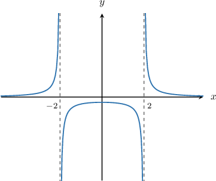

# Vertical Asymptotes of Rational Functions

Source: https://www.mathacademy.com/topics/807?courseId=101
Topic ID: 807

## Prerequisites

- [The Discriminant of a Quadratic Equation](../algebra-i/425-the-discriminant-of-a-quadratic-equation.md)
- [Factoring Cubic Expressions by Grouping](../algebra-ii/428-factoring-cubic-expressions-by-grouping.md)
- [Factoring Sums and Differences of Cubes](../algebra-ii/441-factoring-sums-and-differences-of-cubes.md)
- [Solving Quadratic Equations with Leading Coefficients by Factoring](../algebra-i/1422-solving-quadratic-equations-with-leading-coefficients-by-factoring.md)
- [Simplifying Rational Expressions Using Polynomial Factorization](../algebra-ii/1676-simplifying-rational-expressions-using-polynomial-factorization.md)

## Lesson

### Introduction

A **vertical asymptote** is a vertical line to which a function gets very close but never touches.

For example, let's consider the rational function

$$

f(x) = \dfrac{1}{(x-2)(x+2)}.

$$

The graph of $y=f(x)$ is shown below.

The two dotted lines $x=2$ and $x=-2$ are the vertical asymptotes of the function. The function gets closer and closer to these lines but never touches them.

But how can we calculate the vertical asymptotes of a function without using a graph?

In general, we can find the vertical asymptotes of a rational function using the following procedure:

1. Factor the numerator and denominator and cancel any common factors.

2. Set the denominator equal to zero and solve for $x.$

In our case, the function is already factored, and there are no common factors in the numerator and denominator. So, to find the vertical asymptotes, we set the denominator equal to zero and solve for $x{:}$

$$

(x-2)(x+2) = 0

$$

The solutions to this equation are $x=2$ and $x=-2.$ Therefore, the equations of the vertical asymptotes are $x=-2$ and $x=2.$ This matches up with what we saw in the graph.

### Example: Calculating the Vertical Asymptotes of a Rational Function

#### Question

Determine the vertical asymptotes of $f(x) = \dfrac{1}{x^2-x-6}.$

#### Explanation

To find the vertical asymptotes of a rational function, we factor the numerator and denominator and cancel any common factors. Then, we set the denominator equal to zero and solve for $x.$

Factoring the numerator and denominator, we get

$$

\begin{aligned}𝑓(𝑥)=\frac{1}{(𝑥+2)(𝑥−3)}.\end{aligned}

$$

There are no common factors in the numerator and denominator, so we set the denominator equal to zero and solve for $x\mathbin{:}$

$$

\begin{aligned}(𝑥+2)(𝑥−3) & =0\end{aligned}

$$

This gives the two solutions $x = -2$ and $x = 3.$ Therefore, the equations of the vertical asymptotes are $x = -2$ and $x = 3.$

### Example: Calculating Vertical Asymptotes With Common Factors in the Numerator and Denominator

#### Question

Determine the vertical asymptotes of $f(x) = \dfrac{x-2}{x^2-6x+8}.$

#### Explanation

To find the vertical asymptotes of a rational function, we factor the numerator and denominator and cancel any common factors. Then, we set the denominator equal to zero and solve for $x.$

Factoring the numerator and denominator and canceling any common factors, we get

$$

\begin{aligned}𝑓(𝑥) & =\frac{𝑥−2}{𝑥^{2}−6𝑥+8} \\ & =\frac{𝑥−2}{(𝑥−2)(𝑥−4)} \\ & =\frac{𝑥−2}{(𝑥−2)(𝑥−4)} \\ & =\frac{1}{𝑥−4}.\end{aligned}

$$

Next, we set the denominator equal to zero and solve for $x\mathbin{:}$

$$

x - 4 = 0

$$

This gives the solution $x = 4.$ Therefore, $x = 4$ is the only vertical asymptote.

### Example: Calculating Vertical Asymptotes When the Denominator Has Complex Roots

#### Question

Find the vertical asymptotes of the function $f(x)=\dfrac{2}{x^3+x^2+4x}.$

#### Explanation

To find the vertical asymptotes of a rational function, we factor the numerator and denominator and cancel any common factors. Then, we set the denominator equal to zero and solve for $x.$

Factoring the numerator and denominator, we get

$$

\begin{aligned}𝑓(𝑥) & =\frac{2}{𝑥^{3}+𝑥^{2}+4𝑥} \\ & =\frac{2}{𝑥(𝑥^{2}+𝑥+4)}.\end{aligned}

$$

There are no common factors in the numerator and denominator, so we set the denominator equal to zero. This gives

$$

x(x^2 +x+ 4) = 0.

$$

We now solve the above equation using the zero product property:

- Solving $x = 0$ gives the solution $x = 0.$

- The equation $x^2 +x+ 4 = 0$ has no real solutions because the discriminant $\mathcal D$ is negative:

Therefore, the only vertical asymptote is $x = 0.$

### Example: Calculating Vertical Asymptotes With Common Factors When the Denominator Has Complex Roots

#### Question

Determine the vertical asymptotes of $f(x) = \dfrac{x^2-x-6}{x^3 - 3 x^2 + x - 3}.$

#### Explanation

To find the vertical asymptotes of a rational function, we factor the numerator and denominator and cancel any common factors. Then, we set the denominator equal to zero and solve for $x.$

Factoring the numerator and denominator and canceling any common factors, we get

$$

\begin{aligned}𝑓(𝑥) & =\frac{𝑥^{2}−𝑥−6}{𝑥^{3}−3𝑥^{2}+𝑥−3} \\ & =\frac{(𝑥+2)(𝑥−3)}{𝑥^{2}(𝑥−3)+(𝑥−3)} \\ & =\frac{(𝑥+2)(𝑥−3)}{(𝑥^{2}+1)(𝑥−3)} \\ & =\frac{(𝑥+2)(𝑥−3)}{(𝑥^{2}+1)(𝑥−3)} \\ & =\frac{𝑥+2}{𝑥^{2}+1}.\end{aligned}

$$

Next, we set the denominator equal to zero:

$$

x^2 + 1 = 0

$$

This equation does not have any real solutions because the discriminant $\mathcal D$ is negative:

$$

\begin{aligned}D & =𝑏^{2}−4𝑎𝑐 \\ & =(0)^{2}−4(1)(1) \\ & =0−4 \\ & =−4\end{aligned}

$$

Therefore, $f(x)$ has no vertical asymptotes.
