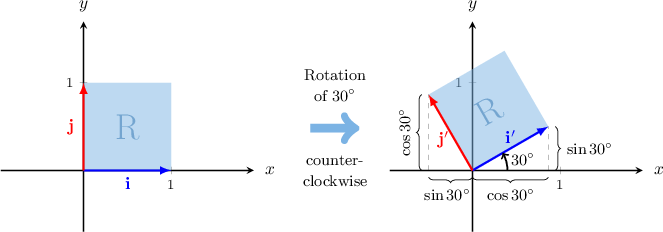

# Rotations as Linear Transformations

Source: https://www.mathacademy.com/topics/932?courseId=101
Topic ID: 932

## Prerequisites

- [Elementary Trigonometric Equations Containing Tangent](./915-elementary-trigonometric-equations-containing-tangent.md)
- [Right-Angle Rotations as Linear Transformations](./931-right-angle-rotations-as-linear-transformations.md)
- [Describing Properties of the Sine Function](../algebra-ii/3540-describing-properties-of-the-sine-function.md)
- [Describing Properties of the Cosine Function](../algebra-ii/3557-describing-properties-of-the-cosine-function.md)

## Lesson

### Introduction

Consider the standard basis $\big\{\mathbf{i},\mathbf{j} \big\}$ of the Euclidean plane $\mathbb{R}^2$ and the unit square spanned by these two vectors.

Let's define a linear transformation $\mathbf R$ by its standard matrix $R,$ given by

$$

[\begin{aligned}cos⁡30^{∘} & −sin⁡30^{∘} \\ sin⁡30^{∘} & cos⁡30^{∘}\end{aligned}]

$$

We can find the images of $\{\mathbf{i},\mathbf{j} \}$ under $\mathbf{R}$ by computing the matrix products, as follows:

$$

\begin{aligned}𝐢^{′} & =𝐑(𝐢)=[\begin{aligned}cos⁡30^{∘} & −sin⁡30^{∘} \\ sin⁡30^{∘} & cos⁡30^{∘}\end{aligned}][\begin{aligned}1 \\ 0\end{aligned}]=[\begin{aligned}cos⁡30^{∘} \\ sin⁡30^{∘}\end{aligned}] \\ 𝐣^{′} & =𝐑(𝐣)=[\begin{aligned}cos⁡30^{∘} & −sin⁡30^{∘} \\ sin⁡30^{∘} & cos⁡30^{∘}\end{aligned}][\begin{aligned}0 \\ 1\end{aligned}]=[\begin{aligned}−sin⁡30^{∘} \\ cos⁡30^{∘}\end{aligned}]\end{aligned}

$$

Plotting the vectors $\mathbf i$ and $\mathbf j$ and their images $\mathbf i'$ and $\mathbf j',$ we obtain the following:

We see that the transformation $\mathbf R$ represented by the matrix $R$ defines a **counterclockwise rotation of $30^\circ$ about the origin.**

As usual, we typically refer to rotations in the counterclockwise sense. However, in this case, the transformation $\mathbf R$ can also be considered a rotation of $360^\circ-30^\circ=330^\circ$ *clockwise* about the origin.

### General Rotation Matrix

The matrix $R_\theta,$ given by

$$

[\begin{aligned}cos⁡𝜃 & −sin⁡𝜃 \\ sin⁡𝜃 & cos⁡𝜃\end{aligned}]

$$

represents a **rotation by an angle $\theta$ counterclockwise about the origin.**

To find the matrix representing a rotation by an angle $\theta$ *clockwise* about the origin, we replace $\theta$ with $-\theta$ in the above. This gives

$$

[\begin{aligned}cos⁡(−𝜃) & −sin⁡(−𝜃) \\ sin⁡(−𝜃) & cos⁡(−𝜃)\end{aligned}]

$$

### Example: Rotating a Vector About the Origin

#### Question

The vector $\mathbf{v}=\langle -5,4 \rangle$ is rotated $135^{\circ}$ counterclockwise about the origin. Find the image of $\mathbf{v}$ under this rotation.

#### Explanation

A rotation of $135^{\circ}$ counterclockwise about the origin is represented by the matrix

$$

[\begin{aligned}cos⁡(135^{∘}) & −sin⁡(135^{∘}) \\ sin⁡(135^{∘}) & cos⁡(135^{∘})\end{aligned}]

$$

To find the image $\mathbf{v}'$ under the action of the matrix $R_{135^{\circ}}$, we compute the matrix product, as follows:

$$

\begin{aligned}𝐯^{′} & =𝑅_{135^{∘}}⋅𝐯 \\ & =\begin{aligned}−\frac{1}{\sqrt{√2}} & −\frac{1}{\sqrt{√2}} \\ \frac{1}{\sqrt{√2}} & −\frac{1}{\sqrt{√2}}\end{aligned}[\begin{aligned}−5 \\ 4\end{aligned}] \\ & =\begin{aligned}\frac{1}{\sqrt{√2}} \\ −\frac{9}{\sqrt{√2}}\end{aligned}\end{aligned}

$$

Therefore, the image is $\mathbf{v}'=\left\langle \dfrac{1}{\sqrt{2}}, -\dfrac{9}{\sqrt{2}} \right\rangle.$

### Example: Interpreting a Given Matrix as a Rotation

#### Question

What is the geometrical interpretation of the transformation represented by the matrix $A$ given below?

$$

\begin{aligned}−\frac{1}{\sqrt{√2}} & −\frac{1}{\sqrt{√2}} \\ \frac{1}{\sqrt{√2}} & −\frac{1}{\sqrt{√2}}\end{aligned}

$$

#### Explanation

The rotation matrix $R_\theta$ represents a rotation of angle $\theta$ counterclockwise about the origin and is given by

$$

[\begin{aligned}cos⁡𝜃 & −sin⁡𝜃 \\ sin⁡𝜃 & cos⁡𝜃\end{aligned}]

$$

Comparing $A$ with the rotation matrix, we have

$$

\begin{aligned}sin⁡𝜃=\frac{1}{\sqrt{√2}} \\ cos⁡𝜃=−\frac{1}{\sqrt{√2}}.\end{aligned}

$$

Since $\sin \theta$ is positive and $\cos \theta$ is negative, we must have $\dfrac{\pi}{2} \leq \theta \leq \pi.$

Dividing the first equation by the second gives

$$

\tan \theta = -1.

$$

The principal value $\theta_1$ is

$$

\theta_1 = \arctan (-1) = -\dfrac{\pi}{4},

$$

but this is outside the range $\dfrac{\pi}{2} \leq \theta \leq \pi.$ To find a value in the required range, we add $\pi{:}$

$$

\theta = \theta_1 + \pi = \dfrac{3\pi}{4}

$$

Therefore, $A$ represents a rotation of $\dfrac{3\pi}{4}$ radians counterclockwise about the origin.

Note that this is also equivalent to a ** rotation with an angle of rotation given by

$$

2\pi - \dfrac{3\pi}{4} = \dfrac{5\pi}{4}.

$$

### Example: Rotating an Object About the Origin

#### Question

A triangle $S$ has vertices at $(1,1), (3,4), (5,8).$ Which of the following are coordinates of the vertices of $S',$ the image of $S$ under a counterclockwise rotation of $\dfrac{\pi}{3}$ radians about the origin?

1. $\left(1,-3\right)$

2. $\big(0,\sqrt{3}\big)$

3. $\left(\dfrac{5-8\sqrt{3}}{2},\dfrac{8+5\sqrt{3}}{2}\right)$

#### Explanation

The rotation matrix $R_\theta$ represents a rotation of angle $\theta$ counterclockwise about the origin and is given by

$$

[\begin{aligned}cos⁡𝜃 & −sin⁡𝜃 \\ sin⁡𝜃 & cos⁡𝜃\end{aligned}]

$$

Substituting $\theta = \dfrac{\pi}{3}$ into the above, we have

$$

\begin{aligned}𝑅 & =\begin{aligned}cos⁡(\frac{𝜋}{3}) & −sin⁡(\frac{𝜋}{3}) \\ sin⁡(\frac{𝜋}{3}) & cos⁡(\frac{𝜋}{3})\end{aligned} \\ & =\begin{aligned}\frac{1}{2} & −\frac{\sqrt{√3}}{2} \\ \frac{\sqrt{√3}}{2} & \frac{1}{2}\end{aligned} \\ & =\frac{1}{2}[\begin{aligned}1 & −\sqrt{√3} \\ \sqrt{√3} & 1\end{aligned}].\end{aligned}

$$

To find the image of $S$ under the transformation, we first create a matrix $X$ containing all of the vertices of $S\mathbin{:}$

$$

[\begin{aligned}1 & 3 & 5 \\ 1 & 4 & 8\end{aligned}]

$$

Now, we compute the image of $X$ under the rotation $\mathbf{R}$ by calculating the matrix product $RX\mathbin{:}$

$$

\begin{aligned}𝑅𝑋 & =\frac{1}{2}[\begin{aligned}1 & −\sqrt{√3} \\ \sqrt{√3} & 1\end{aligned}][\begin{aligned}1 & 3 & 5 \\ 1 & 4 & 8\end{aligned}] \\ & =\frac{1}{2}[\begin{aligned}1−\sqrt{√3} & 3−4\sqrt{√3} & 5−8\sqrt{√3} \\ 1+\sqrt{√3} & 4+3\sqrt{√3} & 8+5\sqrt{√3}\end{aligned}] \\ & =\begin{aligned}\frac{1−\sqrt{√3}}{2} & \frac{3−4\sqrt{√3}}{2} & \frac{5−8\sqrt{√3}}{2} \\ \frac{1+\sqrt{√3}}{2} & \frac{4+3\sqrt{√3}}{2} & \frac{8+5\sqrt{√3}}{2}\end{aligned}\end{aligned}

$$

Therefore, the coordinates of the respective vertices of $S'$ are

$$

\left(\dfrac{1-\sqrt{3}}{2},\dfrac{1+\sqrt{3}}{2}\right), \quad \left(\dfrac{3-4\sqrt{3}}{2},\dfrac{4+3\sqrt{3}}{2}\right),\quad \left(\dfrac{5-8\sqrt{3}}{2},\dfrac{8+5\sqrt{3}}{2}\right).

$$

So, the correct answer is "III only."
