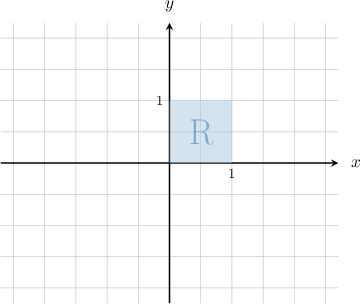
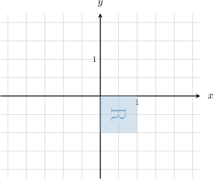
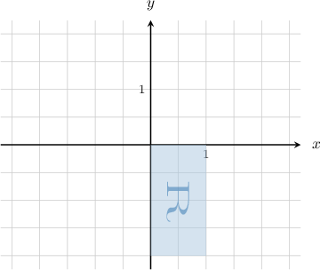

# Combining Linear Transformations Using 2x2 Matrices

Source: https://www.mathacademy.com/topics/933?courseId=101
Topic ID: 933

## Prerequisites

- [Dilations and Reflections as Linear Transformations](./867-dilations-and-reflections-as-linear-transformations.md)
- [Rotations as Linear Transformations](./932-rotations-as-linear-transformations.md)
- [Shear and Stretch as Linear Transformations](./1358-shear-and-stretch-as-linear-transformations.md)

## Lesson

### Introduction

Suppose we are given two linear transformations represented by the matrices

$$

[\begin{aligned}0 & −1 \\ 1 & 0\end{aligned}]

$$

Here, $R$ represents a rotation of $90^\circ$ counterclockwise about the origin, and $S$ represents a reflection in the $x$-axis. Now, let $\mathbf{v}$ be a vector on the plane. Let's apply $R$ and then $S$ (in this particular order) to $\mathbf{v}.$ We obtain the following:

$$

\begin{aligned}𝐯\overset{⟶}{𝑅}𝑅𝐯\overset{⟶}{𝑆}𝑆(𝑅𝐯)\end{aligned}

$$

The above states that $\mathbf{v}$ under the action of $R$ is mapped to $R\mathbf{v},$ and then $R\mathbf{v}$ under the action of $S$ is mapped to $S(R\mathbf{v}).$

Since matrix multiplication is associative, we can write

$$

S(R\mathbf{v}) = (SR)\mathbf{v}.

$$

So, the product $SR$ (in this particular order) represents the combined transformation.

In our case, the matrix that represents the combined transformation is

$$

\begin{aligned}𝑆𝑅 & =[\begin{aligned}1 & 0 \\ 0 & −1\end{aligned}][\begin{aligned}0 & −1 \\ 1 & 0\end{aligned}] \\ & =[\begin{aligned}0 & −1 \\ −1 & 0\end{aligned}].\end{aligned}

$$

### The Order in Which Transformations Are Applied

The order in which the multiplication is carried out is extremely important!

For example, consider the transformations

$$

[\begin{aligned}0 & −1 \\ 1 & 0\end{aligned}]

$$

Computing the product $SR,$ we get

$$

\begin{aligned}𝑆𝑅=[\begin{aligned}1 & 0 \\ 0 & −1\end{aligned}][\begin{aligned}0 & −1 \\ 1 & 0\end{aligned}]=[\begin{aligned}0 & −1 \\ −1 & 0\end{aligned}].\end{aligned}

$$

Therefore, the transformation $SR$ represents a reflection in line $y=-x.$

On the other hand, computing the product $RS,$ we get

$$

\begin{aligned}𝑅𝑆=[\begin{aligned}0 & −1 \\ 1 & 0\end{aligned}][\begin{aligned}1 & 0 \\ 0 & −1\end{aligned}]=[\begin{aligned}0 & 1 \\ 1 & 0\end{aligned}].\end{aligned}

$$

The product $RS$ represents a reflection in line $y=x,$ which is a completely different transformation than $SR.$

In general, the transformations are performed from right-to-left. So, for example, if we have

$$

\mathbf v' = SR\mathbf v,

$$

then we should think of the transformation $R$ as being applied *first*, followed by $S.$

**Note:** The reason why transformations are performed right-to-left is that the rightmost transformation is the first transformation preceding the input. In our case, to compute $SR \mathbf v,$

- we first apply $R$ to $\mathbf v$ to get $R \mathbf v,$

- and then we apply $S$ to $R \mathbf v$ to get $SR \mathbf v.$

### Example: Finding the Image of an Object Under a Combination of Linear Transformations

#### Question

Consider the linear transformation that acts on vectors in $\mathbb{R}^2$ as follows (in the order given):

- it rotates vectors by $90^\circ$ clockwise about the origin, and then

- stretches the result by a scale factor of $2$ in the $y$-direction.

What is the image of the unit square shown below under the action of this linear transformation?

#### Explanation

First, we apply the rotation of $90^\circ$ clockwise:

Then, we apply the stretch by a scale factor of $2$ in the $y$-direction:

### Example: Finding a Matrix That Represents a Combination of Two Linear Transformations

#### Question

Construct the matrix of the linear transformation that acts on a vector in $\mathbb{R}^2$ as follows (in the order given):

- it rotates the vector by $\dfrac{\pi}{2}$ radians counterclockwise about the origin, and then

- stretches the result by a stretch factor of $2$ parallel to the $x$-axis.

#### Explanation

Let $P$ be the matrix that represents the rotation and let $Q$ be the matrix that represents the stretch. These are given by the following elementary transformation matrices:

$$

\begin{aligned}𝑃 & =\begin{aligned}cos⁡(\frac{𝜋}{2}) & −sin⁡(\frac{𝜋}{2}) \\ sin⁡(\frac{𝜋}{2}) & cos⁡(\frac{𝜋}{2})\end{aligned}=[\begin{aligned}0 & −1 \\ 1 & 0\end{aligned}] \\ 𝑄 & =[\begin{aligned}2 & 0 \\ 0 & 1\end{aligned}]\end{aligned}

$$

Therefore, the combined transformation can be represented by the matrix $QP\mathbin{:}$

$$

\begin{aligned}𝑄𝑃 & =[\begin{aligned}2 & 0 \\ 0 & 1\end{aligned}][\begin{aligned}0 & −1 \\ 1 & 0\end{aligned}] \\ & =[\begin{aligned}0 & −2 \\ 1 & 0\end{aligned}]\end{aligned}

$$

### Example: Finding a Matrix That Represents a Combination of Three Linear Transformations

#### Question

Construct the matrix of the linear transformation that acts on a vector in $\mathbb{R}^2$ as follows (in the order given):

- It rotates the vector by $\dfrac{\pi}{3}$ radians counterclockwise about the origin, then

- scales the result by a scale factor of $5$ with the center of enlargement at the origin, and finally

- reflects the result about the $y$-axis.

#### Explanation

Let $P$ be the matrix that represents the rotation, $Q$ be the matrix that represents the scaling, and $R$ be the matrix that represents the reflection. These are given by the following elementary transformation matrices:

$$

\begin{aligned}𝑃 & =\begin{aligned}cos⁡(\frac{𝜋}{3}) & −sin⁡(\frac{𝜋}{3}) \\ sin⁡(\frac{𝜋}{3}) & cos⁡(\frac{𝜋}{3})\end{aligned}=\begin{aligned}\frac{1}{2} & −\frac{\sqrt{√3}}{2} \\ \frac{\sqrt{√3}}{2} & \frac{1}{2}\end{aligned}=\frac{1}{2}[\begin{aligned}1 & −\sqrt{√3} \\ \sqrt{√3} & 1\end{aligned}] \\ 𝑄 & =[\begin{aligned}5 & 0 \\ 0 & 5\end{aligned}]=5[\begin{aligned}1 & 0 \\ 0 & 1\end{aligned}] \\ 𝑅 & =[\begin{aligned}−1 & 0 \\ 0 & 1\end{aligned}]\end{aligned}

$$

Therefore, the combined transformation can be represented by the matrix $RQP\mathbin{:}$

$$

\begin{aligned}𝑅𝑄𝑃 & =[\begin{aligned}−1 & 0 \\ 0 & 1\end{aligned}](5[\begin{aligned}1 & 0 \\ 0 & 1\end{aligned}])(\frac{1}{2}[\begin{aligned}1 & −\sqrt{√3} \\ \sqrt{√3} & 1\end{aligned}]) \\ & =\frac{5}{2}[\begin{aligned}−1 & 0 \\ 0 & 1\end{aligned}][\begin{aligned}1 & 0 \\ 0 & 1\end{aligned}][\begin{aligned}1 & −\sqrt{√3} \\ \sqrt{√3} & 1\end{aligned}] \\ & =\frac{5}{2}[\begin{aligned}−1 & 0 \\ 0 & 1\end{aligned}][\begin{aligned}1 & −\sqrt{√3} \\ \sqrt{√3} & 1\end{aligned}] \\ & =\frac{5}{2}[\begin{aligned}−1 & \sqrt{√3} \\ \sqrt{√3} & 1\end{aligned}]\end{aligned}

$$
