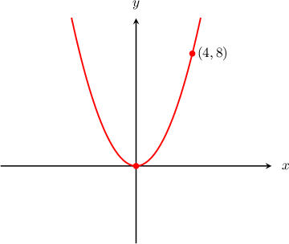
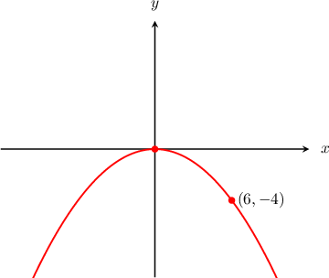
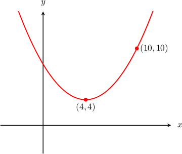
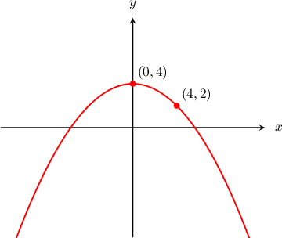

# Upward and Downward Opening Parabolas

Source: https://www.mathacademy.com/topics/1125?courseId=134
Topic ID: 1125

## Prerequisites

- [Vertical Reflections of Quadratic Functions](../algebra-i/117-vertical-reflections-of-quadratic-functions.md)

## Lesson

### Introduction

Given the graph of a parabola, we can determine its equation. For example, let's have a look at the parabola below.

The point where the parabola makes its sharpest turn is the **vertex** of the parabola. Here the vertex is at $(0,0).$

Also, since the two "arms" of our parabola appear to travel upward along the $y$-axis, we say that the parabola is **upward-opening**. (Some other parabolas are **downward-opening**, meaning that their two arms travel downward along the $y$-axis.)

In general, any parabola that is upward-opening or downward-opening has its axis parallel to the $y$-axis.

For any upward or downward-opening parabola whose vertex is $(0,0),$ the general standard equation is given by

$$

x^2 = 4py

$$

where $p$ is a constant. (We will see later that the value of $p$ describes some features of the parabola.)

Since our parabola passes through the point $(4,8),$ we can find the value of $p$ by substituting the values $x=4$ and $y=8$ into the above equation and solving for $p\mathbin{:}$

$$

\begin{aligned}𝑥^{2} & =4𝑝𝑦 \\ (4)^{2} & =4𝑝(8) \\ 16 & =32𝑝 \\ 𝑝 & =\frac{1}{2}\end{aligned}

$$

So, the equation of our parabola is

$$

\begin{aligned}𝑥^{2} & =4𝑝𝑦 \\ 𝑥^{2} & =4(\frac{1}{2})𝑦 \\ 𝑥^{2} & =2𝑦.\end{aligned}

$$

### The Parameter p Determines Whether the Parabola is Upward or Downward-Opening

Remember that for any upward or downward-opening parabola whose vertex is $(0,0),$ the general standard equation is given by

$$

x^2 = 4py

$$

where $p$ is a constant.

The constant $p$ is very important because it determines whether the parabola is upward or downward-opening.

- When $p > 0,$ the arms of the parabola open upwards, so the parabola is **upward-opening**.

- When $p < 0,$ the arms of the parabola open downwards, so the parabola is **downward-opening**.

**Note:** For both upward and downward-opening parabolas, the axis of the parabola is vertical, meaning that it runs parallel to the $y$-axis.

### Example: Determining the Equation of a Parabola Given its Graph

#### Question

What is the equation of the parabola shown above?

#### Explanation

From the diagram we see that the parabola is downward-opening, has its vertex at $(0,0),$ and passes through the point $(6,-4).$

For any upward or downward-opening parabola whose vertex is $(0,0),$ the general standard equation is given by

$$

x^2 = 4py

$$

where $p$ is a constant.

We know that the given parabola passes through the point $(6,-4),$ so we can substitute $x = 6$ and $y = -4$ into the standard equation and solve for $p\mathbin{:}$

$$

\begin{aligned}𝑥^{2} & =4𝑝𝑦 \\ 6^{2} & =4𝑝(−4) \\ 36 & =−16𝑝 \\ 𝑝 & =−\frac{9}{4}.\end{aligned}

$$

Therefore, the equation of the parabola is

$$

\begin{aligned}𝑥^{2} & =4𝑝𝑦 \\ 𝑥^{2} & =4(−\frac{9}{4})𝑦 \\ 𝑥^{2} & =−9𝑦.\end{aligned}

$$

### Example: Determining the Equation of a Parabola Passing Through a Given Point

#### Question

Find the equation of the downward-opening parabola that has its vertex at $(0,0)$ and which passes through the point $(2,-4).$

#### Explanation

We know that for any upward or downward-opening parabola whose vertex is $(0,0),$ the general standard equation is given by

$$

x^2 = 4py

$$

where $p$ is a constant.

We're told that the given parabola passes through the point $(2,-4),$ so we can substitute $x = 2$ and $y = -4$ into the standard equation and solve for $p\mathbin{:}$

$$

\begin{aligned}𝑥^{2} & =4𝑝𝑦 \\ 2^{2} & =4𝑝(−4) \\ 4 & =−16𝑝 \\ 𝑝 & =−\frac{1}{4}\end{aligned}

$$

Therefore, the equation of the parabola is

$$

\begin{aligned}𝑥^{2} & =4𝑝𝑦 \\ 𝑥^{2} & =4(−\frac{1}{4})𝑦 \\ 𝑥^{2} & =−𝑦.\end{aligned}

$$

### Upward and Downward Opening Parabolas With Non-Origin Vertices

Sometimes, a parabola might have its vertex at a point other than the origin. For example, the parabola graphed below has its vertex at $(4,4).$

For any upward or downward-opening parabola with its vertex at $(h,k),$ the general standard equation is given by

$$

(x-h)^2 = 4p(y-k).

$$

where $p$ is a constant.

Here, the vertex has coordinates $(h,k) = (4,4).$ Substituting these into the general standard equation, we get

$$

(x-4)^2 = 4p(y-4).

$$

We are left to find the value of $p.$ We know that the given parabola also passes through the point $(10,10),$ so we can substitute $x=10$ and $y=10$ into the standard equation and solve for $p\mathbin{:}$

$$

\begin{aligned}(𝑥−4)^{2} & =4𝑝(𝑦−4) \\ (10−4)^{2} & =4𝑝(10−4) \\ 6^{2} & =4𝑝(6) \\ 36 & =24𝑝 \\ 𝑝 & =\frac{3}{2}\end{aligned}

$$

Therefore, the equation of our parabola is

$$

\begin{aligned}(𝑥−4)^{2} & =4𝑝(𝑦−4) \\ (𝑥−4)^{2} & =4(\frac{3}{2})(𝑦−4) \\ (𝑥−4)^{2} & =6(𝑦−4).\end{aligned}

$$

### Example: Determining the Equation of a Parabola With Non-Origin Vertex Given its Graph

#### Question

What is the equation of the parabola shown above?

#### Explanation

From the diagram we see that the parabola is downward-opening, has its vertex at $(0,4),$ and passes through the point $(4,2).$

We know that for any upward or downward-opening parabola with its vertex at $(h,k),$ the general standard equation is given by

$$

(x-h)^2 = 4p(y-k).

$$

Here, the vertex has coordinates $(h,k) = (0,4).$ Substituting these into the general standard equation, we get

$$

x^2 = 4p(y-4).

$$

We are left to find the value of $p.$ We know that the given parabola also passes through the point $(4,2),$ so we can substitute $x = 4$ and $y = 2$ into the standard equation and solve for $p\mathbin{:}$

$$

\begin{aligned}𝑥^{2} & =4𝑝(𝑦−4) \\ 4^{2} & =4𝑝(2−4) \\ 16 & =−8𝑝 \\ 𝑝 & =−2\end{aligned}

$$

Therefore, the equation of the parabola is

$$

\begin{aligned}𝑥^{2} & =4𝑝(𝑦−4) \\ 𝑥^{2} & =4(−2)(𝑦−4) \\ 𝑥^{2} & =−8(𝑦−4).\end{aligned}

$$

### Example: Determining the Equation of a Parabola With Non-Origin Vertex Passing Through a Given Point

#### Question

Find the equation of the upward-opening parabola that has its vertex at $(0,-2)$ and which passes through the point $(4,6).$

#### Explanation

For any upward or downward-opening parabola with its vertex at $(h,k),$ the general standard equation is given by

$$

(x-h)^2 = 4p(y-k).

$$

Here, the vertex has coordinates $(h,k) = (0,-2).$ Substituting these into the general standard equation, we get

$$

\begin{aligned}(𝑥−0)^{2} & =4𝑝(𝑦−(−2)) \\ 𝑥^{2} & =4𝑝(𝑦+2).\end{aligned}

$$

We are left to find the value of $p.$ We know that the given parabola also passes through the point $(4,6),$ so we can substitute $x = 4$ and $y = 6$ into the standard equation and solve for $p\mathbin{:}$

$$

\begin{aligned}𝑥^{2} & =4𝑝(𝑦+2) \\ (4)^{2} & =4𝑝(6+2) \\ 16 & =32𝑝 \\ 𝑝 & =\frac{1}{2}\end{aligned}

$$

Therefore, the equation of the parabola is

$$

\begin{aligned}𝑥^{2} & =4𝑝(𝑦+2) \\ 𝑥^{2} & =4(\frac{1}{2})(𝑦+2) \\ 𝑥^{2} & =2(𝑦+2).\end{aligned}

$$
