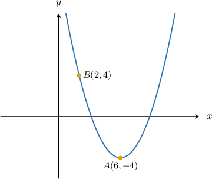

# Calculating the Directrix of a Parabola

Source: https://www.mathacademy.com/topics/1130?courseId=134
Topic ID: 1130

## Prerequisites

- [The Focus-Directrix Property of a Parabola](../algebra-ii/1155-the-focus-directrix-property-of-a-parabola.md)

## Lesson

### Introduction

Recall that a parabola can be defined as a set of points $(x,y)$ equidistant from a line called the **directrix** and a point called the **focus**.

In this lesson, we will practice finding the equation of the directrix of a parabola if we're given the equation of the parabola.

The first step is to write the parabola equation in its general form. For a horizontal parabola (like the one shown above), the general form is

$$

(y-k)^2 = 4p(x-h).

$$

From the general form, we can determine the coordinates of the vertex $(h,k)$ and the value of the parameter $p,$ and we can apply the following rule:

*The directrix is located a distance of $|p|$ units away from the vertex, in the direction opposite to that in which the parabola opens.*

That is to say:

- For a horizontal parabola, the equation of the directrix is $x=h - p.$

- For a vertical parabola, the equation of the directrix is $y = k-p.$

### A Worked Example

Let's use the procedure described earlier to find the directrix of the parabola

$$

y^2 = 2x.

$$

Note that this is a right-opening parabola, and the vertex is $(h,k) = (0,0).$

To determine $p,$ we rewrite the equation of the parabola in the general form $(y-k)^2 = 4p(x-h)\mathbin{:}$

$$

\begin{aligned}𝑦^{2} & =4⋅\frac{1}{2}⋅𝑥\end{aligned}

$$

Therefore, $p = \dfrac 1 2.$

Finally, because the parabola opens to the right, the directrix lies at a distance of $|p|=\dfrac{1}{2}$ to the *left* of the vertex $(0,0).$ This means the equation of the directrix is

$$

\begin{aligned}𝑥 & =0−𝑝 \\ 𝑥 & =0−\frac{1}{2} \\ 𝑥 & =−\frac{1}{2}\end{aligned}

$$

This parabola, along with its focus and directrix, is shown below.

### Example: Finding the Directrix of an Left or Right Opening Parabola

#### Question

Find the directrix of the parabola $(y+3)^2 = -4(x+4).$

#### Explanation

The equation of a left-opening or right-opening parabola is given by

$$

(y - k)^2 = 4p (x - h).

$$

The directrix of this parabola is

$$

x= h-p.

$$

First, we express our equation in standard form, as follows:

$$

(y-(-3))^2 = 4\left(-1\right)(x-(-4))

$$

Comparing this equation side-by-side with the standard form, we obtain

$$

h=-4, \qquad k=-3, \qquad p=-1.

$$

Therefore, the equation of the directrix is

$$

\begin{aligned}𝑥 & =ℎ−𝑝 \\ 𝑥 & =−4−(−1) \\ 𝑥 & =−3.\end{aligned}

$$

### Example: Finding the Directrix of an Upward or Downward Opening Parabola

#### Question

Find the directrix of the parabola $3x^2 -24 x - 4 y + 32 = 0.$

#### Explanation

The equation of an upward-opening or downward-opening parabola is given by

$$

(x - h)^2 = 4p (y - k).

$$

The directrix of this parabola is

$$

y= k-p.

$$

To rewrite our equation of the parabola in standard form, we need to group $x$-terms on the left-hand side of the equation and complete the square, as follows:

$$

\begin{aligned}3𝑥^{2}−24𝑥−4𝑦+32 & =0 \\ 3𝑥^{2}−24𝑥 & =4𝑦−32 \\ 3(𝑥^{2}−8𝑥) & =4𝑦−32 \\ 3((𝑥−4)^{2}−16) & =4𝑦−32 \\ 3(𝑥−4)^{2}−48 & =4𝑦−32 \\ 3(𝑥−4)^{2} & =4𝑦+16 \\ 3(𝑥−4)^{2} & =4(𝑦+4) \\ (𝑥−4)^{2} & =4(\frac{1}{3})(𝑦+4)\end{aligned}

$$

Comparing the final equation side-by-side with the standard form, we obtain

$$

h=4, \qquad k=-4, \qquad p=\dfrac{1}{3}.

$$

Therefore, the equation of the directrix is

$$

\begin{aligned}𝑦 & =𝑘−𝑝 \\ 𝑦 & =−4−(\frac{1}{3}) \\ 𝑦 & =−\frac{13}{3}.\end{aligned}

$$

### Example: Finding the Directrix of a Parabola That Passes Through Two Given Points

#### Question

What is the equation of directrix of the parabola shown below?

#### Explanation

The equation of an upward-opening or downward-opening parabola is given by

$$

(x - h)^2 = 4p(y - k).

$$

The directrix of this parabola is

$$

y = k - p.

$$

Since our parabola is upward opening and has its vertex at $(h,k) = (6,-4),$ the standard equation of the parabola can be written as follows:

$$

\begin{aligned}(𝑥−6)^{2} & =4𝑝(𝑦−(−4)) \\ (𝑥−6)^{2} & =4𝑝(𝑦+4)\end{aligned}

$$

Now, since the parabola passes through the point $B,$ we substitute the coordinates of $B$ into the equation above and solve for $p\mathbin{:}$

$$

\begin{aligned}(2−6)^{2} & =4𝑝(4+4) \\ (−4)^{2} & =4𝑝(8) \\ 16 & =32𝑝 \\ 𝑝 & =\frac{1}{2}\end{aligned}

$$

Therefore, the equation of our parabola is

$$

(x - 6)^2 = 4\left(\dfrac{1}{2}\right)(y + 4)

$$

and we have

$$

h = 6, \qquad k = -4, \qquad p = \dfrac{1}{2}.

$$

Finally, the equation of the directrix is

$$

\begin{aligned}𝑦 & =𝑘−𝑝 \\ 𝑦 & =−4−\frac{1}{2} \\ 𝑦 & =−\frac{9}{2}.\end{aligned}

$$
