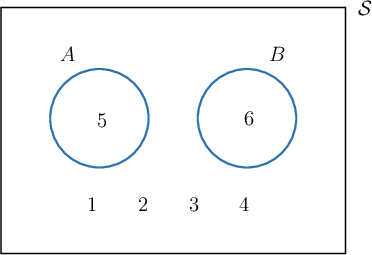

# Mutually Exclusive Events

Source: https://www.mathacademy.com/topics/1154?courseId=134
Topic ID: 1154

## Prerequisites

- [Applying the Addition Law With Event Complements](../geometry/4315-applying-the-addition-law-with-event-complements.md)

## Lesson

### Introduction

When you throw a fair die, it cannot land on both $5$ and $6$ simultaneously. If two events cannot occur simultaneously, then we say that the events are **mutually exclusive**.

To represent two mutually exclusive events in a Venn diagram, we draw two separated circles. In our case, if $A$ is the event that the die lies on $5$ and $B$ is the event that the die lands on $6,$ then we have the following Venn diagram:

Notice that since $A$ and $B$ are two mutually exclusive events, their intersection is empty:

$$

P(A\cap B)=0

$$

This is just another way of stating that the events $A$ and $B$ cannot occur simultaneously.

Therefore, by the addition law, the probability that either one of the events will occur is

$$

\begin{aligned} P(A\cup B) & = P(A)+P(B) - P(A \cap B)\\&= \dfrac{1}{6} + \dfrac{1}{6} - 0\\&= \dfrac{1}{3}.\end{aligned}

$$

**Note:** In general, for two mutually exclusive events $A$ and $B,$ we have $P(A \cap B) = 0,$ and the addition law reduces to

$$

P(A \cup B) = P(A) + P(B).

$$

### Example: Determining Whether Two Events are Mutually Exclusive

#### Question

Given $P(A)=\dfrac{1}{3},$ $P(B)=\dfrac{1}{4},$ and $P(A\cup B)=\dfrac{7}{12},$ determine whether $A$ and $B$ are mutually exclusive events.

#### Explanation

To check if $A$ and $B$ are mutually exclusive, we must check that $P(A\cap B) = 0.$

We can calculate $P(A\cap B)$ using the addition law:

$$

\begin{aligned}𝑃(𝐴∪𝐵) & =𝑃(𝐴)+𝑃(𝐵)−𝑃(𝐴∩𝐵) \\ \frac{7}{12} & =\frac{1}{3}+\frac{1}{4}−𝑃(𝐴∩𝐵) \\ 𝑃(𝐴∩𝐵) & =\frac{1}{3}+\frac{1}{4}−\frac{7}{12} \\ & =\frac{4+3−7}{12} \\ & =0\,✓\end{aligned}

$$

Therefore, $A$ and $B$ are mutually exclusive events.

### Example: Computing a Probability Involving Mutually Exclusive Events

#### Question

Suppose that $A$ and $B$ are mutually exclusive events. Given that $P(A)=\dfrac{1}{3}$ and $P(A\cup B) = \dfrac{4}{9},$ find $P(B).$

#### Explanation

If $A$ and $B$ are mutually exclusive events, then $P(A\cap B) = 0.$

Therefore, by the addition law, we have that

$$

\begin{aligned}𝑃(𝐴∪𝐵) & =𝑃(𝐴)+𝑃(𝐵) \\ 𝑃(𝐵) & =𝑃(𝐴∪𝐵)−𝑃(𝐴) \\ & =\frac{4}{9}−\frac{1}{3} \\ & =\frac{4−3}{9} \\ & =\frac{1}{9}.\end{aligned}

$$

### Example: Computing a Probability Involving Mutually Exclusive Events: Word Problems

#### Question

Two cards are drawn from a standard -card deck: the ace of hearts and the queen of hearts. These are set aside, and a third card is drawn from the remaining deck. What is the probability that the third drawn card is an ace or a heart?

**

#### Explanation

Let be the event that the third card is an ace, and let be the event that the third card is a heart. Then the probability that the third card is an ace or a heart can be represented as

Given that the ace of hearts is no longer in the deck, and are mutually exclusive events, i.e.,

We can find and by computing the necessary ratios. When the third card is drawn, there are cards in the deck. Among the remaining cards, there are hearts and aces. Therefore:

Finally, by the addition law, we have
