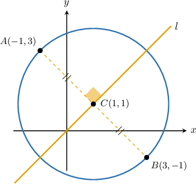
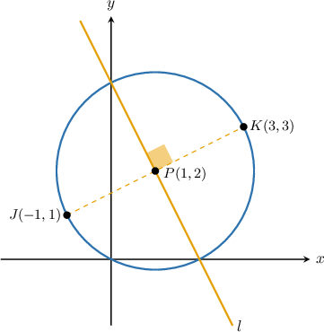
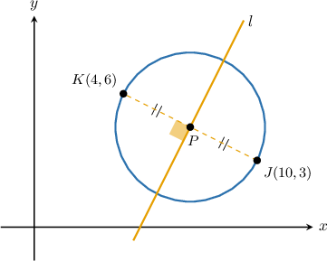

# Perpendicular Bisectors of Diameters in the Coordinate Plane

Source: https://www.mathacademy.com/topics/1184?courseId=134
Topic ID: 1184

## Prerequisites

- [Segment Bisectors and the Perpendicular Bisector Theorem](../grade-7/521-segment-bisectors-and-the-perpendicular-bisector-theorem.md)
- [Circles in the Coordinate Plane](../geometry/1183-circles-in-the-coordinate-plane.md)
- [Finding Equations of Perpendicular Lines](../geometry/3562-finding-equations-of-perpendicular-lines.md)

## Lesson

### Introduction

The circle above has center $C(1,1),$ and the points $A(-1,3)$ and $B(3,-1)$ are endpoints of the diameter $\overline{AB}.$

The line $l$ is the **perpendicular bisector** of the diameter $\overline{AB},$ which means that

- $l$ is *perpendicular* to $\overline{AB},$ and

- $l$ splits the line segment $\overline{AB}$ exactly in half.

Since $l$ bisects $\overline{AB},$ it must pass through the circle's center.

Let's use this information to find the equation of $l.$

First, the slope of the diameter equals the slope of the segment $\overline{AB}.$ So, the slope $m_1$ of this segment is

$$

\begin{aligned}𝑚_{1} & =\frac{𝑦_{2}−𝑦_{1}}{𝑥_{2}−𝑥_{1}} \\ & =\frac{−1−3}{3−(−1)} \\ & =\frac{−4}{4} \\ & =−1.\end{aligned}

$$

Since $\overline{AB}$ and $l$ are perpendicular, the slope of the perpendicular bisector is the negative reciprocal of the slope of the diameter. So, the slope $m_2$ of $l$ is

$$

\begin{aligned}𝑚_{2} & =−\frac{1}{𝑚_{1}} \\ & =−\frac{1}{(−1)} \\ & =1.\end{aligned}

$$

Finally, since $l$ passes through the center $C(1,1),$ we can use the point-slope formula to get the equation of the perpendicular bisector:

$$

\begin{aligned}𝑦−𝑦_{1} & =𝑚_{2}(𝑥−𝑥_{1}) \\ 𝑦−1 & =1⋅(𝑥−1) \\ 𝑦−1 & =𝑥−1 \\ 𝑦 & =𝑥\end{aligned}

$$

So, the perpendicular bisector $l$ has the equation $y=x.$

### Example: Finding the Perpendicular Bisector When the Center Is Given

#### Question

The line $\overline{JK}$ is the diameter of the circle centered at $P(1,2),$ where $J$ and $K$ are $(-1,1)$ and $(3,3),$ respectively. The line $l$ passes through $P$ and is perpendicular to $\overline{JK}.$ Find the equation of the line $l.$

#### Explanation

Let $m_1$ and $m_2$ be the slopes of the lines $\overset{\longleftrightarrow}{JK}$ and $l,$ respectively.

First, we compute the slope of $\overset{\longleftrightarrow}{JK}$ using the coordinates of points $J(-1,1)$ and $K(3,3),$ as follows:

$$

\begin{aligned}𝑚_{1} & =\frac{𝑦_{2}−𝑦_{1}}{𝑥_{2}−𝑥_{1}} \\ & =\frac{3−1}{3−(−1)} \\ & =\frac{2}{4} \\ & =\frac{1}{2}\end{aligned}

$$

The slope of the perpendicular bisector is the negative reciprocal of the slope of the diameter. Therefore, the slope of $l$ is

$$

\begin{aligned}𝑚_{2} & =−\frac{1}{𝑚_{1}} \\ & =−\frac{1}{(\frac{1}{2})} \\ & =−2.\end{aligned}

$$

The line $l$ passes through the point $P(1,2).$ So, we can use the point-slope formula to write the equation of line $l$ as

$$

\begin{aligned}𝑦−𝑦_{1} & =𝑚_{2}(𝑥−𝑥_{1}) \\ 𝑦−2 & =−2(𝑥−1) \\ 𝑦−2 & =−2𝑥+2 \\ 𝑦 & =−2𝑥+4.\end{aligned}

$$

### Example: Finding the Perpendicular Bisector When the Center Is Not Given

#### Question

The line $\overline{JK}$ is the diameter of the circle centered at $P,$ where the points $J$ and $K$ have coordinates $J(10,3)$ and $K(4,6).$ The line $l$ is the perpendicular bisector of $\overline{JK}.$ Find the equation of the line $l.$

#### Explanation

Let's gather the given information into a diagram, as shown below.

Let $m_1$ and $m_2$ be the slopes of the lines $\overset{\longleftrightarrow}{JK}$ and $l$, respectively.

First, we compute the slope of $\overline{JK}$ using the coordinates of the points $J(10,3)$ and $K(4,6),$ as follows:

$$

\begin{aligned}𝑚_{1} & =\frac{𝑦_{2}−𝑦_{1}}{𝑥_{2}−𝑥_{1}}=\frac{6−3}{4−10}=\frac{3}{−6}=−\frac{1}{2}\end{aligned}

$$

The slope of the perpendicular bisector is the negative reciprocal of the slope of the diameter. Therefore, the slope of $l$ is

$$

\begin{aligned}𝑚_{2} & =−\frac{1}{𝑚_{1}}=−\frac{1}{(−\frac{1}{2})}=2.\end{aligned}

$$

The center of the circle is the midpoint of the diameter. So, we can use the midpoint formula to find the center as

$$

\begin{aligned}𝑃 & =(\frac{10+4}{2},\frac{3+6}{2}) \\ & =(\frac{14}{2},\frac{9}{2}) \\ & =(7,\frac{9}{2}).\end{aligned}

$$

The line $l$ passes through the center $P\left(7, \dfrac{9}{2}\right)$ with a slope of $m_2=2.$ So, we can use the point-slope formula to write the equation of the line as

$$

\begin{aligned}𝑦−𝑦_{1} & =𝑚_{2}(𝑥−𝑥_{1}) \\ 𝑦−\frac{9}{2} & =2(𝑥−7) \\ 𝑦 & =2𝑥−14+\frac{9}{2} \\ 𝑦 & =2𝑥−\frac{19}{2}.\end{aligned}

$$
