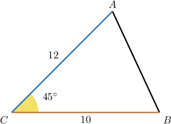
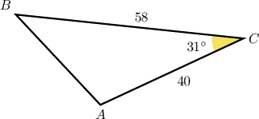
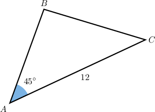
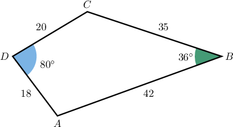
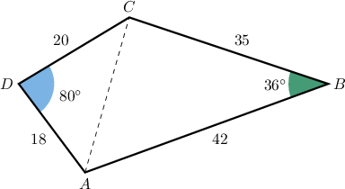
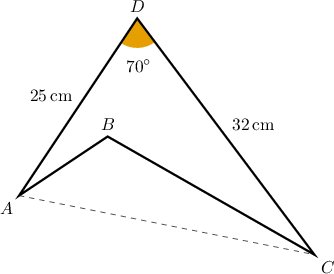
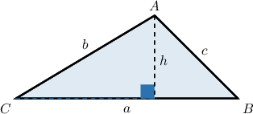

# The Area of a General Triangle

Source: https://www.mathacademy.com/topics/1275?courseId=134
Topic ID: 1275

## Prerequisites

- [Calculating Areas of Right Triangles Using Trigonometry](../geometry/1608-calculating-areas-of-right-triangles-using-trigonometry.md)

## Lesson

### Introduction

The formula for the area of a general triangle is

$$

\mathcal{A}=\frac{1}{2}{\color{red}{a}}{\color{blue}{b}}\sin{C},

$$

where $\color{red}a$ and $\color{blue}b$ are two sides of the triangle and $C$ is the measure of the angle between those sides (called the **included angle**).

We'll prove this result at the end of the lesson.

To demonstrate how this works, suppose that we want to calculate the area of the non-right-angled triangle below:

Let's call the lengths of the sides $BC = \color{red}{a}$ and $AC ={\color{blue}{b}}.$ For the triangle above we have ${\color{red}a=10},$ ${\color{blue}b=12},$ and $m\angle C=45^{\circ}.$

Therefore, the area of our triangle is

$$

\begin{aligned}A & =\frac{1}{2}⋅10⋅12⋅sin⁡45^{∘} \\ & =60⋅\frac{\sqrt{√2}}{2} \\ & =30\sqrt{√2}.\end{aligned}

$$

### Example: Calculating the Area of a Triangle

#### Question

Find the area of $\triangle{ABC}$ below. Round your answer to two decimal places.

#### Explanation

The formula for the area of the triangle is

$$

\mathcal{A}=\dfrac{1}{2}ab\sin{C},

$$

where $\angle{C}$ is between the sides of lengths $a$ and $b.$

Here, we have

$$

\begin{aligned}𝑎 & =𝐶𝐵=58 \\ 𝑏 & =𝐶𝐴=40 \\ 𝑚∠𝐶 & =31^{∘}.\end{aligned}

$$

Since

$$

\sin{31^{\circ}} = 0.515\,038

$$

rounded to six decimal places, we calculate the area as follows:

$$

\begin{aligned}A & =\frac{1}{2}⋅58⋅40sin⁡31^{∘} \\ & =1160⋅(0.515\,038) \\ & ≈597.44,\end{aligned}

$$

rounded to two decimal places.

### Example: Calculating an Angle or Side of a Triangle Given the Area of a Triangle

#### Question

The area of ​​the triangle $\triangle ABC$ is $24\sqrt{2} \text{cm}^2.$ Find $AB.$

#### Explanation

The formula for the area of the triangle is

$$

\mathcal{A}=\dfrac{1}{2}bc\sin{A},

$$

where $\angle{A}$ is between the sides of lengths $b$ and $c.$

Here

$$

\begin{aligned}𝑐 & =𝐴𝐵, \\ 𝑏 & =𝐴𝐶=12 cm, \\ 𝑚∠𝐴 & =45^{∘}.\end{aligned}

$$

Since

$$

\sin{45^{\circ}} = \dfrac{\sqrt{2}}{2},

$$

we can calculate $c=AB,$ as follows:

$$

\begin{aligned}A & =\frac{1}{2}⋅𝑏⋅𝑐⋅sin⁡𝐴 \\ 24\sqrt{√2} & =\frac{1}{2}⋅12⋅𝑐⋅sin⁡45^{∘} \\ 24\sqrt{√2} & =\frac{1}{2}⋅12⋅𝑐⋅(\frac{\sqrt{√2}}{2}) \\ 24\sqrt{√2} & =3\sqrt{√2}𝑐 \\ 24 & =3𝑐 \\ 𝑐 & =8 cm.\end{aligned}

$$

We conclude that $AB = 8\,\textrm{cm}.$

### Example: Calculating the Area of a Quadrilateral

#### Question

Rounded to the nearest integer, what is the area of the quadrilateral $ABCD?$

#### Explanation

The area of the quadrilateral $ABCD$ is the sum of the areas of the triangles $\triangle ABC$ and $\triangle ADC$ (see the illustration below).

First, we find the area for $\triangle ABC,$ and get

$$

\begin{aligned}A_{𝐴𝐵𝐶} & =\frac{1}{2}(42)(35)sin⁡36^{∘} \\ & =735sin⁡36^{∘} \\ & ≈432.022\end{aligned}

$$

rounded to three decimal places.

Now we find the area for $\triangle ADC,$ and get

$$

\begin{aligned}A_{𝐴𝐷𝐶} & =\frac{1}{2}(20)(18)sin⁡80^{∘} \\ & =180sin⁡80^{∘} \\ & ≈177.265\end{aligned}

$$

rounded to three decimal places.

Finally, we add together the areas of our two triangles to determine the area of $ABCD.$ We get

$$

\begin{aligned}A_{𝐴𝐵𝐶𝐷} & =A_{𝐴𝐵𝐶}+A_{𝐴𝐷𝐶} \\ & =432.022+177.265 \\ & ≈609\end{aligned}

$$

Consequently, to the nearest integer, the area of the quadrilateral $ABCD$ is $609.$

### Example: Finding the Area of a Triangle Given the Area of a Quadrilateral

#### Question

The area of $ABCD$ is $300\, \text{cm}^2.$ What is the area of $\triangle ABC$ rounded to the nearest integer?

#### Explanation

Let's start by finding the area of $\triangle ACD.$ We get

$$

\begin{aligned}A_{𝐴𝐶𝐷} & =\frac{1}{2}⋅𝐷𝐴⋅𝐷𝐶⋅sin⁡𝐷 \\ & =\frac{1}{2}(25)(32)sin⁡70^{∘} \\ & =400sin⁡70^{∘} \\ & =375.877... \\ & ≈376\,cm^{2}\end{aligned}

$$

rounded to the nearest integer.

The difference of the areas of the quadrilateral $ABCD$ and $\triangle ACD$ gives the area of $\triangle ABC.$ Therefore,

$$

\begin{aligned}A_{𝐴𝐵𝐶} & =A_{𝐴𝐶𝐷}−A_{𝐴𝐵𝐶𝐷} \\ & =376−300 \\ & =76\,cm^{2}.\end{aligned}

$$

### Deriving the Formula for the Area of a General Triangle

Consider $\triangle ABC$ with sides of lengths $a,b,$ and $c,$ as shown below.

Let's now add the height of length $h$ perpendicular to $\overline{BC},$ as shown.

Using the usual formula for the area $\mathcal A$ of a triangle in terms of its base and height, we have

$$

\mathcal A = \dfrac12 ah.

$$

Using elementary trigonometry, we have that

$$

\dfrac{h}{b} = \sin C

$$

which means that

$$

h = b\sin C.

$$

Therefore, by substituting this into our expression for $\mathcal A,$ we have

$$

\mathcal A = \dfrac12ab\sin C

$$

as required.

We can use a similar approach to prove the following formulas:

$$

\begin{aligned}A & =\frac{1}{2}𝑏𝑐sin⁡𝐴 \\ A & =\frac{1}{2}𝑎𝑐sin⁡𝐵\end{aligned}

$$
