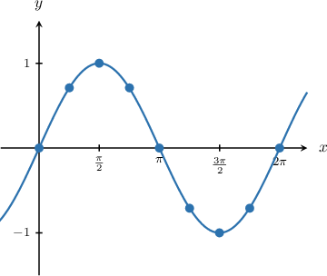
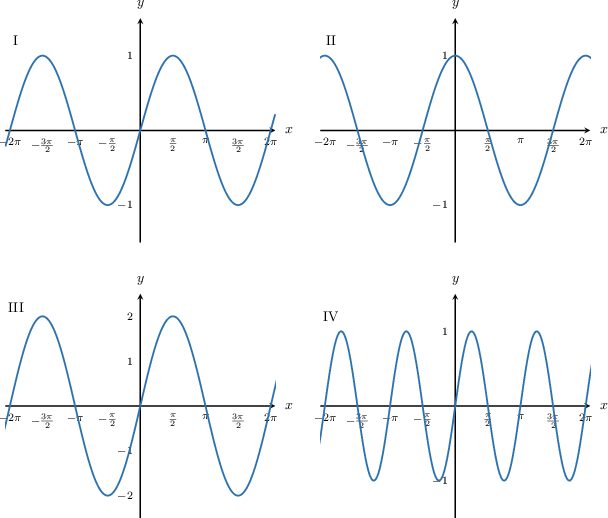
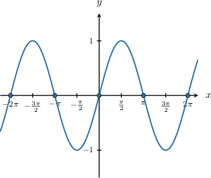
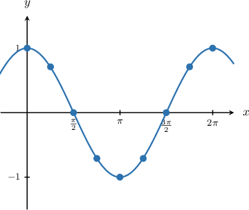
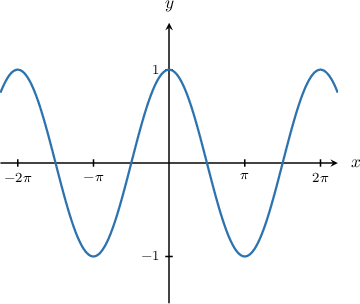
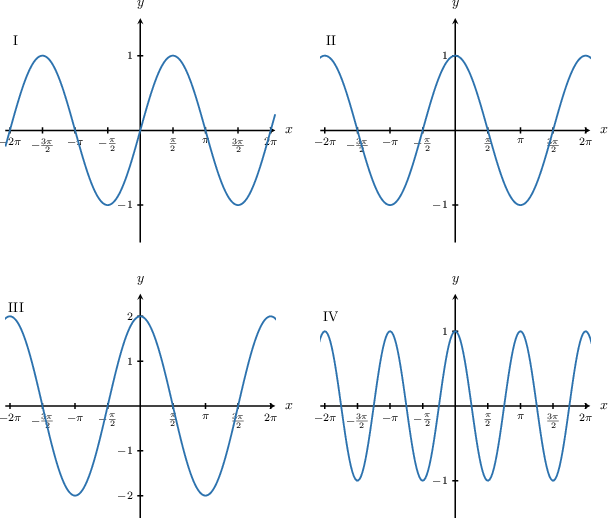
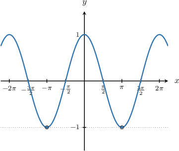

# Graphing Sine and Cosine

Source: https://www.mathacademy.com/topics/1491?courseId=134
Topic ID: 1491

## Prerequisites

- [The Range of a Function](../algebra-i/754-the-range-of-a-function.md)
- [Increasing and Decreasing Functions](../algebra-i/1628-increasing-and-decreasing-functions.md)
- [Further Extensions of the Special Trigonometric Ratios](../algebra-ii/1844-further-extensions-of-the-special-trigonometric-ratios.md)
- [The Roots of a Function](../algebra-i/2022-the-roots-of-a-function.md)
- [Periodic Functions](../algebra-ii/2148-periodic-functions.md)

## Lesson

### Introduction

Suppose we want to plot the graph of $y=\sin x,$ where $x$ is measured in radians.

First, let's create a table of values and include some of the values that we know:

Plotting these points, we get the following curve.

From the unit circle, we know that the function $y=\sin x$ repeats itself every $2\pi$ radians. So we can extend our plot using this periodicity property.

The key characteristics of the graph are:

- The domain of the function is $x\in(-\infty,\infty).$

- The range of the function is $y\in[-1,1].$

- The period of the function is $2\pi.$

- Its zeros occur at $x=0, \pm \pi, \pm 2\pi,\ldots.$

- Its maximum values occur at $\ldots,-\dfrac{3\pi}{2}, \dfrac{\pi}{2},\ldots$

- Its minimum values occur at $\ldots,-\dfrac{\pi}{2}, \dfrac{3\pi}{2},\ldots$

### Example: Plotting the Graph of the Sine Function

#### Question

Which of the following plots is the graph of $y = \sin x?$

#### Explanation

Let's recall some of the basic properties of $y=\sin{x}\mathbin{:}$

- The minimum value is $-1,$ and the maximum value is $1.$

- The period of the function is $2\pi.$

- Its zeros occur at $x=0, \pm \pi, \pm 2\pi,\ldots.$

- Its maximum values occur at $\ldots,-\dfrac{3\pi}{2}, \dfrac{\pi}{2},\ldots$

- Its minimum values occur at $\ldots,-\dfrac{\pi}{2}, \dfrac{3\pi}{2},\ldots$

Of the given plots, the only one that displays all of these properties is I.

### Example: Identifying Characteristics of the Sine Function

#### Question

Which of the following is **** a zero of $y=\sin{x}?$

$$

0, \quad -\dfrac{\pi}{2}, \quad 2\pi, \quad -\pi

$$

#### Explanation

Let's recall the graph of $y=\sin{x}.$

Note that:

- The zeros occur at $x=0, \pm \pi, \pm 2\pi,\ldots.$

Of the given values, the only one that is not a zero of the function is $-\dfrac{\pi}{2}.$

### Graphing the Cosine Function

Suppose that we wish to draw the graph of the function $y=\cos x,$ with $x$ in radians.

First, let's write up a table of values, and include some of the specific values of $\cos x$ that we know:

Now, plotting these points, we get the following graph:

From the unit circle, we know that $y=\cos x$ repeats every $2\pi$ radians. Repeating the graph using this periodicity property, we have:

Some key characteristics of the graph are:

- The domain of the function is $x \in (-\infty, \infty).$

- The range of the function is $y\in [-1,1].$

- The period of the function is $2\pi.$

- Its zeros occur at $x= \dots,\pm\dfrac{\pi}{2},\pm\dfrac{3\pi}{2},\dots$

- Its maximum values occur at $x=0,\pm2\pi, \pm4\pi,\dots$

- Its minimum values occur at $x=\pm\pi,\pm 3\pi,\dots$

### Example: Plotting the Graph of the Cosine Function

#### Question

Which of the following plots is the graph of $y = \cos x?$

#### Explanation

Let's recall some of the basic properties of $y=\cos{x}\mathbin{:}$

- The domain of the function is $x \in (-\infty, \infty).$

- The range of the function is $y\in [-1,1].$

- The period of the function is $2\pi.$

- Its zeroes occur at $x= \dots,\pm\dfrac{\pi}{2},\pm\dfrac{3\pi}{2},\dots$

- Its maximum values occur at $x=0,\pm2\pi, \pm4\pi,\dots$

- Its minimum values occur at $x=\pm\pi,\pm 3\pi,\dots$

Of the given functions, the only one that has all of these properties is II.

### Example: Identifying Characteristics of the Cosine Function

#### Question

Which of the following is a value of $x$ that minimizes the graph of $y=\cos{x}?$

$$

-2\pi , \quad 0, \quad \dfrac{\pi}2, \quad -\pi

$$

#### Explanation

Let's recall the graph of $y=\cos{x}\mathbin{.}$

From the graph, we see that the cosine function reaches its minimum value when $x=-\pi$ and $x=\pi.$

From the given options, the correct answer is $x=-\pi.$
