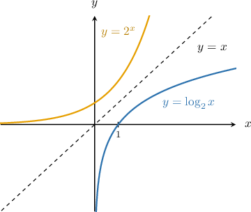
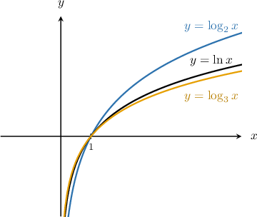
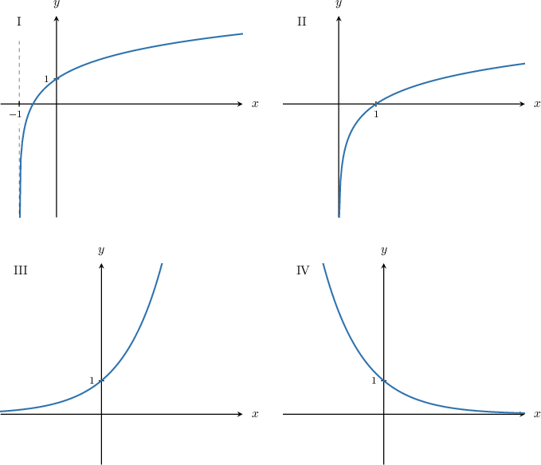
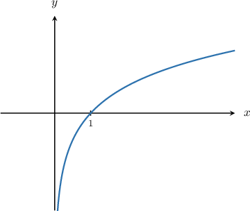
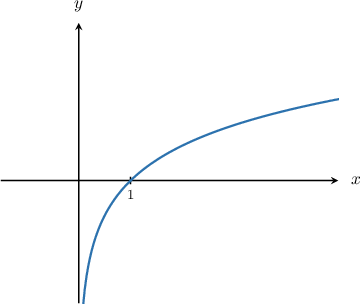
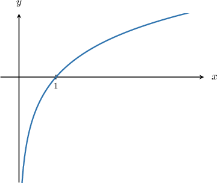

# Graphing Logarithmic Functions

Source: https://www.mathacademy.com/topics/1532?courseId=134
Topic ID: 1532

## Prerequisites

- [The Common Logarithm](../algebra-ii/726-the-common-logarithm.md)
- [The Natural Logarithm](../algebra-ii/818-the-natural-logarithm.md)
- [Graphing Exponential Growth Functions](../algebra-i/1530-graphing-exponential-growth-functions.md)
- [The Roots of a Function](../algebra-i/2022-the-roots-of-a-function.md)
- [Unbounded Behavior of Functions Near a Point](../algebra-ii/2046-unbounded-behavior-of-functions-near-a-point.md)
- [Domain and Range of Inverse Functions](../algebra-ii/3734-domain-and-range-of-inverse-functions.md)

## Lesson

### Introduction

To plot the graph of a logarithmic function, it helps to remember that the inverse of a logarithmic function is an exponential function. So, we can just plot the exponential function and reflect it over the line $y=x.$

For example, suppose that we wish to plot the graph of

$$

y=\log_2 x.

$$

The corresponding inverse function is $y=2^x,$ and since $y=2^x$ is a one-to-one function defined for all real $x,$ we can obtain the graph of $y=\log_2{x}$ by reflecting $y=2^x$ over the line $y=x.$ The result is shown below:

Here are some key points to note about $y=\log_2(x)\mathbin{:}$

- The domain is $x>0$, and the range is $-\infty < y < \infty.$

- The graph has the vertical asymptote $x=0.$

- The function is an increasing function.

- The graph passes through the point $(1,0).$

- For $x>1$, the graph is positive and grows very slowly as we increase $x.$ We say that $y\rightarrow \infty$ (slowly) as $x\rightarrow \infty.$

In general, for any base $n>1,$ the graph of $y=\log_n{x}$ always has the same shape, and all of the above points are valid. We can verify that this is true by inspecting some possible graphs shown below:

**Note:** The important points covered above also apply to two familiar logarithms.

- $y = \ln x = \log_e x$ is the natural logarithm. Since the base is $n=e>1,$ all of the important points covered above apply.

- $y = \log x = \log_{10} x$ is the logarithm with base $10.$ Since the base is $n=10>1,$ all the important points covered above apply.

### Example: Graphing Logarithmic Functions

#### Question

Which of the following plots is the graph of $y = \log (x)?$

#### Explanation

Let's recall some of the basic properties of $y=\log (x)\mathbin{:}$

- The graph passes through the point $(1,0).$

- For $x>1,$ the function is positive and grows very slowly as we increase $x.$ We say that $y\rightarrow \infty$ (slowly) as $x\rightarrow \infty.$

- The domain is $x>0$, and the range is $-\infty < y < \infty.$ The function is not defined at $x=0.$

- The function has the vertical asymptote $x=0.$

- The function is an increasing function.

Of the given plots, the only one that displays all of these properties is II. (For example, plots I, III, and IV all do not have a vertical asymptote $x=0.$)

### Example: Identifying the Domain and Range of a Logarithmic Function

#### Question

What are the domain and range of the function $y=\ln x?$

#### Explanation

Let's recall the graph of $y = \ln x.$

The domain of $y=\ln x$ is $x \in (0,\infty)$ and the range is $y \in (-\infty,\infty).$

### Example: Finding the Zeros and Asymptotes of a Logarithmic Function

#### Question

What is the vertical asymptote of $y=\log_{2} x?$

#### Explanation

Let's recall the graph of $y=\log_{2} x.$

From the graph, we see that the function $y=\log_{2} x$ has the vertical asymptote at $x=0.$

### Example: Identifying True Statements Regarding Logarithmic Functions

#### Question

Which of the following statements are true regarding the function $y=\ln(x)?$

1. $y\rightarrow-\infty$ as $x\rightarrow 0^+$

2. The curve passes through the point $(1,0)$

3. $y\rightarrow\infty$ as $x\rightarrow -\infty$

#### Explanation

First, let's plot the graph of $y=\ln (x).$

Now, let's consider each statement.

- Statement I is true. As $x$ approaches $0^+,$ $y$ decreases without bound.

- Statement II is true. Substituting $x=1$ into the equation of the curve gives a result of $0\mathbin{:}$

- Statement III is false. The function is not defined for $x<0,$ so the function is not defined as $x \to -\infty.$

In conclusion, only statements I and II are true.
