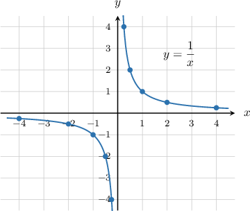
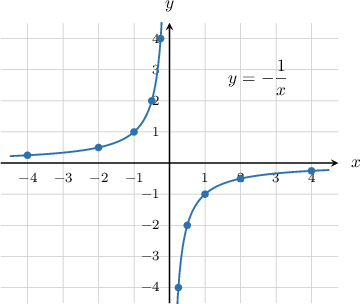
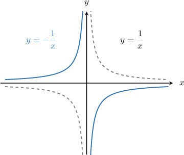
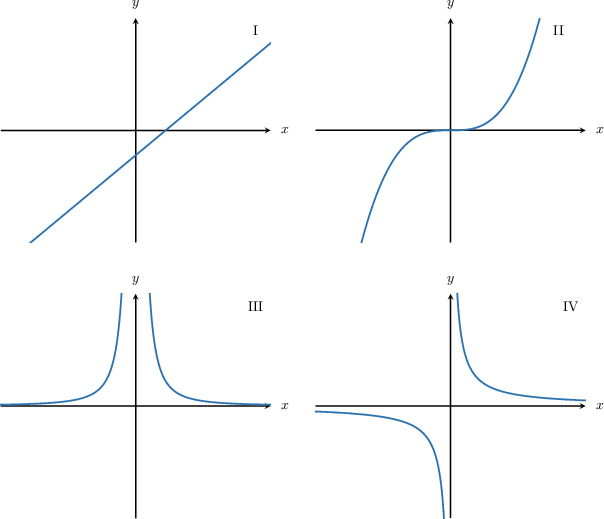
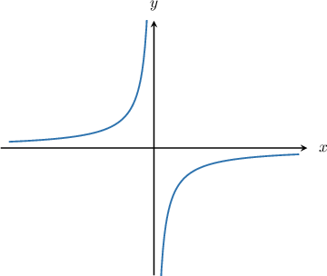
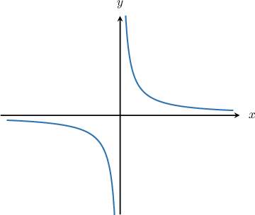

# Graphing Reciprocal Functions

Source: https://www.mathacademy.com/topics/2033?courseId=134
Topic ID: 2033

## Prerequisites

- [Unbounded Behavior of Functions Near a Point](../algebra-ii/2046-unbounded-behavior-of-functions-near-a-point.md)
- [The Range of a Function: Advanced Cases](../algebra-i/3728-the-range-of-a-function-advanced-cases.md)

## Lesson

### Introduction

To plot the graph of $y=\dfrac{1}{x},$ we first create a table of values.

Then, we draw the graph by plotting the corresponding $(x,y)$ pairs and connecting them.

This type of curve is called a **rectangular hyperbola.**

### The Graph of a Negative Reciprocal Curve

Let's now plot the graph of $y=-\dfrac{1}{x}.$ Once again, we first create a table of values.

Now, we can plot the graph:

Notice that $y=-\dfrac{1}{x}$ is the reflection of the curve $y=\dfrac{1}{x}$ over the $x$-axis.

### Example: Identifying a Graph of a Reciprocal Function

#### Question

Which of the following plots is the graph of $y=\dfrac{1}{x}?$

#### Explanation

The graph of $y=\dfrac1x$ is shown below.

Therefore, the correct answer is "IV only."

### Properties of the Reciprocal Curve

Let's sketch the curve $y = \dfrac1x.$

There are some key points to note about this curve:

- As $x \to 0^+,$ the graph approaches $\infty.$

- As $x \to 0^-,$ the graph approaches $-\infty.$

- The graph has the *vertical asymptote* $x=0.$

- As $x\to\infty$ or $x\to-\infty,$ the graph approaches the *horizontal asymptote* $y=0.$

- The domain is $x\in(-\infty,0)\cup (0,\infty),$ and the range is $y\in(-\infty,0)\cup (0,\infty).$

- The function is a decreasing function.

### Properties of the Negative Reciprocal Curve

Now let's remind ourselves of the graph of $y = -\dfrac1x.$

There are some key points to note about this curve:

- As $x\to 0^+,$ the graph approaches $-\infty.$

- As $x \to 0^-,$ the graph approaches $\infty.$

- The graph has the *vertical asymptote* $x=0.$

- As $x\to\infty$ or $x\to-\infty,$ the graph approaches the *horizontal asymptote* $y=0.$

- The domain is $x\in(-\infty,0)\cup (0,\infty),$ and the range is $y\in(-\infty,0)\cup (0,\infty).$

- The function is an increasing function.

### Example: Identifying Properties of Reciprocal Curves

#### Question

For the curve $y=\dfrac{1}{x},$ which of the following statements are true?

1. The graph passes through the point $\left(4,\dfrac{1}{2}\right).$

2. The range of the function is $y \in (-\infty,0)\cup (0,\infty).$

3. $y \rightarrow -\infty$ as $x\rightarrow -\infty.$

#### Explanation

First, let's sketch the graph of $y=\dfrac{1}{x}.$

Now, we analyze each statement in turn.

- Statement I is false. When $x=4,$ we get $y=\dfrac{1}{4},$ so the graph of $y=\dfrac{1}{x}$ passes through the point $\left(4,\dfrac{1}{4}\right).$

- Statement II is true. The curve attains every real number except $0.$

- Statement III is false. From the graph, we see that $y\rightarrow 0$ as $x\rightarrow -\infty.$

In conclusion, the correct answer is "II only."
