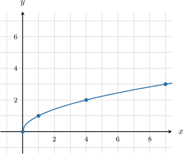
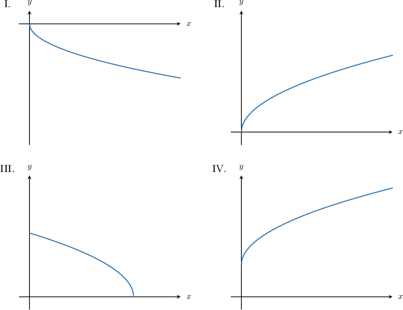
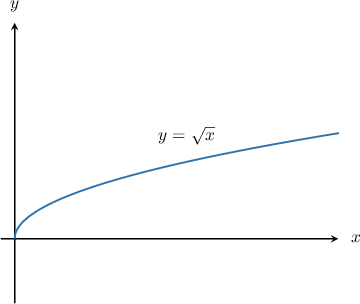

# Graphing the Square Root Function

Source: https://www.mathacademy.com/topics/2038?courseId=134
Topic ID: 2038

## Prerequisites

- [Increasing and Decreasing Functions](../algebra-i/1628-increasing-and-decreasing-functions.md)
- [End Behavior of Functions](../algebra-i/2048-end-behavior-of-functions.md)

## Lesson

### Introduction

Suppose we wish to plot the graph of $f(x)=\sqrt{x}.$ First, we create a table of values.

We do not consider negative values for the input because the square root of a negative number is not a real number.

Now, we can plot the graph:

Some key points to note:

- The graph passes through the points $(1,1)$ and $(0,0).$

- The domain is $x\in [0,\infty).$

- The range is $y\in [0,\infty).$

- The function is increasing over its entire domain.

- As $x \rightarrow \infty,$ we have $y\rightarrow \infty,$ though the function increases more slowly as $x$ gets large.

### Example: Identifying the Graph of the Square Root Function

#### Question

Which of the following could be the graph of $y = \sqrt{x}$?

#### Explanation

Let's recall some of the basic properties of $y=\sqrt x{:}$

- The point $(0,0)$ lies on the graph.

- Its domain is $x\in [0,\infty).$

- Its range is $y\in [0,\infty).$

- The function is increasing over its entire domain.

- As $x \rightarrow \infty,$ we have $y\rightarrow \infty,$ though the function increases more slowly as $x$ gets large.

Of the given options, only graph II has all of the above properties.

Therefore, the correct answer is only II.

### Example: Identifying Properties of the Square Root Function

#### Question

Which of the following statements are true regarding the function $f(x) =\sqrt{x}?$

1. $f(x)$ is always positive.

2. The range of $f(x)$ is $(-\infty,0)\cup (0,\infty).$

3. $f(x) \rightarrow \infty$ as $x \rightarrow \infty$

#### Explanation

Let's start by recalling the graph of $y=\sqrt x.$

Now, let's examine each statement in turn.

- Statement I is false since $f(0)=0 \not\gt 0.$

- Statement II is false since the range of $f(x)$ is $[0,\infty).$

- Statement III is true. Indeed, $f(x) \rightarrow \infty$ as $x \rightarrow \infty.$
