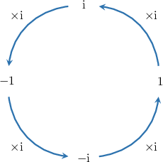

# The Cyclic Property of the Imaginary Unit

Source: https://www.mathacademy.com/topics/32?courseId=134
Topic ID: 32

## Prerequisites

- [Imaginary Numbers](../algebra-ii/14-imaginary-numbers.md)
- [The Power Rule for Exponents](../grade-8/1224-the-power-rule-for-exponents.md)

## Lesson

### Introduction

Let's compute the first few powers of $\textrm{i},$ where $\textrm{i} = \sqrt{-1}\mathbin{:}$

$$

\begin{aligned}i^{0} & =1 \\ i^{1} & =i \\ i^{2} & =−1 \\ i^{3} & =i^{2}⋅i=(−1)⋅i=−i \\ i^{4} & =i^{2}⋅i^{2}=(−1)⋅(−1)=1\end{aligned}

$$

We can use these results to evaluate expressions containing powers of $\textrm{i}.$ Let's take a look at some examples.

### Example: Raising i to a Small Positive Integer Power

#### Question

What is the value of $4\textrm{i}^3?$

#### Explanation

Let's recall the first few powers of $\textrm{i},$ where $\textrm{i} = \sqrt{-1}\mathbin{:}$

$$

\begin{aligned}i^{0} & =1 \\ i^{1} & =i \\ i^{2} & =−1 \\ i^{3} & =i^{2}⋅i=(−1)⋅i=−i \\ i^{4} & =i^{2}⋅i^{2}=(−1)⋅(−1)=1\end{aligned}

$$

Therefore,

$$

\begin{aligned}4i^{3} & =4⋅(−i)=−4i.\end{aligned}

$$

### The Cyclic Nature of Powers of i

Let's remind ourselves of the first few powers of $\textrm{i}\mathbin{:}$

$$

\begin{aligned}i^{1} & =i \\ i^{2} & =−1 \\ i^{3} & =−i \\ i^{4} & =1\end{aligned}

$$

At the fourth power, we return to the value of $1,$ which can also be written as $\textrm{i}^0 = 1.$ This means that if we continue to increase the powers, we would cycle through the same four values once again, as shown below.

So, for $\textrm{i}^5$ through $\textrm{i}^8,$ the exact same pattern repeats. Remembering that $\textrm{i}^4 = 1,$ we have

$$

\begin{aligned} \textrm{i}^5&=\textrm{i}^4 \cdot \textrm{i} &= \textrm{i}\\\[5pt] \textrm{i}^6&=\textrm{i}^4 \cdot \textrm{i}^2 &=-1\\\[5pt] \textrm{i}^7&=\textrm{i}^4 \cdot \textrm{i}^3 &= -\textrm{i} \\\[5pt] \textrm{i}^8&=\textrm{i}^4 \cdot \textrm{i}^4 &= 1 . \end{aligned}

$$

Similarly, for $\textrm{i}^9$ through to $\textrm{i}^{12},$ the pattern repeats again:

$$

\begin{aligned} \textrm{i}^9&=(\textrm{i}^4)^2 \cdot \textrm{i} &= \textrm{i}\\\[5pt] \textrm{i}^{10}&=(\textrm{i}^4)^2 \cdot \textrm{i}^2 &=-1\\\[5pt] \textrm{i}^{11}&=(\textrm{i}^4)^2 \cdot \textrm{i}^3 &= -\textrm{i} \\\[5pt] \textrm{i}^{12}&=(\textrm{i}^4)^2 \cdot \textrm{i}^4 &= 1 \end{aligned}

$$

Therefore, to simplify a higher integer power of $\textrm{i},$ we *divide the power by $4$ and raise $\textrm{i}$ to the remainder*.

Let's see this idea in action.

### Example: Raising i to a Positive Integer Power Using the Cyclic Property

#### Question

Simplify $\textrm{i}^{15}.$

#### Explanation

To find the value of $\textrm{i}$ to some positive integer power $n$, we divide $n$ by $4$ and raise $\textrm{i}$ to the remainder.

In our case, we have $n=15.$ Dividing the power by $4,$ we get

$$

15\div 4 = 3\,\textrm{R} \color{blue}{3}.

$$

So the remainder is $\color{blue}3.$ Therefore,

$$

\textrm{i}^{15} = \textrm{i}^{\color{blue}{3}} = -\textrm{i}.

$$

### Example: Evaluating an Expression Involving Powers of i Using the Laws of Exponents

#### Question

If $a = \textrm{i}^9$ and $b = \textrm{i}^{7},$ then $ab =$

#### Explanation

Using the addition law for exponents, we have

$$

ab =\textrm{i}^9\cdot\textrm{i}^7 = \textrm{i}^{9+7} = \textrm{i}^{16}.

$$

To find the value of $\textrm{i}$ raised to some positive integer power $n,$ we divide $n$ by $4$ and raise $\textrm{i}$ to the remainder.

In our case, we have $n=16.$ Dividing the power by $4,$ we get

$$

16\div 4 = 4\,\textrm{R} \color{blue}{0}.

$$

So the remainder is $\color{blue}0.$ Therefore,

$$

\textrm{i}^{16} = \textrm{i}^{\color{blue}{0}} =1.

$$

### Example: Raising i to a Negative Power

#### Question

Find the value of $\textrm{i}^{-2}.$

#### Explanation

First, using the laws of exponents, we can write

$$

\textrm{i}^{-2}=\dfrac{1}{\textrm{i}^2}.

$$

We now recall that $\textrm{i}^2 = -1.$ Therefore,

$$

\dfrac{1}{\textrm{i}^2} = \dfrac{1}{(-1)} = -1.

$$
