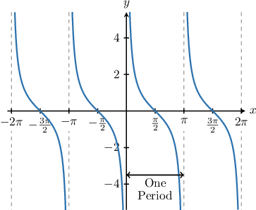
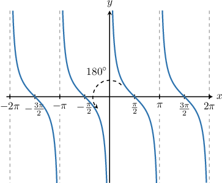
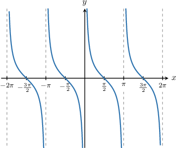

# Describing Properties of the Cotangent Function

Source: https://www.mathacademy.com/topics/3566?courseId=134
Topic ID: 3566

## Prerequisites

- [Describing Properties of the Tangent Function](../algebra-ii/3558-describing-properties-of-the-tangent-function.md)

## Lesson

### Introduction

Recall the graph of the function $y=\cot x\mathbin{:}$

Similarly to the tangent, the cotangent has infinitely many zeros, and the function has an infinite number of vertical asymptotes. Let's construct general expressions for these, assuming that $n$ represents an integer.

**The Zeros of the Function**

From the graph, the function has a zero when $x=\dfrac\pi 2,$ and the function is periodic with period $\pi.$ Therefore, a general expression for the zeros is

$$

x = \dfrac{\pi}{2}+ n\pi.

$$

**The Vertical Asymptotes of the Function**

From the graph, we see that the vertical asymptotes of the function occur at $x=0,\pm\pi,\pm2\pi,\dots.$

Therefore, a general equation for the asymptotes is

$$

x = n\pi.

$$

### Example: Describing Properties of the Cotangent Function

#### Question

Which of the following statements are true regarding the function $y=\cot x?$

1. The function has zeros at $x = \pi n,$ where $n$ is an integer.

2. The function has asymptotes at $x = \pm\dfrac \pi 2, \pm \dfrac {3 \pi} 2,\dots$

3. The range of $y = \cot x$ is $(-\infty,-1] \cup [1,\infty).$

#### Explanation

Let's plot the graph of $y=\cot x.$

Now, let's go through each statement.

- Statement I is false. The zeros of the function occur at the values $x=\dfrac{\pi}{2}+n\pi.$

- Statement II is false. The vertical asymptotes of the function are at integer multiples of $\pi$, i.e., $x=n\pi.$

- Statement III is false. The range of $y=\cot x$ is $(-\infty, \infty).$

In conclusion, none of the statements are true.

### The Periodicity Property of the Cotangent Function

Let's inspect the graph of the function $y=\cot x$ one more time.

We've seen that the function $y=\cot x$ is periodic, where the period is $\pi.$

The periodicity of $y=\cot x$ means that $\cot\left(x+n\pi\right) = \cot\left(x\right)$ for any real number $x$ and for any integer $n.$

### Example: Utilizing the Periodicity Property of the Cotangent Function

#### Question

If $\cot x = 1$ for some $x,$ then find the value of $\cot(x+5\pi).$

#### Explanation

The period of $y = \cot x$ is $\pi.$ Therefore, for any integer $n,$ we have

$$

\cot{x} = \cot{(x+n\pi)} .

$$

Substituting $n=5$ into the above gives

$$

\begin{aligned}cot⁡𝑥 & =cot⁡(𝑥+5⋅𝜋) \\ & =cot⁡(𝑥+5𝜋).\end{aligned}

$$

Therefore, if $\cot{x} = 1,$ then $\cot{(x+5\pi)} = 1.$

### The Oddness Property of the Cotangent Function

Recall that a function $f(x)$ is *odd* if it satisfies the property

$$

f(-x) = -f(x).

$$

As it turns out, cotangent is an odd function! So, for any value of $x,$ we have

$$

\cot(-x) = -\cot(x).

$$

Odd functions always have rotational symmetry of order $2$ about the origin. This is indeed true of the cotangent function, as we can see from the diagram below.

We can use the oddness property of cotangent in conjunction with its periodicity property to simplify trigonometric expressions. Let's see an example.

### Example: Utilizing the Oddness Property of the Cotangent Function

#### Question

If $\cot x = 2,$ then what is the value of $\cot (-x+7\pi)?$

#### Explanation

First, let's recall the graph of $y=\cot{x}.$

From the graph, we note the following:

- The period of $\cot{x}$ is $\pi.$

- Our graph has rotational symmetry of order $2$ about the origin. This means that $\cot{x}$ is an ** function, and we have

Let's now evaluate our expression:

- Firstly, using the periodicity of $\cot{x},$ we have

- Secondly, using the oddness of $\cot{x},$ we have

Therefore, $\cot (-x+7\pi)=-2.$
