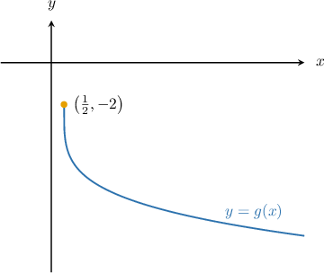
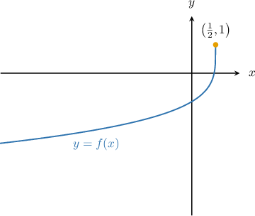

# The Range of a Transformed Radical Function

Source: https://www.mathacademy.com/topics/3741?courseId=134
Topic ID: 3741

## Prerequisites

- [Graphing the Cube Root Function](../algebra-ii/454-graphing-the-cube-root-function.md)
- [Properties of Transformed Square Root Functions](../algebra-ii/1875-properties-of-transformed-square-root-functions.md)

## Lesson

### Introduction

The range of a radical function $f(x)=\sqrt[n]{x}$ depends on whether the index $n$ of the radical is even or odd.

Let's start with the odd case first. What is the range of

$$

f(x) = -2\sqrt[3]{3x-2}+2?

$$

First, recall that the range of $y = \sqrt[3] x$ is $y \in (-\infty,\infty).$

Transformations do not change this interval. Therefore, the range of $f(x)$ is $y \in (-\infty,\infty).$

### Example: Finding the Range of a Transformed Radical Function With an Odd Index

#### Question

What is the range of $f(x) = -3\sqrt[3]{5-2x}+6?$

#### Explanation

The range of $y = \sqrt[3] x$ is $y \in (-\infty,\infty).$

Transformations do not change this interval. Therefore, the range of $f(x)$ is $y \in (-\infty,\infty).$

### The Range of a Transformed Radical Function With an Even Index

Let's now focus on the even case. What is the range of

$$

g(x) = -3\sqrt[4]{2x-1}-2?

$$

The range of $\sqrt[4] x$ is

$$

\sqrt[4] x \ge 0.

$$

Now, let's apply transformations to the inequality above to turn the left-hand side into $g(x).$

First, remember that horizontal shifts and stretches do not affect the range. Therefore,

$$

\sqrt[4]{2x-1} \ge 0.

$$

Multiplying the above inequality by $-3$ and then subtracting $2,$ we get

$$

\begin{aligned}\sqrt[√2𝑥−1]{4} & ≥0 \\ −3\sqrt[√2𝑥−1]{4} & ≤0 \\ −3\sqrt[√2𝑥−1]{4}−2 & ≤−2 \\ 𝑔(𝑥) & ≤−2.\end{aligned}

$$

Therefore, the range of the given function is $g(x) \in (-\infty,-2].$

We can also see that this is true from the graph of the function. The graph of $y=g(x)$ is shown below.

### Example: Finding the Range of a Transformed Radical Function With an Even Index

#### Question

What is the range of $f(x) = -2\sqrt[4]{1-2x}+1?$

#### Explanation

The range of $\sqrt[4] x$ is

$$

\sqrt[4] x \ge 0.

$$

Horizontal shifts and stretches do not affect the range. Therefore,

$$

\sqrt[4]{1-2x} \ge 0.

$$

Multiplying the above inequality by $-2$ and then adding $1,$ we get

$$

\begin{aligned}\sqrt[√1−2𝑥]{4} & ≥0 \\ −2\sqrt[√1−2𝑥]{4} & ≤0 \\ −2\sqrt[√1−2𝑥]{4}+1 & ≤1 \\ 𝑓(𝑥) & ≤1.\end{aligned}

$$

Therefore, the range of the given function is $f(x) \in (-\infty,1].$

We can also see that this is true from the graph of the function. The graph of $y=f(x)$ is shown below.

