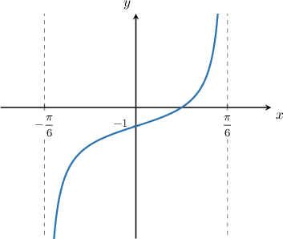
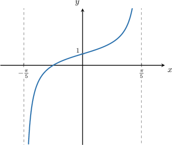
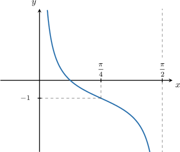
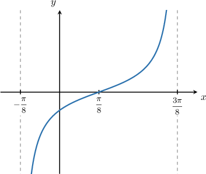
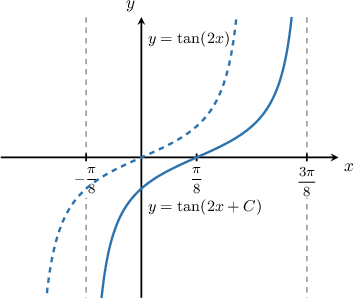

# Combining Graph Transformations of Tangent and Cotangent

Source: https://www.mathacademy.com/topics/3850?courseId=134
Topic ID: 3850

## Prerequisites

- [Graph Transformations of Tangent and Cotangent](../algebra-ii/654-graph-transformations-of-tangent-and-cotangent.md)

## Lesson

### Introduction

We can apply combinations of vertical and horizontal shifts and stretches to tangent and cotangent curves.

For example, let's consider the function

$$

y = \tan(Bx) + D,

$$

where $B$ and $D$ are constants. The graph of this function is shown below.

Let's compute the values of $B$ and $D$ using our knowledge of graph transformations.

Firstly, recall that we can calculate the period $T$ of a tangent or cotangent function by considering the difference in the $x$-values between two consecutive asymptotes. Therefore,

$$

T = \dfrac{\pi}{6} - \left(-\dfrac{\pi}{6}\right) = \dfrac{\pi}{3}.

$$

The formula for the period $T$ of the function $y = A\tan(Bx + C) + D$ is given by

$$

T = \dfrac{\pi}{B}.

$$

By applying this formula, we can calculate the value of $B\mathbin{:}$

$$

\dfrac{\pi}{3} = \dfrac{\pi}{B} \quad\Longrightarrow \quad B = \dfrac{\pi}{\left(\dfrac{\pi}{3}\right)} = 3

$$

The parameter $D$ represents the vertical shift of the tangent function. The graph shows that the function has been translated by $1$ unit down. Hence, $D = -1.$

Therefore, the equation of our curve is

$$

y = \tan(3x) - 1.

$$

### Example: Identifying the Horizontal Stretch and Vertical Shift of a Transformed Tangent Curve

#### Question

The graph above shows the function $y = \tan(Bx) + D,$ where $B$ and $D$ are constants. What is $B + D?$

#### Explanation

The period $T$ of the function is

$$

T = \dfrac{\pi}{5} - \left(-\dfrac{\pi}{5}\right) = \dfrac{2\pi}{5}.

$$

The formula for the period $T$ of the function $y = A\tan(Bx + C) + D$ is given by

$$

T = \dfrac{\pi}{B}.

$$

Applying the formula of the period, we get

$$

\dfrac{2\pi}{5} = \dfrac{\pi}{B} \quad\Longrightarrow \quad B = \dfrac{\pi}{\left(\dfrac{2\pi}{5}\right)} = \dfrac{5}{2}.

$$

The parameter $D$ represents the vertical shift of the tangent function. The graph shows that the function has been translated by $1$ unit up. Hence, $D = 1.$

Therefore,

$$

B + D =\dfrac{5}{2} +1 = \dfrac{7}{2}.

$$

Finally, the equation of the curve is

$$

y = \tan\left(\frac{5x}{2} \right) +1.

$$

### Example: Identifying the Horizontal Stretch and Vertical Shift of a Transformed Cotangent Curve

#### Question

The graph below shows the function $y=\cot{(Bx)}+D,$ where $B$ and $D$ are constants. What are the values of $B$ and $D?$

#### Explanation

The period $T$ of the function is $\dfrac \pi 2.$

The formula for the period $T$ of the function $y=A\cot(Bx + C) + D$ is given by

$$

T = \dfrac{\pi}{B}.

$$

Applying the formula of the period, we get

$$

\dfrac \pi 2 = \dfrac{\pi}{B}\quad\Longrightarrow\quad B = \dfrac{\pi}{\left(\dfrac \pi 2\right)} = 2.

$$

The parameter $D$ represents the vertical shift of the tangent function. We see that the function has been translated by $1$ unit down. Therefore, $D=-1.$

So, the final equation of the curve is

$$

y=\cot\left(2x\right)-1.

$$

### Example: Identifying the Horizontal Shift of a Horizontally Stretched Tangent or Cotangent Curve

#### Question

The graph above shows the function where is a constant. Given that what is the value of

#### Explanation

The parameter represents a horizontal shift of the function.

First, we rewrite the function by factoring the horizontal stretch factor, as follows:

The factor indicates that the graph of is a horizontal translation of Comparing the two graphs below allows us to determine the amount of this shift.

From the diagram, we see that our curve has been obtained by shifting by units to the right. Therefore,

Since and is in this interval, the value of is.
