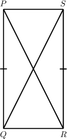
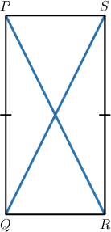
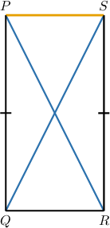
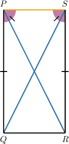
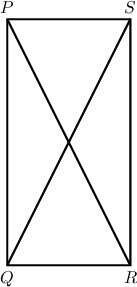
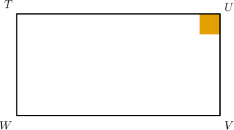
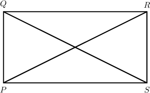
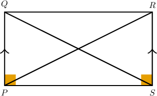

# Proving Criteria for Parallelograms and Rectangles

Source: https://www.mathacademy.com/topics/5169?courseId=134
Topic ID: 5169

## Prerequisites

- [Proving Properties of Parallelograms](../geometry/1398-proving-properties-of-parallelograms.md)

## Lesson

### Introduction

In this lesson, we'll learn how to prove theorems relating parallelograms and rectangles.

Let's begin by restating the definition of a parallelogram.

*A parallelogram is a quadrilateral where the opposite sides are parallel.*

A rectangle is simply a special type of parallelogram.

*A rectangle is a parallelogram containing four right angles.*

Let's now consider our first theorem.

### Proving That Parallelograms With Congruent Diagonals are Rectangles

The first theorem we'll consider is the following:

*If a parallelogram has congruent diagonals, then it's a rectangle.*

To prove this theorem, consider the diagram below, where $PQRS$ is a parallelogram and $\overline{QS} \cong \overline{PR}.$

We wish to prove the following statement:

$\angle{QPS}$ is a right angle

As we'll see shortly, this is enough to conclude that $PQRS$ is a rectangle.

First, let's outline our strategy for this proof:

- First, we want to show that $\triangle QPS$ and $\triangle RSP$ are congruent using the SSS congruence criterion.

- Next, we'll CPCTC to deduce that $\angle QPS \cong \angle RSP.$

- Finally, $\angle QPS$ and $\angle RSP$ are also supplementary since $PQRS$ is a parallelogram. This gives us enough information to deduce that $\angle QPS$ must be a right angle.

Following this strategy, we complete our proof as follows:

- **Step 1**: We are *given* that $PQRS$ is a parallelogram.

- **Step 2**: Since $PQRS$ is a parallelogram, *its opposite sides are congruent*. Therefore, we have

- **Step 3**: We are *given* that $\overline{QS} \cong \overline{PR}.$

- **Step 4**: The *reflexive property of congruence* states that every segment is congruent to itself. Therefore, $\overline{PS} \cong \overline{PS}.$

- **Step 5**: In steps 2, 3, and 4, we showed that all three sides of $\triangle{QPS}$ are congruent to the corresponding sides of $\triangle{RSP}.$ Therefore, by the *SSS criterion*.

- **Step 6**: Since $\triangle{QPS} \cong \triangle{RSP},$ we have by *CPCTC*.

- **Step 7**: By *the definition of congruent angles,* we obtain

- **Step 8**: Since *adjacent angles of a parallelogram are supplementary,* we have that $\angle{QPS}$ and $\angle{RSP}$ are supplementary.

- **Step 9**: Since $\angle{QPS}$ and $\angle{RSP}$ are supplementary, by the *definition of supplementary angles,* we have

- **Step 10**: *Substituting* the expression from step 7 into the expression from step 9, we get

- **Step 11**: We can solve for $m\angle{QPS}$ using *algebra* as follows:

- **Step 12**: Finally, by the *definition of a right angle*, we conclude that $\angle{QPS}$ is a right angle, as required.

Let's now state our proof using a two-column format.

### Stating the Full Proof Using the Two-Column Format

The table below shows the proof that parallelograms with congruent diagonals are rectangles in a two-column format.

### A Parallelogram Containing a Right Angle Is a Rectangle

The last proof showed that a parallelogram with congruent diagonals must contain a right angle. As it turns out, this is enough to conclude that the parallelogram is a rectangle:

*If a parallelogram contains a right angle, then it's a rectangle.*

Let's discuss a strategy for proving this result.

- **Step 1**: We're given a parallelogram with a right angle.

- **Step 2**: Since our quadrilateral is a parallelogram, the opposite angles are congruent, which means our parallelogram must contain two right angles:

- **Step 3**: Since adjacent angles in a parallelogram are supplementary, we can use some algebra to conclude that the remaining two angles must be right, too.

Let's now look at a formal proof of this result.

### Example: Constructing Partial Proofs of Parallelogram and Rectangle Criteria

#### Question

In the diagram above, $TUVW$ is a parallelogram, and $\angle{U}$ is a right angle.

Consider the following statement:

**

The table below provides proof of the statement. Complete the proof by filling in the missing entries.

#### Explanation

The correct proof is shown below.

Let's examine the rows of the table with missing parts in turn.

- Consider row 3. Note that $\angle{W}$ and $\angle{U}$ are opposite angles of a parallelogram. In any parallelogram, the opposite angles are congruent. Therefore,

- Consider row 6. Note that $\angle{U}$ and $\angle{V}$ are adjacent angles of a parallelogram. In any parallelogram, the adjacent angles are supplementary. Therefore, $\angle{U}$ and $\angle{V}$ are supplementary.

- Consider row 7. From row 6, $\angle{U}$ and $\angle{V}$ are supplementary. Therefore, by the definition of supplementary angles,

### Example: Constructing Complete Proofs of Parallelogram and Rectangle Criteria

#### Question

In the diagram above, is a parallelogram and

Consider the following statement:

**

The table below gives the proof of the statement. Fill in the blanks and thus complete the proof.

#### Explanation

The correct proof is shown below.

Let's examine each row in turn.

1. We are ** that is a parallelogram.

2. We are **

3. The ** states that every segment is congruent to itself. Therefore,

4. Notice that and are opposite sides of a parallelogram. In any parallelogram, the **. Therefore,

5. From rows 2, 3, and 4, we have Therefore, by the SSS congruence criterion,

6. Therefore, by CPCTC,

7. Therefore, by the definition of congruent angles, we get

8. Notice that and are adjacent angles of a parallelogram. In any parallelogram, the adjacent angles are supplementary. Therefore, and are supplementary.

9. Therefore, by the definition of supplementary angles, we have

10. Substituting the expression from row 7 into the expression in row 9, we get

11. Using algebra (solving for), we obtain

12. Therefore, by the definition of a right angle, we get that is a right angle.
