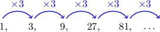
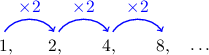
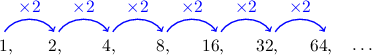

# Introduction to Geometric Sequences

Source: https://www.mathacademy.com/topics/679?courseId=134
Topic ID: 679

## Prerequisites

- [Fractions of Fractions](../grade-7/323-fractions-of-fractions.md)
- [Solving Rational Equations Using Cross-Multiplication](../algebra-i/698-solving-rational-equations-using-cross-multiplication.md)
- [Introduction to Sequences](../algebra-i/2271-introduction-to-sequences.md)

## Lesson

### Introduction

Consider the following sequence:

$$

1,\quad\:\: 3,\quad\:\: 9,\quad\:\: 27,\quad\:\: 81,\quad\:\: \ldots

$$

Notice that each term is ${\color{blue}3}$ times the previous term:

A sequence like the one above, where each term is found by multiplying the previous term by a fixed constant, is called a **geometric sequence**.

This fixed constant is called the **common ratio**, and is denoted by $r.$ In this particular case, the common ratio is $r={\color{blue}3}.$

### Example: Computing the Common Ratio

#### Question

Find the common ratio of the following geometric sequence.

$$

90, \: -30, \: 10, \: -\dfrac{10}{3}, \: \ldots

$$

#### Explanation

The common ratio $r$ of a geometric sequence is the constant we multiply by to get to the next term. In other words, it is the ratio of consecutive terms.

Therefore, the common ratio for our sequence is

$$

r = \dfrac{a_2}{a_1} = \dfrac{(-30)}{90} = -\dfrac{1}{3}.

$$

### Example: Finding a Particular Term

#### Question

Find the $7$th term of the following geometric sequence.

$$

1, \: 2, \: 4, \: 8, \: \ldots

$$

#### Explanation

Notice that the sequence is geometric, with a common ratio of

$$

r=\dfrac{2}{1}=2.

$$

So, we can get each term by multiplying the previous term by $2.$

Continuing to list terms of the sequence until we get to the $7$th term, we obtain the following:

Therefore, the $7$th term is $64.$

### Example: Solving for a Variable Using the Common Ratio

#### Question

Given that $x$, $3x$, $36$ are the first three terms of a geometric sequence, find $x.$

#### Explanation

The first three terms are as follows:

$$

\begin{aligned}𝑎_{1}=𝑥,\,𝑎_{2}=3𝑥,\,𝑎_{3}=36.\end{aligned}

$$

The common ratio of the first two terms is

$$

\begin{aligned}𝑟=\frac{𝑎_{2}}{𝑎_{1}}=\frac{3𝑥}{𝑥}=3.\end{aligned}

$$

On the other hand, the common ratio of the second and third terms is

$$

\begin{aligned}𝑟=\frac{𝑎_{3}}{𝑎_{2}}=\frac{36}{3𝑥}=\frac{12}{𝑥}.\end{aligned}

$$

So, by equating the values for $r$ and solving for $x,$ we conclude that

$$

\begin{aligned}3 & =\frac{12}{𝑥} \\ 3𝑥 & =12 \\ 𝑥 & =4.\end{aligned}

$$

### Example: Identifying Geometric Sequences

#### Question

Which of the sequences below are geometric sequences?

1. $2, \: 4, \: 8, \: 16, \: \ldots$

2. $1, \: -\dfrac{1}{3}, \: \dfrac{1}{9}, \: -\dfrac{1}{27}, \: \ldots$

3. $4, \: 8, \: 12, \: 16, \: \ldots$

#### Explanation

A sequence is geometric if there is a common ratio between its terms. Let's check each sequence in turn.

- Sequence I is geometric. For each pair of consecutive terms, the common ratio is the same:

- Sequence II is also geometric. Again, for each pair of consecutive terms, the common ratio is the same:

- Sequence III is not geometric because not every pair of consecutive terms has the same ratio. To see this, we only need to go up to the third term:

In conclusion, only sequences I and II could be geometric sequences.
