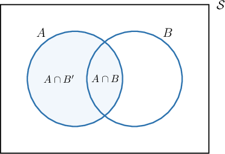

# The Law of Total Probability

Source: https://www.mathacademy.com/topics/773?courseId=134
Topic ID: 773

## Prerequisites

- [The Multiplication Law for Conditional Probability](../geometry/715-the-multiplication-law-for-conditional-probability.md)

## Lesson

### Introduction

When computing probabilities, we often have to put bits and pieces of information together to construct a desired probability.

The **law of total probability** provides a rule for doing this. It states that

$$

P(A) = P(A\cap B) + P(A\cap B').

$$

We can visualize the law of total probability using the following Venn diagram:

As a simple example, suppose that we have a crate of fruit in which $\dfrac{1}{10}$ of the fruit are apricots that are ripe and $\dfrac{1}{8}$ of the fruit are apricots that are not ripe. If $A$ represents the event that a randomly selected fruit is an apricot and $B$ represents the event that the randomly selected fruit is ripe, then we have

$$

P(A \cap B) = \dfrac{1}{10}, \qquad P(A \cap B') = \dfrac{1}{8}.

$$

To find the probability of selecting an apricot from the crate, we add up the probability of selecting an apricot that is ripe and the probability of selecting an apricot that is not ripe:

$$

\begin{aligned}𝑃(𝐴) & =𝑃(𝐴∩𝐵)+𝑃(𝐴∩𝐵^{′}) \\ & =\frac{1}{10}+\frac{1}{8} \\ & =\frac{4}{40}+\frac{5}{40} \\ & =\frac{9}{40}\end{aligned}

$$

### Example: Using The Law of Total Probability Stated in Terms of Intersections

#### Question

In box $A,$ there are $19$ marbles, $7$ of which are green. In box $B,$ there are $21$ marbles, $8$ of which are green. The marbles from the two boxes are mixed, and one marble is randomly chosen from the mixture. What is the probability that the selected marble is green?

#### Explanation

Let $G$ be the event that the chosen marble is green, and let $A$ be the event that the chosen marble was in box $A.$ Then $A'$ is the event that the chosen marble was in box $B.$

To calculate the probability that the randomly selected marble is green, we can use the law of total probability:

$$

P(G) = P(G\cap A) + P(G\cap A')

$$

To calculate $P(G\cap A),$ we take the number of green marbles in box $A$ $(7)$ and divide by the total number of marbles in both boxes $(19+21=40).$ So, we have

$$

P(G \cap A) = \dfrac{7}{40}.

$$

Similarly, to calculate $P(G\cap A'),$ we take the number of green marbles in box $B$ $(8)$ and divide by the total number of marbles in both boxes $(40).$ So, we have

$$

P(G \cap A') = \dfrac{8}{40}.

$$

Finally, substituting the above information into the law of total probability, the probability that a randomly selected marble is green is

$$

\begin{aligned}𝑃(𝐺) & =𝑃(𝐺∩𝐴)+𝑃(𝐺∩𝐴^{′}) \\ & =\frac{7}{40}+\frac{8}{40} \\ & =\frac{15}{40} \\ & =\frac{3}{8}.\end{aligned}

$$

### The Law of Total Probability Stated in Terms of Conditional Probability

It is sometimes helpful to write the law of total probability in terms of conditional probabilities. To do this, we first start with the familiar formula:

$$

P(A) = P(A\cap B) + P(A\cap B')

$$

Then, we express each of the joint probabilities using the multiplication law for conditional probability:

$$

\begin{aligned}𝑃(𝐴∩𝐵) & =𝑃(𝐴|𝐵)𝑃(𝐵) \\ 𝑃(𝐴∩𝐵^{′}) & =𝑃(𝐴|𝐵^{′})𝑃(𝐵^{′})\end{aligned}

$$

Substituting the above into the law of total probability, we get the law of total probability stated in terms of conditional probabilities:

$$

P(A) = P(A|B)P(B) + P(A|B')P(B')

$$

### Example: Using The Law of Total Probability Stated in Terms of Conditional Probability

#### Question

A certain disease is present in $\dfrac{1}{5}$ of the population. A test to detect the disease gives a positive result in $\dfrac{10}{11}$ of the people with the disease, and $\dfrac{3}{11}$ of the people without the disease. What is the probability that a randomly selected patient tests positive for the disease?

#### Explanation

Let $A$ be the event that a patient tests positive, and let $D$ be the event that the patient has the disease. Then $D'$ is the event that the patient does not have the disease.

To calculate the probability that a randomly selected patient tests positive, we can use the law of total probability:

$$

P(A) = P(A|D)P(D) + P(A|D')P(D')

$$

Let's go through the problem statement and translate each piece of information into mathematical notation.

- Since the disease is present in $\dfrac{1}{5}$ of the population, we have

- Since the test gives a positive result in $\dfrac{10}{11}$ of the people with the disease, and $\dfrac{3}{11}$ of the people without the disease, we have

Substituting the above information into the law of total probability, the probability that a randomly selected patient tests positive is

$$

\begin{aligned}𝑃(𝐴) & =𝑃(𝐴|𝐷)𝑃(𝐷)+𝑃(𝐴|𝐷^{′})𝑃(𝐷^{′}) \\ & =(\frac{10}{11})(\frac{1}{5})+(\frac{3}{11})(\frac{4}{5}) \\ & =\frac{2}{11}+\frac{12}{55} \\ & =\frac{10+12}{55} \\ & =\frac{2}{5}.\end{aligned}

$$

### Example: Solving for an Unknown Using the Law of Total Probability

#### Question

A company manufactures electronic components, where $70\%$ of the components are produced by machine $A,$ and the remaining $30\%$ are produced by machine $B.$ Of the components produced by machine $A,$ $8\%$ are defective, and of the components produced by both machines, $11\%$ are defective. If a component produced by machine $B$ is randomly selected, what is the probability of being defective?

#### Explanation

Let $D$ be the event that the selected component is defective, and let $A$ be the event that the component was produced by machine $A.$ Then $A'$ is the event that the component was produced by machine $B.$

To calculate the probability that a randomly selected component is defective, we can use the law of total probability:

$$

P(D) = P(D|A)P(A) + P(D|A')P(A')

$$

Let's go through the problem statement and translate each piece of information into mathematical notation.

- Since machine $A$ produces $70\%$ of the components and $B$ the remaining $30\%$, we have

- Since $8\%$ of the components produced by machine $A$ are defective, we have

- Since $11\%$ of the components produced by both machines are defective, we have

Substituting the above information into the law of total probability and solving for $P(D|A'),$ we get

$$

\begin{aligned}𝑃(𝐷) & =𝑃(𝐷|𝐴)𝑃(𝐴)+𝑃(𝐷|𝐴^{′})𝑃(𝐴^{′}) \\ 0.11 & =(0.08)(0.70)+𝑃(𝐷|𝐴^{′})(0.30) \\ 0.110 & =0.056+0.3𝑃(𝐷|𝐴^{′}) \\ 0.3𝑃(𝐷|𝐴^{′}) & =0.054 \\ 𝑃(𝐷|𝐴^{′}) & =0.18.\end{aligned}

$$

Therefore, the probability that a randomly selected component produced by machine $B$ is defective is $0.18.$
