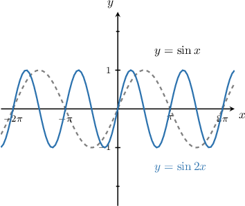
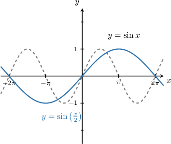
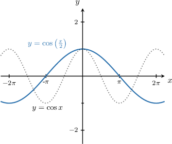
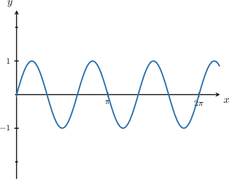
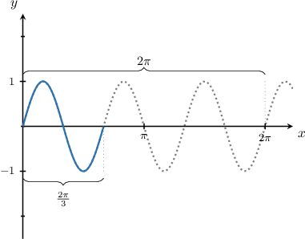
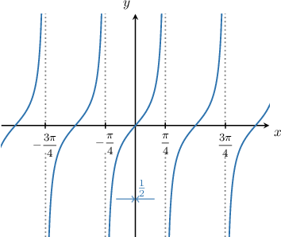
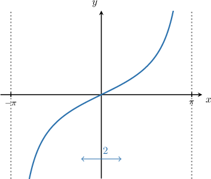
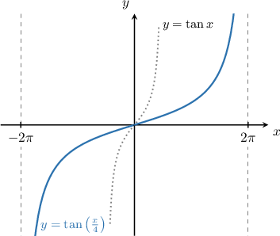
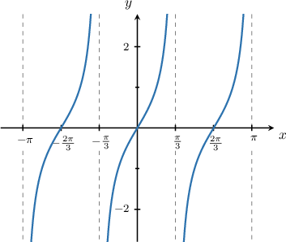
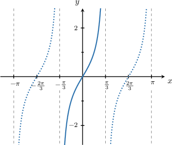

# Horizontal Stretches of Trigonometric Functions

Source: https://www.mathacademy.com/topics/784?courseId=134
Topic ID: 784

## Prerequisites

- [Graphing Sine and Cosine](../algebra-ii/1491-graphing-sine-and-cosine.md)
- [Graphing Tangent and Cotangent](../algebra-ii/1493-graphing-tangent-and-cotangent.md)
- [Horizontal Stretches of Functions](../algebra-ii/1586-horizontal-stretches-of-functions.md)

## Lesson

### Introduction

When we multiply the argument of $y=\sin x$ by some number $B,$ the resulting function $y=\sin(Bx)$ is a horizontal scaling of the original graph by a scaling factor $\dfrac{1}{B}.$ More specifically, it is said to be

- a **horizontal stretch** if $\dfrac{1}{B} > 1,$ or

- a **horizontal shrink** if $0 < \dfrac{1}{B} < 1.$

In general, the period of $y=\sin (Bx)$ is equal to the period of $y=\sin x$ (which is $2\pi$) multiplied by the scaling factor:

$$

\text{period} = 2\pi\cdot \dfrac{1}{B}

$$

For example, consider the graph of $\displaystyle y=\sin{2x}$ shown below. For this function, we have $B=2,$ so the scaling factor is $\dfrac{1}{2}.$ Consequently, the function is a horizontal shrink with period $2\pi \cdot \dfrac{1}{2} = \pi.$

On the other hand, consider the graph of $y=\sin\left(\dfrac{1}{2}x\right)$ shown below. For this function, we have $B=\dfrac{1}{2},$ so the scaling factor is $\dfrac{1}{\left(\dfrac{1}{2} \right)} = 2.$ Consequently, the function is a horizontal stretch with period $2\pi \cdot 2 = 4\pi.$

### Example: Determining the Period of a Stretched Sine or Cosine Function

#### Question

What is the period of $y=\cos\left(\dfrac x 2\right)?$

#### Explanation

First, note that the function $y=\cos\left(\dfrac x 2\right)$ can be written as $y=\cos\left(\dfrac{1}{2} x\right).$ So, it takes the form $y=\cos(Bx)$ with $B = \dfrac{1}{2}.$

The horizontal scaling factor is given by

$$

\dfrac{1}{B} = \dfrac{1}{\left( \dfrac{1}{2} \right) } = 2.

$$

So, the period is

$$

2\pi \cdot \dfrac{1}{B} = 2\pi \cdot 2= 4\pi.

$$

We can verify this in the graph shown below:

### Example: Identifying the Missing Parameter Given the Graph of a Stretched Sine or Cosine Function

#### Question

The graph below is generated by the function $y=\sin(Bx).$ Find the value of $B.$

#### Explanation

In order to find the value of $B,$ we first need to find the period of the function.

From the graph, we can see that function makes $3$ complete cycles on the interval $[0,2\pi].$ So, the period is $\dfrac{2\pi}{3}.$

We know that for a function $y=\sin (Bx),$ the horizontal scaling factor is $\dfrac{1}{B},$ and the period is multiplied by the scaling factor:

$$

\text{period} = 2\pi \cdot \dfrac{1}{B}

$$

For our particular function, the period is $\dfrac{2\pi}{3},$ so we have

$$

\begin{aligned}\frac{2𝜋}{3} & =2𝜋⋅\frac{1}{𝐵} \\ \frac{2𝜋}{3} & =\frac{2𝜋}{𝐵} \\ 𝐵 & =3.\end{aligned}

$$

### Horizontal Stretches of the Tangent Function

Graphs of tangent can be horizontally scaled in the same way as graphs of sine and cosine. The only difference is that the period of $y=\tan x$ is $\pi$ (rather than $2\pi$), so the period of $y= \tan(Bx)$ is

$$

\text{period} = \pi \cdot \dfrac{1}{B}.

$$

For example, consider the graph of $y=\tan(2x)$ shown below. For this function, we have $B=2,$ so the scaling factor is $\dfrac{1}{2}.$ Consequently, the function is a horizontal shrink with period $\pi \cdot \dfrac{1}{2} = \dfrac{\pi}{2}.$

On the other hand, consider the graph of $y=\tan\left(\dfrac{1}{2}x \right)$ shown below. For this function, we have $B=\dfrac{1}{2},$ so the scaling factor is $\dfrac{1}{\left(\dfrac{1}{2} \right)} = 2.$ Consequently, the function is a horizontal stretch with period $\pi \cdot 2 = 2\pi.$

### Example: Identifying the Graph of a Stretched Tangent Function

#### Question

Given that $f(x) = \tan \left(\dfrac{x}{4} \right),$ what is the graph of the curve $y=f(x)?$

#### Explanation

In order to graph the function, it's helpful to know the period. In order to determine the period, we first need to determine the scaling factor.

Notice that the function $f(x) = \tan \left(\dfrac{x}{4} \right)$ can be written as $f(x) = \tan \left(\dfrac{1}{4} x \right).$ So, it takes the form $y=\tan (Bx)$ with $B = \dfrac{1}{4}.$

The horizontal scaling factor is given by

$$

\dfrac{1}{B} = \dfrac{1}{\left( \dfrac{1}{4} \right)} = 4.

$$

So, the period is

$$

\pi \cdot \dfrac{1}{B} = \pi \cdot 4 = 4\pi.

$$

Now that we know the period is $4\pi,$ we can draw the general shape of the tangent function, but stretch it so that it fills up the interval $(-2\pi, 2\pi).$

The resulting graph is shown below.

### Example: Identifying the Missing Parameter Given the Graph of a Stretched Tangent Function

#### Question

The graph below shows $y=\tan(Bx).$ What is the value of $B?$

#### Explanation

In order to find the value of $B,$ we first need to find the period of the function.

From the graph, we can see that function makes $3$ complete cycles on the interval $(-\pi,\pi).$ So, the period is $\dfrac{2\pi}{3}.$

We know that for a function $y=\tan (Bx),$ the horizontal scaling factor is $\dfrac{1}{B},$ and the period is multiplied by the scaling factor:

$$

\text{period} = \pi \cdot \dfrac{1}{B}

$$

For our particular function, the period is $\dfrac{2\pi}{3},$ so we have

$$

\begin{aligned}\frac{2𝜋}{3} & =𝜋⋅\frac{1}{𝐵} \\ \frac{2}{3} & =\frac{1}{𝐵} \\ 𝐵 & =\frac{3}{2}.\end{aligned}

$$
