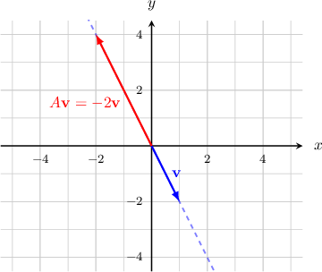
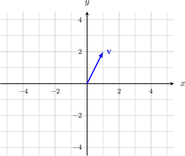
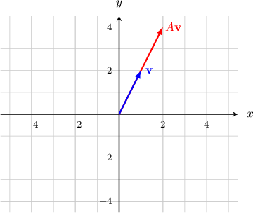

# The Eigenvalues and Eigenvectors of a 2x2 Matrix

Source: https://www.mathacademy.com/topics/1375?courseId=55
Topic ID: 1375

## Prerequisites

- [Linear Transformations of Objects in the Plane](../integrated-math-iii-honors/866-linear-transformations-of-objects-in-the-plane.md)

## Lesson

### Introduction

Given a matrix $A,$ an **eigenvector** of $A$ is a *non-zero* vector $\mathbf{v}$ such that

$$

A \mathbf{v} = \lambda \mathbf{v}

$$

for some scalar $\lambda \in \mathbb{R}.$ The scalar $\lambda$ is called the **eigenvalue** corresponding to the eigenvector $\mathbf{v}.$

For example, consider the matrix $[\begin{aligned}2 & 2 \\ 2 & −1\end{aligned}]$ and the vector $[\begin{aligned}1 \\ −2\end{aligned}]$ Computing the product $A \cdot \mathbf{v},$ we get

$$

\begin{aligned}𝐴𝐯 & =[\begin{aligned}2 & 2 \\ 2 & −1\end{aligned}]⋅[\begin{aligned}1 \\ −2\end{aligned}] \\ & =[\begin{aligned}−2 \\ 4\end{aligned}] \\ & =(−2)⋅[\begin{aligned}1 \\ −2\end{aligned}] \\ & =−2𝐯.\end{aligned}

$$

We've discovered that $A {\color{blue}\mathbf{v}} = {\color{red}-2} {\color{blue}\mathbf{v}}.$ Therefore,

- the vector $[\begin{aligned}1 \\ −2\end{aligned}]$ is an *eigenvector* of $A,$ and

- the scalar $\color{red}\lambda=-2$ is the *eigenvalue* corresponding to the eigenvector ${\color{blue}\mathbf{v}}.$

**Caution:** Remember that an eigenvector must be a *non-zero* vector. This is very important.

### Example: Finding the Eigenvalue that Corresponds to a Given Eigenvector

#### Question

Determine if $\begin{aligned}1 \\ 1\end{aligned}$ is an eigenvector of the matrix $\begin{aligned}1 & 3 \\ 3 & 1\end{aligned}$ If so, then what is the corresponding eigenvalue?

#### Explanation

The eigenvectors of $A$ are the non-zero vectors $\mathbf{v}$ such that $A\mathbf{v}=\lambda \mathbf{v}.$ We have

$$

\begin{aligned}𝐴𝐯 & =[\begin{aligned}1 & 3 \\ 3 & 1\end{aligned}][\begin{aligned}1 \\ 1\end{aligned}] \\ & =[\begin{aligned}4 \\ 4\end{aligned}] \\ & =4⋅[\begin{aligned}1 \\ 1\end{aligned}] \\ & =4𝐯.\end{aligned}

$$

Since $A\mathbf{v}=4 \mathbf{v},$ we conclude that $\mathbf{v}$ is an eigenvector of $A$ and the corresponding eigenvalue is $\lambda=4.$

### The Geometric Interpretation of Eigenvalues and Eigenvectors

Eigenvectors and eigenvalues can be interpreted geometrically.

First, recall that if the matrix is the standard matrix of some linear transformation then the product gives the image of under the action of The image of under the action of can appear quite different from the original vector

However, for an eigenvector with corresponding eigenvalue we get

In other words, when the matrix is applied to an eigenvector the image of is a scaled version of the original vector, and the scale factor is

To demonstrate, consider once again the following matrix:

We've already seen that has an eigenvector with corresponding eigenvalue So we have

Plotting the vector and its image in the plane, we get the following picture.

In general, when we apply a matrix to an eigenvector the resulting vector always lies on the same line as

If then the matrix stretches the vector. For the matrix compresses the vector. In addition, a negative eigenvalue means that is flipped in the opposite direction as well as scaled.

### Example: Plotting the Product of a Matrix and an Eigenvector Given its Corresponding Eigenvalue

#### Question

The vector $\mathbf{v}$ is an eigenvector of a $2 \times 2$ matrix $A$ corresponding to the eigenvalue $2.$ Find the vector $A\mathbf{v}.$

#### Explanation

The eigenvector $[\begin{aligned}1 \\ 2\end{aligned}]$ corresponds to the eigenvalue $\lambda=2.$ So,

$$

\begin{aligned}𝐴𝐯=2𝐯.\end{aligned}

$$

Therefore, we have the following picture:

### Example: Determining the Value of an Unknown Given an Eigenvalue and Eigenvector of a Matrix

#### Question

An eigenvector of $\begin{aligned}2 & 1 \\ 1 & 2\end{aligned}$ corresponding to an eigenvalue $\lambda=6c$ is $\begin{aligned}1 \\ 2𝑐\end{aligned}$ Determine the value of $c.$

#### Explanation

Remember that the eigenvectors of $A$ are the non-zero vectors $\mathbf{v}$ such that $A\mathbf{v}=\lambda \mathbf{v}.$ So, we have

$$

\begin{aligned}𝐴𝐯 & =𝜆𝐯 \\ [\begin{aligned}2 & 1 \\ 1 & 2\end{aligned}][\begin{aligned}1 \\ 2𝑐\end{aligned}] & =6𝑐[\begin{aligned}1 \\ 2𝑐\end{aligned}] \\ [\begin{aligned}2+2𝑐 \\ 1+4𝑐\end{aligned}] & =[\begin{aligned}6𝑐 \\ 12𝑐^{2}\end{aligned}].\end{aligned}

$$

This gives us the following system of linear equations:

$$

\begin{aligned}2+2𝑐=6𝑐 \\ 1+4𝑐=12𝑐^{2}\end{aligned}

$$

Solving for $c$ in the first equation, we get

$$

2+2c=6c \qquad \Longrightarrow \qquad c = \dfrac{1}{2}.

$$

Now, substituting $c=\dfrac{1}{2}$ into the second equation, we get

$$

\begin{aligned}1+4𝑐 & =12𝑐^{2} \\ 1+4⋅\frac{1}{2} & =12(\frac{1}{2})^{2} \\ 3 & =3,\end{aligned}

$$

which is a true statement.

Therefore, the solutions of the system is $c=\dfrac{1}{2}$.

### Example: Identifying True Statements About Eigenvalues and Eigenvectors

#### Question

Which of the following statements are true?

1. $[\begin{aligned}1 \\ 4\end{aligned}]$ is an eigenvector of $[\begin{aligned}2 & 0 \\ 4 & 1\end{aligned}]$ that corresponds to the eigenvalue $2.$

2. $[\begin{aligned}0 \\ 0\end{aligned}]$ is an eigenvector of $[\begin{aligned}1 & 1 \\ 1 & 1\end{aligned}]$ that corresponds to the eigenvalue $0.$

3. If $\mathbf{v}$ is an eigenvector of a matrix $A$ corresponding to the eigenvalue $\lambda = 5,$ then $2\mathbf{v}$ is also an eigenvector of $A$ corresponding to $\lambda = 5.$

#### Explanation

Remember that the eigenvectors of $A$ are the non-zero vectors $\mathbf{v}$ such that $A\mathbf{v}=\lambda \mathbf{v}.$ With that in mind, let's examine the statements one by one.

- Statement I is true. We have Since $A\mathbf{v}=2 \mathbf{v},$ we conclude that $\mathbf{v}$ is an eigenvector of $A$ and the corresponding eigenvalue is $\lambda=2.$

- Statement II is false. An eigenvector must be a ** vector.

- Statement III is true. We have Since, $A(2\mathbf{v})=5(2 \mathbf{v}),$ and $2 \mathbf{v} \neq \mathbf{0},$ this implies that $2 \mathbf{v}$ is an eigenvector of $A$ and the corresponding eigenvalue is $\lambda = 5.$

Therefore, the correct answer is, "I and III only."

**** Statement III is true in the general case, too. In general, any non-zero multiple of an eigenvector is again an eigenvector, and the corresponding eigenvalue is the same.
