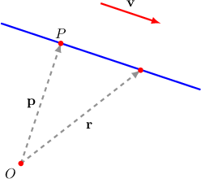
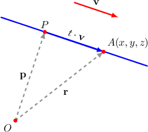
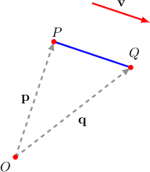

# The Vector Equation of a Line

Source: https://www.mathacademy.com/topics/1376?courseId=55
Topic ID: 1376

## Prerequisites

- [Graphing Curves Defined Parametrically](../integrated-math-iii-honors/803-graphing-curves-defined-parametrically.md)
- [Describing the Position Vector of a Point Using Known Vectors](../integrated-math-iii-honors/1106-describing-the-position-vector-of-a-point-using-known-vectors.md)
- [Calculating the Magnitude of Cartesian Vectors in 3D](../integrated-math-iii-honors/1277-calculating-the-magnitude-of-cartesian-vectors-in-3d.md)

## Lesson

### Introduction

Suppose we are given a point $P$ with position vector $\mathbf{p},$ and another vector $\mathbf{v}.$

The **vector equation** of the line that is parallel to $\mathbf{v}$ and passes through $P$ is given by

$$

\begin{aligned}𝐫=𝐩+𝑡𝐯,\,𝑡∈(−∞,∞).\end{aligned}

$$

The vector $\mathbf{v}$ is often called the **direction vector** of the line, while the vector $\mathbf{r}$ denotes the position vector of an arbitrary point on the line.

For example, if

$$

\begin{aligned}1 \\ 2 \\ −1\end{aligned}

$$

the vector equation of the line that is parallel to $\mathbf{v}$ and passes through $P$ is given by

$$

\begin{aligned}𝐫 & =\begin{aligned}−1 \\ 0 \\ −3\end{aligned}+𝑡\begin{aligned}1 \\ 2 \\ −1\end{aligned},\,𝑡∈(−∞,∞).\end{aligned}

$$

### Example: Finding a Vector Equation of a Line Given a Point and Direction Vector

#### Question

Find a vector equation of the straight line passing through $P(3,-1,7)$ and parallel to $\begin{aligned}0 \\ 5 \\ −3\end{aligned}$

#### Explanation

The vector equation of the straight line passing through $P$ and parallel to $\mathbf{v}$ is given by

$$

\mathbf{r} = \mathbf{p} + t \mathbf{v},

$$

where $t \in (-\infty, \infty)$ and $\mathbf{p}$ is the position vector of $P$.

In our case, the position vector of the point $P$ is $\begin{aligned}3 \\ −1 \\ 7\end{aligned}$

Using the formula for the vector equation of a line, we have

$$

\begin{aligned}𝐫 & =\begin{aligned}3 \\ −1 \\ 7\end{aligned}+𝑡\begin{aligned}0 \\ 5 \\ −3\end{aligned},\,𝑡∈(−∞,∞).\end{aligned}

$$

### Example: Finding a Vector Equation of the Line Passing Through Two Given Points

#### Question

Find a vector equation of the line that passes through the points $P(1,-1,2)$ and $Q(3,2,7).$

#### Explanation

The vector equation of the straight line passing through $P$ and parallel to $\mathbf{v}$ is given by

$$

\mathbf{r} = \mathbf{p} + t \mathbf{v},

$$

where $t \in (-\infty, \infty)$ and $\mathbf{p}$ is the position vector of $P.$

We can find a direction vector by computing the displacement vector between the given points $P(1,-1,2)$ and $Q(3,2,7),$ as follows:

$$

\begin{aligned}𝐯 & =\overset{𝑃𝑄}{} \\ & =⟨3,2,7⟩−⟨1,−1,2⟩ \\ & =⟨2,3,5⟩\end{aligned}

$$

Therefore, the vector equation of the line is given by

$$

\begin{aligned}𝐫 & =\begin{aligned}1 \\ −1 \\ 2\end{aligned}+𝑡\begin{aligned}2 \\ 3 \\ 5\end{aligned},\,𝑡∈(−∞,∞).\end{aligned}

$$

### Geometric Intuition Behind the Formula

There is a geometric intuition behind the formula $\mathbf{r} = \mathbf{p} + t \mathbf{v},$ as shown in the diagram below.

To get to any point $A(x,y,z)$ on the desired line, starting from the origin $O,$ we can

- first travel along the vector $\mathbf{p}$ to get to the point $P$ on the line, and

- then travel along the vector $t \mathbf{v}$ to get to $A.$ (The scalar $t$ represents how far we travel forward or backward along the line in the direction of $\mathbf{v}.$)

### Example: Finding Points on a Line That Are a Fixed Distance From Another Point on the Line

#### Question

Consider the straight line that passes through $P(1,2,0)$ and parallel to $\mathbf{v}= \langle -4,1,1 \rangle.$ Find all the possible points $A$ on that line such that $PA=6\sqrt{2}.$

#### Explanation

First, we find the vector equation of the line, as follows:

$$

\begin{aligned}𝐫 & =𝐩+𝑡𝐯 \\ 𝐫 & =⟨1,2,0⟩+𝑡⟨−4,1,1⟩\end{aligned}

$$

where $t \in (-\infty, \infty).$

Since $A$ lies on the line, we know that there must be a real number $t$ such that

$$

\overrightarrow{OA} = \langle 1, 2, 0 \rangle + t \langle -4, 1, 1 \rangle

$$

and

$$

\begin{aligned}\overset{𝑃𝐴}{} & =\overset{𝑂𝐴}{}−\overset{𝑂𝑃}{} \\ & =(⟨1,2,0⟩+𝑡⟨−4,1,1⟩)−⟨1,2,0⟩ \\ & =𝑡\,⟨−4,\,1,\,1⟩ \\ & =⟨−4𝑡,\,𝑡,\,𝑡⟩.\end{aligned}

$$

Using the fact that $PA=6\sqrt{2},$ we get:

$$

\begin{aligned}𝑃𝐴 & =6\sqrt{√2} \\ |\overset{𝑃𝐴}{}| & =6\sqrt{√2} \\ |⟨−4𝑡,\,𝑡,\,𝑡⟩| & =6\sqrt{√2} \\ \sqrt{√(−4𝑡)^{2}+𝑡^{2}+𝑡^{2}} & =6\sqrt{√2} \\ \sqrt{√18𝑡^{2}} & =6\sqrt{√2} \\ ±3𝑡\sqrt{√2} & =6\sqrt{√2} \\ 𝑡 & =±2\end{aligned}

$$

Finally, putting the values $t=\pm 2$ into the equation for the line, we obtain

$$

\begin{aligned} & \overset{𝑂𝐴_{1}}{}=⟨1,2,0⟩+2⟨−4,1,1⟩=⟨−7,4,2⟩, \\ & \overset{𝑂𝐴_{2}}{}=⟨1,2,0⟩−2⟨−4,1,1⟩=⟨9,0,−2⟩.\end{aligned}

$$

Therefore, the points are $A_1(-7, 4, 2)$ and $A_2(9, 0, -2).$

### The Vector Equation of a Segment

Suppose we wish to find a vector equation of the line *segment* whose endpoints are $P(3,-1,7)$ and $Q(3,4,4).$

To do this, we need to find the vector equation of the corresponding line and then restrict the domain of the parameter $t.$

First, we need to find a direction vector parallel to the given line. We can use the vector $\overrightarrow{PQ}$ as follows:

$$

\begin{aligned}𝐯 & =\overset{𝑃𝑄}{} \\ & =\overset{𝑂𝑄}{}−\overset{𝑂𝑃}{} \\ & =\begin{aligned}3 \\ 4 \\ 4\end{aligned}−\begin{aligned}3 \\ −1 \\ 7\end{aligned} \\ & =\begin{aligned}0 \\ 5 \\ −3\end{aligned}\end{aligned}

$$

So, the vector equation of the line $\overset{\longleftrightarrow}{PQ}$ is

$$

\begin{aligned}3 \\ −1 \\ 7\end{aligned}

$$

This equation describes every point on the line $\overset{\longleftrightarrow}{PQ}.$

To restrict this to points on the segment $\overline{PQ}$ only, we set $t\in [0,1].$ Thus, the vector equation of the line segment $\overline{PQ}$ is

$$

\begin{aligned}3 \\ 5𝑡−1 \\ 7−3𝑡\end{aligned}

$$

Writing the equation of a line segment in this way is sometimes called **parametrizing** the line segment since each point on the segment corresponds to a single parameter $t.$

- Notice that $t=0$ gives us the position vector of $P{:}$

$$

\begin{aligned}3 \\ 5(0)−1 \\ 7−3(0)\end{aligned}

$$

- Similarly, $t=1$ gives us the position vector of $Q{:}$

$$

\begin{aligned}3 \\ 5(1)−1 \\ 7−3(1)\end{aligned}

$$

Since increasing $t$ moves our vector $\mathbf r (t)$ from $P$ to $Q,$ we say that the line segment $\overline{PQ}$ is **traversed** *from* the point $P$ *to* the point $Q$ under this parametrization.

### Example: Finding the Vector Equation of a Line Segment

#### Question

Using $\mathbf{i},\mathbf{j},\mathbf{k}$ notation, find a parametrization of the line segment $\overline{PQ},$ where $P(-4,1,2)$ and $Q(-2,5,-1).$

#### Explanation

We need to find a direction vector that is parallel to the given line. We can use the vector $\overrightarrow{PQ}$ as follows:

$$

\begin{aligned}𝐯 & =\overset{𝑃𝑄}{} \\ & =\overset{𝑂𝑄}{}−\overset{𝑂𝑃}{} \\ & =(−2\,𝐢+5\,𝐣−𝐤)−(−4\,𝐢+𝐣+2\,𝐤) \\ & =2\,𝐢+4\,𝐣−3\,𝐤\end{aligned}

$$

So, the vector equation of the line is

$$

\mathbf{r} = \mathbf{p} + t \mathbf{v} \qquad\Longrightarrow\qquad \mathbf{r} = (-4 \, \mathbf{i} + \mathbf{j} + 2\,\mathbf{k}) + t (2 \, \mathbf{i} + 4 \, \mathbf{j} - 3 \, \mathbf{k})

$$

and the parametrization of the line segment $\overline{PQ}$ is

$$

\begin{aligned}𝐫(𝑡) & =(−4\,𝐢+𝐣+2\,𝐤)+𝑡(2\,𝐢+4\,𝐣−3\,𝐤) \\ & =(2𝑡−4)\,𝐢+(4𝑡+1)\,𝐣+(2−3𝑡)\,𝐤,\,𝑡∈[0,1].\end{aligned}

$$
