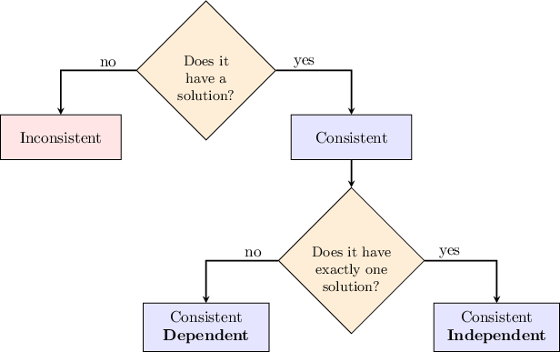

# Gaussian Elimination For NxM Systems of Equations

Source: https://www.mathacademy.com/topics/1733?courseId=55
Topic ID: 1733

## Prerequisites

- [Reduced Row Echelon Form](./1049-reduced-row-echelon-form.md)

## Lesson

### Introduction

We can use Gaussian elimination to find the general solutions of systems with any number of equations and variables. For instance, consider the system of linear equations

$$

\begin{aligned}𝑥−𝑦+𝑧=1, \\ 𝑦+3𝑧=0.\end{aligned}

$$

This system has the augmented matrix

$$

\begin{aligned}1 & −1 & 1 & 1 \\ 0 & 1 & 3 & 0\end{aligned}

$$

Using the standard Gauss-Jordan method, we can reduce this matrix to reduced row echelon form as follows:

$$

\begin{aligned}𝑀 & =[\begin{aligned}1 & −1 & 1 & 1 \\ 0 & 1 & 3 & 0\end{aligned}]\, & 𝑅_{1} & :=𝑅_{1}+𝑅_{2} \\ & ∼[\begin{aligned}1 & 0 & 4 & 1 \\ 0 & 1 & 3 & 0\end{aligned}] & & \end{aligned}

$$

The corresponding system is now

$$

\begin{aligned}𝑥+4𝑧=1 \\ 𝑦+3𝑧=0.\end{aligned}

$$

We see that the basic variables are $x$ and $y,$ and we have one free variable $z.$ From the second equation, we get $y=-3z,$ and from the first equation, we obtain $x=1-4z.$ Therefore, the general solution is

$$

\begin{aligned}𝑥=1−4𝑧, \\ 𝑦=−3𝑧, \\ 𝑧=𝑧.\end{aligned}

$$

In vector form, the solution can be written as

$$

\begin{aligned}\begin{aligned}𝑥 \\ 𝑦 \\ 𝑧\end{aligned}=\begin{aligned}1−4𝑧 \\ −3𝑧 \\ 𝑧\end{aligned}=\begin{aligned}1 \\ 0 \\ 0\end{aligned}+𝑧\begin{aligned}−4 \\ −3 \\ 1\end{aligned},\,𝑧∈(−∞,∞).\end{aligned}

$$

### Example: Solving a Consistent System of Equations Using Gauss-Jordan Elimination

#### Question

Consider the system of linear equations

$$

\begin{aligned} & 𝑥+5𝑦+𝑧=2 \\ & 𝑥+5𝑦+2𝑧=5.\end{aligned}

$$

Use the standard Gauss-Jordan method to reduce the augmented matrix $M$ of the system to reduced row echelon form, and then solve the linear system.

#### Explanation

The augmented matrix for this system is

$$

\begin{aligned}1 & 5 & 1 & 2 \\ 1 & 5 & 2 & 5\end{aligned}

$$

Using the standard Gauss-Jordan method, we can reduce this matrix to reduced row echelon form as follows:

$$

\begin{aligned}𝑀 & ∼[\begin{aligned}1 & 5 & 1 & 2 \\ 1 & 5 & 2 & 5\end{aligned}] & 𝑅_{2} & :=𝑅_{2}+(−1)𝑅_{1} \\ & ∼[\begin{aligned}1 & 5 & 1 & 2 \\ 0 & 0 & 1 & 3\end{aligned}] & 𝑅_{1} & :=𝑅_{1}+(−1)𝑅_{2} \\ & ∼[\begin{aligned}1 & 5 & 0 & −1 \\ 0 & 0 & 1 & 3\end{aligned}] & & \end{aligned}

$$

The corresponding system is now

$$

\begin{aligned} & 𝑥+5𝑦=−1 \\ & 𝑧=3.\end{aligned}

$$

The basic variables are the variables whose coefficients are pivots. In this case, the basic variables are $x$ and $z,$ and we have one free variable, $y.$ That means we need to find $x$ and $z$ in terms of $y.$

Therefore, the general solution is

$$

\begin{aligned}𝑥=−1−5𝑦 \\ 𝑦=𝑦 \\ 𝑧=3,\end{aligned}

$$

where $y$ (the free variable) is an arbitrary number.

In vector form, the solution can be written as

$$

\begin{aligned}\begin{aligned}𝑥 \\ 𝑦 \\ 𝑧\end{aligned}=\begin{aligned}−1−5𝑦 \\ 𝑦 \\ 3\end{aligned},\,𝑦∈(−∞,∞).\end{aligned}

$$

### Consistent and Inconsistent Systems of Linear Equations

Recall that a system of linear equations is called **consistent** if it has at least one solution. Otherwise, if there are no solutions, the system is called **inconsistent**.

For a consistent system,

- the system is called **consistent independent** if the solution is unique, while

- the system is called **consistent dependent** if there are infinitely many solutions.

### Example: Classifying a System as Consistent Dependent, Consistent Independent, or Inconsistent

#### Question

Given the system

$$

\begin{aligned} & 2𝑥−3𝑦=4 \\ & −4𝑥+6𝑦=−8,\end{aligned}

$$

which of the following statements are true?

1. The system is consistent dependent

2. The system has no solution

3. The system is consistent independent

#### Explanation

To classify the system, we first need to find its solution. The augmented matrix for this system is

$$

\begin{aligned}2 & −3 & 4 \\ −4 & 6 & −8\end{aligned}

$$

Using Gaussian elimination, we can reduce this matrix to row echelon form as follows:

$$

\begin{aligned}𝑀 & =[\begin{aligned}2 & −3 & 4 \\ −4 & 6 & −8\end{aligned}] & 𝑅_{2} & :=𝑅_{2}+2𝑅_{1} \\ & ∼[\begin{aligned}2 & −3 & 4 \\ 0 & 0 & 0\end{aligned}] & & \end{aligned}

$$

The system is now

$$

\begin{aligned} & 2𝑥−3𝑦=4 \\ & 0𝑥+0𝑦=0.\end{aligned}

$$

Since any numbers $x$ and $y$ form a solution of the final equation $0x+0y=0,$ we can remove this equation from the system. So, our system now consists of just a single equation:

$$

2x -3y= 4

$$

The basic variable is $x,$ and we have a free variable $y.$ That means we need to find $x$ in terms of $y.$

Therefore, since there are infinitely many solutions, we conclude that the system is **.

As a result, only statement I is true.

### Example: Determining the Value of a Constant for Which a Given Linear System Is Consistent or Inconsistent

#### Question

Determine the value of $k$ for which the following system of linear equations is inconsistent:

$$

\begin{aligned}2𝑥−2𝑦=1, \\ 4𝑥+𝑘𝑦=−3\end{aligned}

$$

#### Explanation

The augmented matrix for this system is

$$

\begin{aligned}2 & −2 & 1 \\ 4 & 𝑘 & −3\end{aligned}

$$

Using the method of Gaussian elimination, we can reduce this matrix to row echelon form as follows:

$$

\begin{aligned}𝑀 & =[\begin{aligned}2 & −2 & 1 \\ 4 & 𝑘 & −3\end{aligned}] & 𝑅_{2} & :=𝑅_{2}−2𝑅_{1} \\ & ∼[\begin{aligned}2 & −2 & 1 \\ 0 & 𝑘+4 & −5\end{aligned}] & & \end{aligned}

$$

The corresponding system is now

$$

\begin{aligned} & 2𝑥−2𝑦=1 \\ & (𝑘+4)𝑦=−5.\end{aligned}

$$

The system is inconsistent if it has no solutions. For the system to have no solutions, one of the equations above must be false.

If $k=-4,$ then the second equation is $0=-5,$ which is false, and the system will have no solution.

Therefore, our system is inconsistent when $k=-4.$
