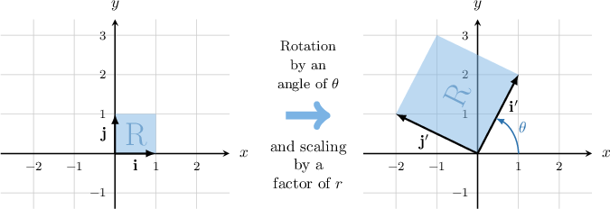
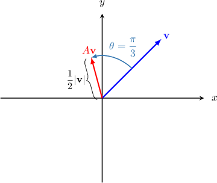
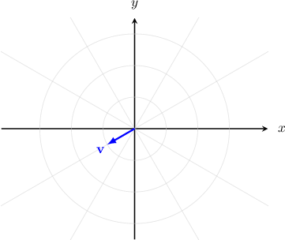
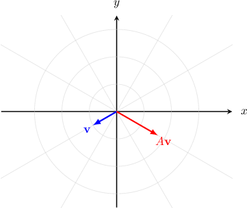

# Rotation-Scaling Matrices

Source: https://www.mathacademy.com/topics/2017?courseId=55
Topic ID: 2017

## Prerequisites

- [Dilations and Reflections as Linear Transformations](../integrated-math-iii-honors/867-dilations-and-reflections-as-linear-transformations.md)
- [Rotations as Linear Transformations](../integrated-math-iii-honors/932-rotations-as-linear-transformations.md)

## Lesson

### Introduction

Consider the standard basis $\big\{\mathbf{i},\mathbf{j} \big\}$ of the Euclidean plane $\mathbb{R}^2$ and the unit square spanned by these two vectors.

Let's define a linear transformation $\mathbf A$ by its standard matrix $A,$ given by

$$

[\begin{aligned}1 & −2 \\ 2 & 1\end{aligned}]

$$

We can find the images of $\{\mathbf{i},\mathbf{j} \}$ under $\mathbf{A}$ by computing the matrix products as follows:

$$

\begin{aligned}𝐢^{′} & =𝐴(𝐢)=[\begin{aligned}1 & −2 \\ 2 & 1\end{aligned}][\begin{aligned}1 \\ 0\end{aligned}]=[\begin{aligned}1 \\ 2\end{aligned}]=𝐢+2\,𝐣 \\ 𝐣^{′} & =𝐴(𝐣)=[\begin{aligned}1 & −2 \\ 2 & 1\end{aligned}][\begin{aligned}0 \\ 1\end{aligned}]=[\begin{aligned}−2 \\ 1\end{aligned}]=−2\,𝐢+𝐣\end{aligned}

$$

Plotting the vectors $\mathbf i$ and $\mathbf j$ and their images $\mathbf i'$ and $\mathbf j',$ we obtain the following:

The transformation rotates the square by an angle of

$$

\theta = \tan^{-1}\left(\dfrac{\color{red}2}{\color{blue}1}\right) \approx 63.4^\circ,

$$

then scales it by a scale factor of

$$

r=\sqrt{{\color{blue}1}^2 + {\color{red}2}^2} = \sqrt{5}.

$$

In fact, any matrix of the form

$$

[\begin{aligned}𝑎 & −𝑏 \\ 𝑏 & 𝑎\end{aligned}]

$$

where $\color{blue}a$ and $\color{red}b$ are real numbers (not both equal to zero simultaneously) is a matrix that rotates and then scales. These types of matrices are called **rotation-scaling matrices**.

### Example: Identifying Rotation-Scaling Matrices

#### Question

Which of the following are rotation-scaling matrices?

1. $[\begin{aligned}7 & −1 \\ 1 & 7\end{aligned}]$

2. $[\begin{aligned}9 & −8 \\ −8 & 9\end{aligned}]$

3. $[\begin{aligned}−8 & 3 \\ −3 & −8\end{aligned}]$

#### Explanation

A rotation-scaling matrix has the form

$$

[\begin{aligned}𝑎 & −𝑏 \\ 𝑏 & 𝑎\end{aligned}]

$$

where $a$ and $b$ are real numbers that are not equal to zero simultaneously. Notice that the entries on the main diagonal are the same, while the antidiagonal entries have opposite signs.

With that in mind let's check each of the given matrices:

- $[\begin{aligned}7 & −1 \\ 1 & 7\end{aligned}]$ is a rotation-scaling matrix (with $a=7$ and $b=1$).

- $[\begin{aligned}9 & −8 \\ −8 & 9\end{aligned}]$ is ** a rotation-scaling matrix since the entries on the antidiagonal do not have opposite signs.

- $[\begin{aligned}−8 & 3 \\ −3 & −8\end{aligned}]$ is a rotation-scaling matrix (with $a=-8$ and $b=-3$).

In conclusion, the correct answer is "I and III only."

### Constructing a Rotation-Scaling Matrix

How do we construct a particular rotation-scaling matrix $A?$

First, recall that rotation matrices are of the form

$$

[\begin{aligned}cos⁡𝜃 & −sin⁡𝜃 \\ sin⁡𝜃 & cos⁡𝜃\end{aligned}]

$$

Here, the matrix $R$ rotates a vector by an angle of $\theta$ counterclockwise about the origin.

Scaling matrices are of the form

$$

[\begin{aligned}𝑟 & 0 \\ 0 & 𝑟\end{aligned}]

$$

The scaling matrix $S$ scales a vector by a scale factor of $r,$ where the origin is the center of enlargement.

We can write any rotation-scaling matrix $A$ as a product of a scaling matrix and a rotation matrix:

$$

A=SR

$$

Or, more explicitly:

$$

[\begin{aligned}𝑟 & 0 \\ 0 & 𝑟\end{aligned}]

$$

### Example: Constructing a Rotation-Scaling Matrix That Represents a Geometric Transformation

#### Question

The vectors $\mathbf{v}$ and $A\mathbf{v}$ are shown above. If $A$ is a rotation-scaling matrix, then find $A.$

#### Explanation

Since $A$ is a rotation-scaling matrix, then we can write

$$

[\begin{aligned}𝑟 & 0 \\ 0 & 𝑟\end{aligned}]

$$

where $r$ is the scale factor and $\theta$ the angle of rotation.

According to the diagram, $r=\dfrac{1}{2}$ and $\theta=\dfrac{\pi}{3}.$ Therefore,

$$

\begin{aligned}𝐴 & =[\begin{aligned}𝑟 & 0 \\ 0 & 𝑟\end{aligned}][\begin{aligned}cos⁡𝜃 & −sin⁡𝜃 \\ sin⁡𝜃 & cos⁡𝜃\end{aligned}] \\ & =\begin{aligned}\frac{1}{2} & 0 \\ 0 & \frac{1}{2}\end{aligned}\begin{aligned}\frac{1}{2} & −\frac{\sqrt{√3}}{2} \\ \frac{\sqrt{√3}}{2} & \frac{1}{2}\end{aligned} \\ & =\begin{aligned}\frac{1}{4} & −\frac{\sqrt{√3}}{4} \\ \frac{\sqrt{√3}}{4} & \frac{1}{4}\end{aligned}.\end{aligned}

$$

### Finding the Scale Factor and Rotation Angle Of a Rotation-Scaling Matrix

We've seen that we can write a rotation-scaling matrix $A$ is the product of a rotation and a scaling matrix:

$$

[\begin{aligned}𝑟 & 0 \\ 0 & 𝑟\end{aligned}]

$$

So, the natural question now is, how does a rotation-scaling matrix

$$

[\begin{aligned}𝑎 & −𝑏 \\ 𝑏 & 𝑎\end{aligned}]

$$

relate to the individual rotation and scaling matrices?

First, setting the two equal to each other, we get

$$

[\begin{aligned}𝑎 & −𝑏 \\ 𝑏 & 𝑎\end{aligned}]

$$

From this, we can find the scale factor and angle of rotation of a rotation-scaling matrix. First, notice that we have

$$

{\color{blue}a} = {\color{blue}r\cos\theta}, \quad \textrm{and}\quad {\color{red}b} = {\color{red}r\sin\theta}.

$$

To find $r$ in terms of $a$ and $b,$ we can square and then add the two equations above. This gives

$$

\begin{aligned}𝑎^{2}+𝑏^{2} & =𝑟^{2}cos^{2}⁡𝜃+𝑟^{2}sin^{2}⁡𝜃 \\ & =𝑟^{2}(cos^{2}⁡𝜃+sin^{2}⁡𝜃) \\ & =𝑟^{2}.\end{aligned}

$$

Therefore, the scale factor $r$ is given by

$$

r = \sqrt{a^2+b^2} = \sqrt{\det{A}}.

$$

Similarly, to find the rotation angle $\theta$ in terms of $a$ and $b,$ we start with the equations

$$

{\color{blue}a} = {\color{blue}r\cos\theta}, \quad \textrm{and}\quad {\color{red}b} = {\color{red}r\sin\theta}.

$$

Dividing the second equation by the first, we get

$$

\tan\theta = \dfrac{b}{a}\quad\Longrightarrow\quad \theta = \arctan\left(\dfrac ba \right).

$$

It's also possible to recover both the original scaling *and* rotation matrix once the scale factor $r$ is known. Let's see how that works.

### Example: Finding the Scale Factors and Angles of Rotation of Rotation-Scaling Matrices

#### Question

Let $\mathbf{v}$ be a non-zero vector from $\mathbb{R}^2$ and let $A$ be the rotation-scaling matrix given by

$$

[\begin{aligned}−2\sqrt{√2} & −2\sqrt{√2} \\ 2\sqrt{√2} & −2\sqrt{√2}\end{aligned}]

$$

The description of $A\mathbf{v}$ in terms of geometric transformations in the plane is given below. What are the missing entries?

**

#### Explanation

We can find the scale factor using the following formula:

$$

\begin{aligned}𝑟 & =\sqrt{√det(𝐴)} \\ & =\sqrt{√(2\sqrt{√2})^{2}+(2\sqrt{√2})^{2}} \\ & =\sqrt{√8+8} \\ & =\sqrt{√16} \\ & =4\end{aligned}

$$

We can now represent $A$ as a product of a rotation and a scaling matrix, as follows:

$$

\begin{aligned}𝐴 & =4\begin{aligned}−\frac{\sqrt{√2}}{2} & −\frac{\sqrt{√2}}{2} \\ \frac{\sqrt{√2}}{2} & −\frac{\sqrt{√2}}{2}\end{aligned} \\ & =[\begin{aligned}4 & 0 \\ 0 & 4\end{aligned}]\begin{aligned}−\frac{\sqrt{√2}}{2} & −\frac{\sqrt{√2}}{2} \\ \frac{\sqrt{√2}}{2} & −\frac{\sqrt{√2}}{2}\end{aligned} \\ & =[\begin{aligned}𝑟 & 0 \\ 0 & 𝑟\end{aligned}][\begin{aligned}cos⁡𝜃 & −sin⁡𝜃 \\ sin⁡𝜃 & cos⁡𝜃\end{aligned}]\end{aligned}

$$

Therefore, we obtain that

$$

\begin{aligned}cos⁡𝜃=−\frac{\sqrt{√2}}{2} \\ sin⁡𝜃=\frac{\sqrt{√2}}{2}\end{aligned}

$$

Finally, we conclude that the missing entries are $\theta=\dfrac{3\pi}{4}$ and $r=4.$

### Example: Sketching the Image of a Vector Under the Action Of a Rotation-Scaling Matrix

#### Question

Consider the vector $\mathbf{v}$ shown above. Sketch the vector $A\mathbf{v}$ given that

$$

\begin{aligned}−\frac{\sqrt{√3}}{2} & −\frac{3}{2} \\ \frac{3}{2} & −\frac{\sqrt{√3}}{2}\end{aligned}

$$

#### Explanation

Notice that $A$ is a rotation-scaling matrix. So, we need to find its scale factor and the angle of rotation.

We can find the scale factor using the following formula:

$$

\begin{aligned}𝑟 & =\sqrt{√det(𝐴)} \\ & =\sqrt{(\frac{\sqrt{√3}}{2})^{2}+(\frac{3}{2})^{2}} \\ & =\sqrt{√\frac{3}{4}+\frac{9}{4}} \\ & =\sqrt{√\frac{12}{4}} \\ & =\sqrt{√3}\end{aligned}

$$

Now, we can represent $A$ as a product of a rotation and a scaling matrix, as follows:

$$

\begin{aligned}𝐴 & =\sqrt{√3}\begin{aligned}−\frac{1}{2} & −\frac{\sqrt{√3}}{2} \\ \frac{\sqrt{√3}}{2} & −\frac{1}{2}\end{aligned} \\ & =[\begin{aligned}\sqrt{√3} & 0 \\ 0 & \sqrt{√3}\end{aligned}]\begin{aligned}−\frac{1}{2} & −\frac{\sqrt{√3}}{2} \\ \frac{\sqrt{√3}}{2} & −\frac{1}{2}\end{aligned} \\ & =[\begin{aligned}𝑟 & 0 \\ 0 & 𝑟\end{aligned}][\begin{aligned}cos⁡𝜃 & −sin⁡𝜃 \\ sin⁡𝜃 & cos⁡𝜃\end{aligned}]\end{aligned}

$$

Hence, we obtain that

$$

\begin{aligned}cos⁡𝜃=−\frac{1}{2} \\ sin⁡𝜃=\frac{\sqrt{√3}}{2}\end{aligned}

$$

Therefore, to find $A\mathbf{v}$ we need to rotate $\mathbf{v}$ counterclockwise by an angle of $\dfrac{2\pi}{3}$ and then scale the result by a scale factor of $\sqrt{3} \approx 1.73,$ as shown below.

