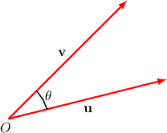

# The Cauchy-Schwarz Inequality and the Angle Between Two Vectors

Source: https://www.mathacademy.com/topics/2101?courseId=55
Topic ID: 2101

## Prerequisites

- [The Angle Between Two Vectors](../integrated-math-iii-honors/1278-the-angle-between-two-vectors.md)
- [The Norm of a Vector in N-Dimensional Euclidean Space](./2095-the-norm-of-a-vector-in-n-dimensional-euclidean-space.md)

## Lesson

### Introduction

The **Cauchy-Schwarz Inequality** (sometimes called the **Cauchy-Bunyakovsky-Schwarz Inequality**) provides a connection between dot products and norms. It states that for any two vectors $\mathbf{u}$ and $\mathbf{v}$ in $\mathbb{R}^n$, we have the inequality

$$

\vert \mathbf{u} \cdot \mathbf{v} \vert \leq \Vert \mathbf{u} \Vert \Vert \mathbf{v} \Vert.

$$

In other words, the absolute value of the dot product is no more than the product of the norms.

For instance, if $[\begin{aligned}3 \\ −4\end{aligned}]$ and $[\begin{aligned}5 \\ 12\end{aligned}]$ then

$$

\begin{aligned}|𝐮⋅𝐯| & ≤‖𝐮‖⋅‖𝐯‖ \\ |3⋅5+(−4)⋅12| & ≤\sqrt{√3^{2}+(−4)^{2}}\sqrt{√5^{2}+12^{2}} \\ |−33| & ≤5⋅13 \\ 33 & ≤65.\,✓\end{aligned}

$$

**Note:** An easy trick to remember the Cauchy-Schwarz inequality is to think of the formula for the dot product:

$$

\mathbf u \cdot \mathbf v = \Vert \mathbf u \Vert \Vert \mathbf v \Vert \cos \theta

$$

Because $\vert \cos \theta \vert \leq 1,$ we can see that

$$

\vert \mathbf{u} \cdot \mathbf{v} \vert \leq \Vert \mathbf{u} \Vert \Vert \mathbf{v} \Vert.

$$

**Watch out!** The above trick is only a mnemonic trick, *not* an actual proof of the Cauchy-Schwarz inequality. The formula $\mathbf u \cdot \mathbf v = \Vert \mathbf u \Vert \Vert \mathbf v \Vert \cos \theta$ is actually a *consequence* of the Cauchy-Schwarz inequality, so a proof of the Cauchy-Schwarz inequality cannot use the formula.

### Example: Determining a Minimum Possible Value Using the Cauchy-Schwarz Inequality

#### Question

Consider the vector $\begin{aligned}1 \\ \sqrt{√𝑘} \\ −2 \\ 1\end{aligned}$ Given that $\mathbf{u}\cdot \mathbf{v}=-12$ and $\Vert \mathbf{v}\Vert =4,$ what is the smallest possible value of $k?$

#### Explanation

We will use the Cauchy-Schwarz inequality,

$$

\vert \mathbf{u}\cdot \mathbf{v} \vert \leq \Vert \mathbf{u} \Vert \cdot \Vert \mathbf{v} \Vert.

$$

We are given all the quantities in the inequality above, except for $\Vert \mathbf{u} \Vert.$ So first, we compute $\Vert \mathbf{u} \Vert$ as follows:

$$

\begin{aligned}‖𝐮‖ & =\sqrt{√1^{2}+(\sqrt{√𝑘})^{2}+(−2)^{2}+1^{2}} \\ & =\sqrt{√6+𝑘}\end{aligned}

$$

Now, using the Cauchy-Schwarz inequality, we have

$$

\begin{aligned}|𝐮⋅𝐯| & ≤‖𝐮‖⋅‖𝐯‖ \\ |−12| & ≤\sqrt{√6+𝑘}⋅(4) \\ 12 & ≤4\sqrt{√6+𝑘} \\ 3 & ≤\sqrt{√6+𝑘} \\ 3^{2} & ≤(\sqrt{√6+𝑘})^{2} \\ 9 & ≤6+𝑘 \\ 3 & ≤𝑘.\end{aligned}

$$

Therefore, the smallest possible value of $k$ is $3.$

### The Angle Between Two Vectors

Now, using the dot product, we can define the angle $\theta$ between two vectors $\mathbf{u}$ and $\mathbf{v}$ in $\mathbb{R}^n$, where $n \ge 2$.

To do that, we say that $\cos\theta$ will be equal to the ratio of the two sides of the Cauchy-Schwarz inequality, as follows:

$$

\cos\theta = \dfrac{\mathbf{u}\cdot\mathbf{v}}{\Vert \mathbf{u} \Vert \cdot \Vert \mathbf{v} \Vert}

$$

Notice that this formula is completely analogous to the formula for the angle between two vectors in two-dimensional or three-dimensional space. It only works for non-zero vectors (otherwise, we will be dividing by zero).

Since the Cauchy-Schwarz inequality guarantees that $|\mathbf{u} \cdot \mathbf{v}| \leq \| \mathbf{u} \| \cdot \| \mathbf{v} \|$, we get

$$

-1 \leq \dfrac{\mathbf{u}\cdot\mathbf{v}}{\Vert \mathbf{u} \Vert \cdot \Vert \mathbf{v} \Vert} \leq 1,

$$

which means that $\theta$ can be found given any two non-zero $\mathbf{u}$ and $\mathbf{v}$.

### Example: Finding the Acute Angle Between Two Vectors

#### Question

Find the acute angle between the vectors $\begin{aligned}−1 \\ 2 \\ −4 \\ −2\end{aligned}$ and $\begin{aligned}−2 \\ 2 \\ −2 \\ 2\end{aligned}$

#### Explanation

Using the formula

$$

\cos\theta = \dfrac{\mathbf{v} \cdot \mathbf{w}}{\Vert\mathbf{v}\Vert \, \Vert \mathbf{w}\Vert},

$$

we have the following:

$$

\begin{aligned}cos⁡𝜃 & =\frac{𝑣_{1}𝑤_{1}+𝑣_{2}𝑤_{2}+𝑣_{3}𝑤_{3}+𝑣_{4}𝑤_{4}}{\sqrt{√𝑣_{21}^{}+𝑣_{22}^{}+𝑣_{23}^{}+𝑣_{24}^{}}\,\sqrt{√𝑤_{21}^{}+𝑤_{22}^{}+𝑤_{23}^{}+𝑤_{24}^{}}} \\ & =\frac{(−1)⋅(−2)+2⋅2+(−4)⋅(−2)+(−2)⋅2}{\sqrt{√(−1)^{2}+2^{2}+(−4)^{2}+(−2)^{2}}\,\sqrt{√(−2)^{2}+2^{2}+(−2)^{2}+2^{2}}} \\ & =\frac{10}{\sqrt{√25}⋅\sqrt{√16}} \\ & =\frac{10}{5⋅4} \\ & =\frac{1}{2}\end{aligned}

$$

Therefore,

$$

\theta=\arccos \left( \dfrac{1}{2} \right)=\dfrac{\pi}{3}.

$$

### Example: Calculating the Cosine of an Angle

#### Question

Let $A(-2, 4, -2, 2)$ and $B(4, 0, -1, -4).$ Find the cosine of the angle $\angle{AOB},$ where $O(0,0,0,0)$ is the origin.

#### Explanation

First, let

$$

\begin{aligned}𝐚=\overset{𝑂𝐴}{}=\begin{aligned}−2 \\ 4 \\ −2 \\ 2\end{aligned},\,𝐛=\overset{𝑂𝐵}{}=\begin{aligned}4 \\ 0 \\ −1 \\ −4\end{aligned}.\end{aligned}

$$

Also, let $\theta = m\angle{AOB}$ be the angle between the vectors $\mathbf{a}$ and $\mathbf{b}.$ Then, we can find $\cos \theta$ using the formula:

$$

\begin{aligned}cos⁡𝜃 & =\frac{𝐚⋅𝐛}{‖𝐚‖\,‖𝐛‖} \\ & =\frac{𝑎_{1}𝑏_{1}+𝑎_{2}𝑏_{2}+𝑎_{3}𝑏_{3}+𝑎_{4}𝑏_{4}}{\sqrt{√𝑎_{21}^{}+𝑎_{22}^{}+𝑎_{23}^{}+𝑎_{24}^{}}\,\sqrt{√𝑏_{21}^{}+𝑏_{22}^{}+𝑏_{23}^{}+𝑏_{24}^{}}} \\ & =\frac{(−2)⋅4+4⋅0+(−2)⋅(−1)+2⋅(−4)}{\sqrt{√(−2)^{2}+4^{2}+(−2)^{2}+2^{2}}\,\sqrt{√4^{2}+0^{2}+(−1)^{2}+(−4)^{2}})} \\ & =\frac{−14}{\sqrt{√28}⋅\sqrt{√33}} \\ & =\frac{−14}{\sqrt{√14}⋅\sqrt{√2}⋅\sqrt{√33}} \\ & =−\frac{\sqrt{√14}}{\sqrt{√2}⋅\sqrt{√33}} \\ & =−\sqrt{√\frac{7}{33}}\end{aligned}

$$

### Algebraic Proof of the Schwarz Inequality

Now, let's prove the general statement of the Cauchy-Schwarz inequality for vectors $\mathbf{u}, \mathbf{v} \in \mathbb{R}^n\mathbin{:}$

$$

\vert \mathbf{u}\cdot\mathbf{v} \vert \leq \Vert \mathbf{u} \Vert \Vert \mathbf{v} \Vert

$$

To start, let $t\in\mathbb{R}$ be any number, and consider the vector $t\mathbf{u}+\mathbf{v}.$ Since $\Vert t\mathbf{u} + \mathbf{v} \Vert \geq 0,$ using the definition and properties of the dot product, we have

$$

\begin{aligned}‖𝑡𝐮+𝐯‖^{2} & ≥0 \\ (𝑡𝐮+𝐯)⋅(𝑡𝐮+𝐯) & ≥0 \\ 𝑡^{2}(𝐮⋅𝐮)+𝑡(𝐮⋅𝐯)+𝑡(𝐯⋅𝐮)+(𝐯⋅𝐯) & ≥0 \\ 𝑡^{2}‖𝐮‖^{2}+2𝑡(𝐮⋅𝐯)+‖𝐯‖^{2} & ≥0.\end{aligned}

$$

In the last line above, we have a quadratic with the coefficients $a=\Vert \mathbf{u} \Vert^2,$ $b=2\left(\mathbf{u}\cdot\mathbf{v} \right),$ and $c=\Vert \mathbf{v} \Vert^2.$

Since the quadratic is greater than or equal to zero, its discriminant must be less than or equal to zero, $\mathcal{D} \leq 0.$ Therefore, we have

$$

\begin{aligned}D & ≤0 \\ 𝑏^{2}−4𝑎𝑐 & ≤0 \\ (2(𝐮⋅𝐯))^{2}−4⋅‖𝐮‖^{2}⋅‖𝐯‖^{2} & ≤0 \\ 4(𝐮⋅𝐯)^{2}−4‖𝐮‖^{2}‖𝐯‖^{2} & ≤0 \\ (𝐮⋅𝐯)^{2} & ≤‖𝐮‖^{2}‖𝐯‖^{2} \\ \sqrt{√(𝐮⋅𝐯)^{2}} & ≤\sqrt{√‖𝐮‖^{2}‖𝐯‖^{2}} \\ |𝐮⋅𝐯| & ≤‖𝐮‖‖𝐯‖.\end{aligned}

$$
