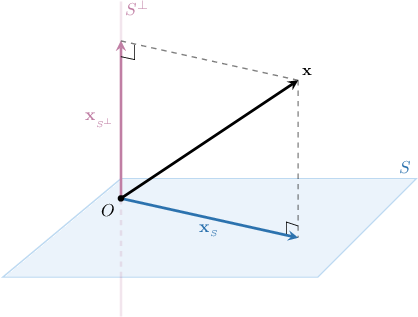

# Projecting Vectors Onto Subspaces in Euclidean Spaces (Arbitrary Bases)

Source: https://www.mathacademy.com/topics/2124?courseId=55
Topic ID: 2124

## Prerequisites

- [The Transpose of a Matrix](../integrated-math-iii-honors/232-the-transpose-of-a-matrix.md)
- [Inverses of 2x2 Matrices](../integrated-math-iii-honors/864-inverses-of-2x2-matrices.md)
- [Multiplying Matrices](../integrated-math-iii-honors/1196-multiplying-matrices.md)
- [Projecting Vectors Onto Subspaces in Euclidean Spaces (Orthogonal Bases)](./2123-projecting-vectors-onto-subspaces-in-euclidean-spaces-orthogonal-bases.md)

## Lesson

### Introduction

We've already seen how to find the orthogonal projection of a vector onto a subspace in the case when the subspace is defined using an orthogonal basis. In this lesson, we'll learn how to do the same thing in the case of non-orthogonal bases.

For example, consider the following vectors:

$$

\begin{aligned}1 \\ 2 \\ 1\end{aligned}

$$

How can we find the orthogonal projection $\mathbf{x}_S$ of the vector $\mathbf{x}$ onto the subspace $S = \textrm{Span}\{\mathbf{a}_1, \mathbf{a}_2 \}?$ Notice that since $\mathbf a_1\cdot \mathbf a_2 \neq 0,$ the vectors $\mathbf{a}_1$ and $\mathbf{a}_2$ are not orthogonal.

As usual, we would like to write $\mathbf{x}$ as

$$

\mathbf{x} = \mathbf{x}_S + \mathbf{x}_{S^\perp},

$$

where $\mathbf{x}_S = k_1 \mathbf{a}_1 + k_2 \mathbf{a}_2 \in S$ and $\mathbf{x}_{S^\perp} \!\in S^\perp.$

So, we have

$$

\begin{aligned}𝐱_{𝑆^{⊥}} & =𝐱−𝐱_{𝑆} \\ & =𝐱−(𝑘_{1}𝐚_{1}+𝑘_{2}𝐚_{2}) \\ & =𝐱−𝑘_{1}𝐚_{1}−𝑘_{2}𝐚_{2}.\end{aligned}

$$

Since $\mathbf{x}_{S^\perp} \in S^\perp,$ that is, $\mathbf{x}_{S^\perp} \perp S,$ we obtain

$$

\begin{aligned}\begin{aligned}𝐱_{𝑆^{⊥}}⊥𝐚_{1} \\ 𝐱_{𝑆^{⊥}}⊥𝐚_{2}\end{aligned}\,⟹\,\begin{aligned}𝐱_{𝑆^{⊥}}⋅𝐚_{1}=0 \\ 𝐱_{𝑆^{⊥}}⋅𝐚_{2}=0.\end{aligned}\end{aligned}

$$

Now, we substitute the expression for $\mathbf{x}_{S^\perp}$ into the system to get

$$

\begin{aligned}(𝐱−𝑘_{1}𝐚_{1}−𝑘_{2}𝐚_{2})⋅𝐚_{1}=0 \\ (𝐱−𝑘_{1}𝐚_{1}−𝑘_{2}𝐚_{2})⋅𝐚_{2}=0\end{aligned}

$$

We can write this system in an equivalent matrix form as follows:

$$

[\begin{aligned}−\,\,𝐚_{1}\,\,− \\ −\,\,𝐚_{2}\,\,−\end{aligned}]

$$

If we denote $\begin{aligned}| & | \\ 𝐚_{1} & 𝐚_{2} \\ | & |\end{aligned}$ and $[\begin{aligned}𝑘_{1} \\ 𝑘_{2}\end{aligned}]$ then we obtain

$$

A^TA\mathbf{k} = A^T\mathbf{x} \qquad\Longrightarrow\qquad \mathbf{k}=(A^TA)^{-1}A^T\mathbf{x}.

$$

Also, we note that $\mathbf{x}_S = k_1 \mathbf{a}_1 + k_2 \mathbf{a}_2$ can be expressed as $\textrm{proj}_{S}\,\mathbf{x} = A\mathbf{k}.$

Therefore,

$$

\begin{aligned}proj_{𝑆}\,𝐱 & =𝐴𝐤 \\ & =𝐴(𝐴^{𝑇}𝐴)^{−1}𝐴^{𝑇}𝐱.\end{aligned}

$$

This is a formula for the orthogonal projection!

Now, we return to our example. Using the formula, we get

$$

\begin{aligned}proj_{𝑆}\,𝐱 & =\begin{aligned}1 & 1 \\ 2 & 3 \\ 1 & 1\end{aligned}⋅[\begin{aligned}1 & 2 & 1 \\ 1 & 3 & 1\end{aligned}]⋅\begin{aligned}1 & 1 \\ 2 & 3 \\ 1 & 1\end{aligned}^{−1}⋅[\begin{aligned}1 & 2 & 1 \\ 1 & 3 & 1\end{aligned}]⋅\begin{aligned}2 \\ 4 \\ 0\end{aligned} \\ & =\begin{aligned}1 & 1 \\ 2 & 3 \\ 1 & 1\end{aligned}⋅([\begin{aligned}6 & 8 \\ 8 & 11\end{aligned}])^{−1}⋅[\begin{aligned}10 \\ 14\end{aligned}] \\ & =\begin{aligned}1 & 1 \\ 2 & 3 \\ 1 & 1\end{aligned}⋅\frac{1}{2}[\begin{aligned}11 & −8 \\ −8 & 6\end{aligned}]⋅[\begin{aligned}10 \\ 14\end{aligned}] \\ & =\begin{aligned}1 & 1 \\ 2 & 3 \\ 1 & 1\end{aligned}⋅[\begin{aligned}−1 \\ 2\end{aligned}] \\ & =\begin{aligned}1 \\ 4 \\ 1\end{aligned}.\end{aligned}

$$

**Note**: Pay attention to the order in which we carried out the multiplication. Carrying out the operations in the order shown above can save us a lot of work!

### The General Formula for the Orthogonal Projection of a Vector Onto a Subspace

If $\{\mathbf{a}_1, \mathbf{a}_2, \ldots, \mathbf{a}_n \}$ is a set of *linearly independent* vectors, then the orthogonal projection of a vector $\mathbf{x}$ onto the subspace $S = \textrm{span}\{\mathbf{a}_1, \mathbf{a}_2, \ldots, \mathbf{a}_n \}$ is given by

$$

\textrm{proj}_{S} \: \mathbf{x} = A(A^T\!A)^{-1}\!A^T\,\mathbf{x},

$$

where $A$ is the matrix whose columns are the vectors of $\mathbf{a}_1, \mathbf{a}_2, \ldots, \mathbf{a}_n,$ that is,

$$

\begin{aligned}| & | & … & | \\ 𝐚_{1} & 𝐚_{2} & … & 𝐚_{𝑛} \\ | & | & … & |\end{aligned}

$$

**Watch out!** The fact that $\{\mathbf{a}_1, \mathbf{a}_2, \ldots, \mathbf{a}_n \}$ must be linearly independent is important. If the vectors are linearly dependent, we need to find the basis of the span before applying the formula.

### Example: Finding the Orthogonal Projection of a Vector Onto a Plane

#### Question

Find the orthogonal projection of the vector $\mathbf{x}$ onto the plane $\mathbf{r}=s\mathbf{v}+t\mathbf{w},$ where $s,t\in\mathbb R,$ and

$$

\begin{aligned}−2 \\ −2 \\ 2\end{aligned}

$$

#### Explanation

First, notice that $\mathbf v$ and $\mathbf w$ are linearly independent.

The orthogonal projection of $\mathbf{x}$ onto the subspace spanned by the columns of a matrix $A$ is given by

$$

\textrm{proj}_{S} \: \mathbf{x} = A\left(A^T\!A\right)^{-1}\!A^T\,\mathbf{x}.

$$

Since our plane passes through the origin, it defines the subspace $S=\text{Span}\{\mathbf{v}, \mathbf{w}\}$ in $\mathbb{R}^3.$ In our case, we have

$$

\begin{aligned}| & | \\ 𝐯 & 𝐰 \\ | & |\end{aligned}

$$

Therefore, we get the following projection:

$$

\begin{aligned}proj_{𝑆}\,𝐱 & =\begin{aligned}−2 & −2 \\ −2 & −2 \\ 2 & −2\end{aligned}⋅[\begin{aligned}−2 & −2 & 2 \\ −2 & −2 & −2\end{aligned}]⋅\begin{aligned}−2 & −2 \\ −2 & −2 \\ 2 & −2\end{aligned}^{−1}⋅[\begin{aligned}−2 & −2 & 2 \\ −2 & −2 & −2\end{aligned}]⋅\begin{aligned}2 \\ 0 \\ 8\end{aligned} \\ & =\begin{aligned}−2 & −2 \\ −2 & −2 \\ 2 & −2\end{aligned}⋅[\begin{aligned}12 & 4 \\ 4 & 12\end{aligned}]^{−1}⋅[\begin{aligned}12 \\ −20\end{aligned}] \\ & =\begin{aligned}−2 & −2 \\ −2 & −2 \\ 2 & −2\end{aligned}⋅\frac{1}{32}[\begin{aligned}3 & −1 \\ −1 & 3\end{aligned}]⋅[\begin{aligned}12 \\ −20\end{aligned}] \\ & =\begin{aligned}−2 & −2 \\ −2 & −2 \\ 2 & −2\end{aligned}⋅\frac{1}{4}[\begin{aligned}7 \\ −9\end{aligned}] \\ & =\begin{aligned}1 \\ 1 \\ 8\end{aligned}\end{aligned}

$$

### Example: Finding the Orthogonal Projection of a Vector Onto a Subspace

#### Question

Verify whether the vectors $\mathbf{a}_1, \mathbf{a}_2, \mathbf{a}_3$ are linearly independent, and find the orthogonal projection of $\mathbf{x}$ onto the subspace spanned by the vectors $\{\mathbf{a}_1, \mathbf{a}_2, \mathbf{a}_3 \},$ where

$$

\begin{aligned}4 \\ 3 \\ 1\end{aligned}

$$

#### Explanation

First, we verify whether $\mathbf{a}_1, \mathbf{a}_2, \mathbf{a}_3$ are linearly independent. So, we start by creating a matrix whose columns are made up of our vectors, and then we reduce the matrix to row echelon form:

$$

\begin{aligned}𝑀 & =\,\,\begin{aligned}4 & 1 & 1 \\ 3 & 1 & 2 \\ 1 & 1 & 4\end{aligned} & & \begin{aligned}𝑅_{3}↔𝑅_{1}\end{aligned} \\ & ∼\begin{aligned}1 & 1 & 4 \\ 3 & 1 & 2 \\ 4 & 1 & 1\end{aligned} & & \begin{aligned}𝑅_{2}:=𝑅_{2}+(−3)𝑅_{1} \\ 𝑅_{3}:=𝑅_{3}+(−4)𝑅_{1}\end{aligned} \\ & ∼\begin{aligned}1 & 1 & 4 \\ 0 & −2 & −10 \\ 0 & −3 & −15\end{aligned} & & \begin{aligned}𝑅_{3}:=𝑅_{3}+(−\frac{3}{2})𝑅_{2}\end{aligned} \\ & ∼\begin{aligned}1 & 1 & 4 \\ 0 & −2 & −10 \\ 0 & 0 & 0\end{aligned} & & \end{aligned}

$$

In the reduced matrix above, the pivot columns correspond to the linearly independent vectors $\mathbf{a}_1$ and $\mathbf{a}_2$ that form the basis of our span.

Now, the orthogonal projection of $\mathbf{x}$ onto the subspace spanned by the linearly independent columns of a matrix $A$ is given by

$$

\textrm{proj}_{S} \: \mathbf{x} = A(A^T\!A)^{-1}\!A^T\,\mathbf{x}.

$$

In our case, we have

$$

\begin{aligned}| & | \\ 𝐚_{1} & 𝐚_{2} \\ | & |\end{aligned}

$$

Therefore, we get the following projection:

$$

\begin{aligned}proj_{𝑆}\,𝐱 & =\begin{aligned}4 & 1 \\ 3 & 1 \\ 1 & 1\end{aligned}⋅[\begin{aligned}4 & 3 & 1 \\ 1 & 1 & 1\end{aligned}]⋅\begin{aligned}4 & 1 \\ 3 & 1 \\ 1 & 1\end{aligned}^{−1}⋅[\begin{aligned}4 & 3 & 1 \\ 1 & 1 & 1\end{aligned}]⋅\begin{aligned}5 \\ −1 \\ 1\end{aligned} \\ & =\begin{aligned}4 & 1 \\ 3 & 1 \\ 1 & 1\end{aligned}⋅[\begin{aligned}26 & 8 \\ 8 & 3\end{aligned}]^{−1}⋅[\begin{aligned}18 \\ 5\end{aligned}] \\ & =\begin{aligned}4 & 1 \\ 3 & 1 \\ 1 & 1\end{aligned}⋅\frac{1}{14}[\begin{aligned}3 & −8 \\ −8 & 26\end{aligned}]⋅[\begin{aligned}18 \\ 5\end{aligned}] \\ & =\begin{aligned}4 & 1 \\ 3 & 1 \\ 1 & 1\end{aligned}[\begin{aligned}1 \\ −1\end{aligned}] \\ & =\begin{aligned}3 \\ 2 \\ 0\end{aligned}\end{aligned}

$$

### Some Intuition Behind the Formula

As we've already seen, the orthogonal projection of a vector $\mathbf{x}$ onto the one-dimensional subspace $\textrm{Span}\{\mathbf{a}\}$ is given by

$$

\textrm{proj}_{\mathbf{a}} \, \mathbf{x} = \dfrac{\mathbf{a} \cdot \mathbf{x}}{\mathbf{a} \cdot \mathbf{a}} \: \mathbf{a}.

$$

If we suppose that $\mathbf{a}$ denotes the column-vector $\begin{aligned}| \\ 𝐚 \\ |\end{aligned}$ then the dot product $\mathbf{a} \cdot \mathbf{a}$ is simply $\mathbf{a}^T \mathbf{a},$ and we can write the formula as follows:

$$

\begin{aligned}proj_{𝐚}\,𝐱 & =\frac{(𝐚⋅𝐱)}{(𝐚⋅𝐚)}\,𝐚 \\ & =[\frac{(𝐚^{𝑇}𝐱)}{(𝐚^{𝑇}𝐚)}]𝐚 \\ & =𝐚[\frac{(𝐚^{𝑇}𝐱)}{(𝐚^{𝑇}𝐚)}] \\ & =𝐚[(𝐚^{𝑇}𝐚)^{−1}𝐚^{𝑇}𝐱] \\ & =𝐚\,(𝐚^{𝑇}𝐚)^{−1}𝐚^{𝑇}𝐱.\end{aligned}

$$

Now, let's compare the above with the formula that we use when we want to project onto an arbitrary subspace:

$$

\textrm{proj}_{S} \: \mathbf{x} = A(A^T\!A)^{-1}\!A^T\,\mathbf{x}

$$

As we can see, they are basically the same thing!
