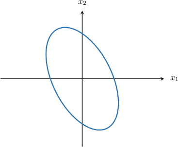
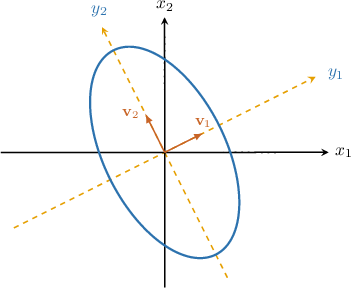
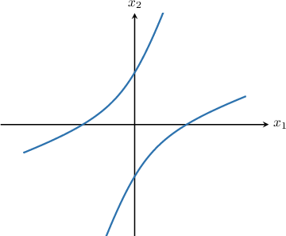
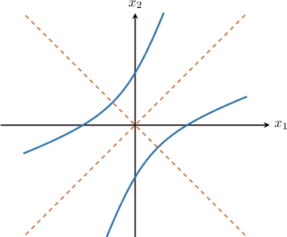

# Reducing a Quadratic Curve to Its Principal Axes

Source: https://www.mathacademy.com/topics/3129?courseId=55
Topic ID: 3129

## Prerequisites

- [Equations of Hyperbolas Centered at the Origin](../integrated-math-iii-honors/871-equations-of-hyperbolas-centered-at-the-origin.md)
- [Finding the Canonical Form of a Quadratic Form Using Orthogonal Transformations](./3126-finding-the-canonical-form-of-a-quadratic-form-using-orthogonal-transformations.md)

## Lesson

### Introduction

Let $A$ be a $2\times 2$ symmetric matrix with real entries. As we know, there exists an orthonormal change of variables

$$

\mathbf{x}=P\mathbf{y}

$$

that transforms the quadratic form $\mathbf{x}^TA\mathbf{x}$ into the quadratic form $\mathbf{y}^TD\mathbf{y},$ where $D$ is a diagonal matrix.

The columns of the matrix $P$ are the (normalized) unit eigenvectors of $A,$ which are mutually orthogonal. These are called the **principal axes** of the quadratic form.

Let's use this knowledge to find out which curve is defined by the equation

$$

6x_1^2+4x_1x_2+3x_2^2= 14,

$$

and see the geometric interpretation of the principal axes.

If we plot our curve using a graphical calculator, we obtain the following:

It looks like an ellipse. Let's now find our coordinate system, in which the equation of the curve will be the simplest.

First, we consider the corresponding quadratic form

$$

Q(\mathbf{x})={\color{blue}6}x_1^2+{\color{red}4}x_1x_2+{\color{blue}3}x_2^2,

$$

which we reduce to its canonical (diagonal) form.

So, we write down the matrix of $Q(\mathbf{x}) \mathbin{:}$

$$

[\begin{aligned}6 & 2 \\ 2 & 3\end{aligned}]

$$

Next, we find the eigenvalues of $A\mathbin{:}$

$$

\begin{aligned}|𝐴−𝜆𝐼| & =0 \\ \begin{aligned}6−𝜆 & 2 \\ 2 & 3−𝜆\end{aligned} & =0 \\ 𝜆^{2}−9𝜆+14 & =0 \\ 𝜆 & =7,\,2\end{aligned}

$$

Now, let's find the principal axes of the curve.

- Seeking a non-zero solution of $(A-7I)\mathbf{x}=\mathbf{0}$ gives the eigenvector $[\begin{aligned}2 \\ 1\end{aligned}]$ Dividing $\mathbf{v}_1$ by its norm $\| \mathbf{v}_1 \| = \sqrt{5},$ we get

- Seeking a non-zero solution of $(A-2I)\mathbf{x}=\mathbf{0}$ gives the eigenvector $[\begin{aligned}−1 \\ 2\end{aligned}]$ Dividing $\mathbf{v}_2$ by its norm $\| \mathbf{v}_2 \| = \sqrt{5},$ we get

Therefore, the principal axes of our quadratic form (and the corresponding curve) are

$\qquad$ $[\begin{aligned}2 \\ 1\end{aligned}]$ and $[\begin{aligned}−1 \\ 2\end{aligned}]$

Notice that in the diagram below, the principal axes correspond to the axes $y_1$ and $y_2.$

In the new coordinate system, our quadratic form can be reduced to

$$

7y_1^2 + 2y_2^2.

$$

Therefore, the curve has the following equation:

$$

\begin{aligned}7𝑦_{21}^{}+2𝑦_{22}^{} & =14 \\ \frac{𝑦_{21}^{}}{(\sqrt{√2})^{2}}+\frac{𝑦_{22}^{}}{(\sqrt{√7})^{2}} & =1\end{aligned}

$$

This is an ellipse with semiaxes $\sqrt2$ and $\sqrt{7}.$

### Example: Identifying the Principal Axes of a Quadratic Curve Using a Diagram

#### Question

Draw a diagram that depicts the lines representing the principal axes of the quadratic curve shown below.

#### Explanation

The principal axes of a curve define a coordinate system in which the curve can be represented by its (simplest) canonical equation.

Our curve is a hyperbola. This curve will have the canonical equation of the form

$$

\dfrac{x^2}{a^2} - \dfrac{y^2}{b^2} = 1

$$

if one axis passes through the vertices of the hyperbola and the other axis is the perpendicular bisector of the segment connecting the two vertices.

### Example: Identifying a Quadratic Plane Curve

#### Question

Which curve is defined by the equation $6x_1^2+8x_1x_2-9x_2^2= 70?$

#### Explanation

Consider the quadratic form $Q(\mathbf{x})=6x_1^2+8x_1x_2-9x_2^2.$ To determine the curve defined by the given equation, we reduce $Q(\mathbf{x})$ to its canonical (diagonal) form.

First, we write down the matrix of $Q(\mathbf{x}),$ which is

$$

[\begin{aligned}6 & 4 \\ 4 & −9\end{aligned}]

$$

Next, we find the eigenvalues of $A\mathbin{:}$

$$

\begin{aligned}|𝐴−𝜆𝐼| & =0 \\ \begin{aligned}6−𝜆 & 4 \\ 4 & −9−𝜆\end{aligned} & =0 \\ 𝜆^{2}+3𝜆−70 & =0 \\ 𝜆 & =7,\,−10\end{aligned}

$$

So, our quadratic form can be reduced to $7y_1^2 -10 y_2^2.$

In the new variables, the curve has the following equation:

$$

\begin{aligned}7𝑦_{21}^{}−10𝑦_{22}^{} & =70 \\ \frac{𝑦_{21}^{}}{10}−\frac{𝑦_{22}^{}}{7} & =1 \\ \frac{𝑦_{21}^{}}{(\sqrt{√10})^{2}}−\frac{𝑦_{22}^{}}{(\sqrt{√7})^{2}} & =1\end{aligned}

$$

This is a hyperbola with semiaxes $\sqrt{10}$ and $\sqrt{7}.$

### Some Special Cases

In some special cases, a quadratic equation might generate a degenerate curve or even an empty set.

- For example, consider the quadratic equation Reducing the left-hand side to the canonical form, we obtain which represents two intersecting lines $y_1 = y_2$ and $y_1 = -y_2.$

- Now consider the quadratic equation Reducing the left-hand side to the canonical form, we obtain which represents an empty set as the equation $y_2^2 = -1$ does not have any real solution.

- Finally, reducing the left-hand side of to the canonical form, we obtain which represents a pair of parallel lines $y_2 = 1$ and $y_2=-1.$

### Example: Finding the Principal Axes of a Quadratic Plane Curve Given the Corresponding Eigenvalues

#### Question

Consider the matrix $[\begin{aligned}2 & 1 \\ 1 & 2\end{aligned}]$ and the quadratic curve $\mathbf{x}^T \! A \mathbf{x} = 1.$ Given that $A$ has eigenvalues $\lambda_1=3$ and $\lambda_2=1,$ find the principal axes of the curve.

#### Explanation

Notice that $A$ is symmetric. The principal axes of the curve

$$

\mathbf{x}^T \! A \mathbf{x} = 1

$$

are the vectors that give an orthonormal eigenvector basis for $A.$ Let's now find these eigenvectors.

- For $\lambda_1=3,$ we have Seeking a non-zero solution of $(A-3I)\mathbf{x}=\mathbf{0}$ gives the eigenvector $[\begin{aligned}1 \\ 1\end{aligned}]$ Dividing $\mathbf{v}_1$ by its norm $\| \mathbf{v}_1 \| = \sqrt{2},$ we get

- For $\lambda_2=1,$ we have Seeking a non-zero solution of $(A-I)\mathbf{x}=\mathbf{0}$ gives the eigenvector $[\begin{aligned}−1 \\ 1\end{aligned}]$ Dividing $\mathbf{v}_2$ by its norm $\| \mathbf{v}_2 \| = \sqrt{2},$ we get

Therefore, the principal axes of our curve are

$\qquad$ $[\begin{aligned}1 \\ 1\end{aligned}]$ and $[\begin{aligned}−1 \\ 1\end{aligned}]$

### Example: Finding the Principal Axes of a Quadratic Plane Curve

#### Question

Find the principal axes of the curve $19x_1^2-6x_1x_2+11x_2^2 = 20.$

#### Explanation

First, consider the quadratic form $Q(\mathbf{x})=19x_1^2-6x_1x_2+11x_2^2.$ The matrix of the form is

$$

[\begin{aligned}19 & −3 \\ −3 & 11\end{aligned}]

$$

Notice that $A$ is symmetric. The principal axes of the curve

$$

\mathbf{x}^T \! A \mathbf{x} = 20

$$

are the vectors that form an orthonormal eigenvector basis of $A.$

By solving the characteristic equation $|A-\lambda I| = 0,$ we obtain

$\qquad$ $\lambda_1=20 \quad$ and $\quad \lambda_2=10.$

Let's now find the eigenvectors.

- For $\lambda_2=20,$ we have Seeking a non-zero solution of $(A-20I)\mathbf{x}=\mathbf{0}$ gives the eigenvector $[\begin{aligned}−3 \\ 1\end{aligned}]$ Dividing $\mathbf{v}_2$ by its norm $\| \mathbf{v}_2 \| = \sqrt{10},$ we get

- For $\lambda_1=10,$ we have Seeking a non-zero solution of $(A-10I)\mathbf{x}=\mathbf{0}$ gives the eigenvector $[\begin{aligned}1 \\ 3\end{aligned}]$ Dividing $\mathbf{v}_1$ by its norm $\| \mathbf{v}_1 \| = \sqrt{10},$ we get

Therefore, the principal axes of our curve are

$\qquad$ $[\begin{aligned}−3 \\ 1\end{aligned}]$ and $[\begin{aligned}1 \\ 3\end{aligned}]$
