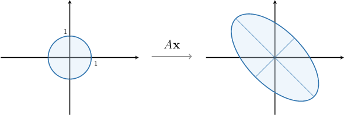
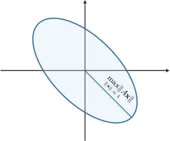
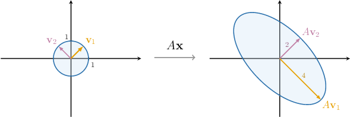
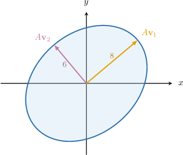

# The Singular Values of a Matrix

Source: https://www.mathacademy.com/topics/3131?courseId=55
Topic ID: 3131

## Prerequisites

- [Positive-Definite and Negative-Definite Quadratic Forms](./3127-positive-definite-and-negative-definite-quadratic-forms.md)
- [Constrained Optimization of Quadratic Forms: Determining Where Extrema are Attained](./4238-constrained-optimization-of-quadratic-forms-determining-where-extrema-are-attained.md)

## Lesson

### Introduction

Let's suppose we are given the matrix

$$

[\begin{aligned}1 & 3 \\ −3 & −1\end{aligned}]

$$

Then, the corresponding linear transformation

$$

\mathbf x \mapsto A \mathbf x

$$

maps the unit circle $\big\{\mathbf x \, | \, \|\mathbf x\|=1 \big\}$ in $\mathbb R^2$ onto an ellipse $\big\{A\mathbf{x} \,|\, \| \mathbf{x} \| =1 \big\}$ in $\mathbb{R}^2,$ as shown below.

How can we find the maximum possible value of $\|A \mathbf x\|?$ Geometrically, this is equivalent to finding the semi-major axis of our ellipse.

First, we note the following:

- The value of $\mathbf x$ that maximizes $||A\mathbf x||$ also maximizes $||A\mathbf x||^2.$

- If $\mathbf v$ is a column vector, then $||\mathbf v||^2 = \mathbf v^T \mathbf v\mathbin{:}$

Therefore, we can re-write the squared distance from the origin to the point $A\mathbf{x}$ on our ellipse as follows:

$$

\begin{aligned}‖𝐴𝐱‖^{2} & =(𝐴𝐱)^{𝑇}(𝐴𝐱) \\ & =(𝐱^{𝑇}\,𝐴^{𝑇})(𝐴𝐱) \\ & =𝐱^{𝑇}\,(𝐴^{𝑇}\,𝐴)𝐱\end{aligned}

$$

Note that $\mathbf{x}^T (A^T A) \mathbf{x}$ is a quadratic form with the matrix $A^T A.$ Therefore, the maximum value of this quadratic form for $\| \mathbf{x} \| =1$ equals the largest eigenvalue of the matrix $A^T A.$

In our case, we have

$$

\begin{aligned}𝐴^{𝑇}\,𝐴 & =[\begin{aligned}1 & 3 \\ −3 & −1\end{aligned}]^{𝑇}[\begin{aligned}1 & 3 \\ −3 & −1\end{aligned}] \\ & =[\begin{aligned}1 & −3 \\ 3 & −1\end{aligned}][\begin{aligned}1 & 3 \\ −3 & −1\end{aligned}] \\ & =[\begin{aligned}10 & 6 \\ 6 & 10\end{aligned}].\end{aligned}

$$

Next, we calculate the eigenvalues of the matrix $A^TA\mathbin{:}$

$$

\begin{aligned}|𝐴^{𝑇}𝐴−𝜆𝐼| & =0 \\ \begin{aligned}10−𝜆 & 6 \\ 6 & 10−𝜆\end{aligned} & =0 \\ (10−𝜆)^{2}−36 & =0 \\ (10−𝜆)^{2} & =36 \\ 10−𝜆 & =±6 \\ 𝜆 & =4,\,16\end{aligned}

$$

Since the largest eigenvalue of $A^T A$ is $16,$ we obtain

$$

\max\limits_{\| \mathbf{x} \| = 1} \big\{ \| A\mathbf{x} \|^2 \big\} = 16 \qquad\Longrightarrow\qquad \max\limits_{\| \mathbf{x} \| = 1} \big\{ \| A\mathbf{x} \| \big\} = \sqrt{16} = 4.

$$

Therefore, the length of the semi-major axis of our ellipse equals $4.$

### Example: Finding the Semi-Major Axis of the Image of the Unit Sphere

#### Question

A $2 \times 3$ matrix $A$ maps the unit sphere $\big\{\mathbf{x} \,|\, \| \mathbf{x} \| =1 \big\}$ from $\mathbb{R}^3$ onto an ellipse in $\mathbb{R}^2.$ Given that the eigenvalues of $A^T A$ are $7, 2,$ and $0,$ find the length of the ellipse's semi-major axis.

#### Explanation

The matrix $A$ maps the unit sphere $\big\{\mathbf{x} \,|\, \| \mathbf{x} \| =1 \big\}$ from $\mathbb{R}^3$ onto the ellipse $\big\{A\mathbf{x} \,|\, \| \mathbf{x} \| =1 \big\}$ in $\mathbb{R}^2.$

First, let's re-write the squared distance from the origin to the point $A\mathbf{x}$ on our ellipse, as follows:

$$

\begin{aligned}‖𝐴𝐱‖^{2} & =(𝐴𝐱)^{𝑇}(𝐴𝐱) \\ & =(𝐱^{𝑇}\,𝐴^{𝑇})(𝐴𝐱) \\ & =𝐱^{𝑇}\,(𝐴^{𝑇}\,𝐴)𝐱,\end{aligned}

$$

where $\mathbf{x}^T (A^T A) \mathbf{x}$ is the quadratic form with the matrix $A^T A.$

The maximum value of this quadratic form, when $\| \mathbf{x} \| =1,$ is equal to the largest eigenvalue of the matrix $A^T A.$

Since the largest eigenvalue of $A^T A$ is $7,$ we obtain

$$

\max\limits_{\| \mathbf{x} \| = 1} \big\{ \| A\mathbf{x} \|^2 \big\} = 7 \qquad\Longrightarrow\qquad \max\limits_{\| \mathbf{x} \| = 1} \big\{ \| A\mathbf{x} \| \big\} = \sqrt{7}.

$$

Therefore, the semi-major axis of our ellipse is $\sqrt{7}.$

### The Singular Values of a Matrix

Let $A$ be an $m\times n$ matrix. Then, $A^T A$ is always a symmetric, positive semi-definite matrix. In particular, $A^TA$ can be orthogonally diagonalized, and its eigenvalues are non-negative real numbers.

The **singular values** of $A$ are defined as the square roots of the eigenvalues of the matrix $A^T A.$ The $i$th singular value of $A$ is denoted $\sigma_i\mathbin{:}$

- $\sigma_1 = \sqrt{\lambda_1}$

- $\sigma_2 = \sqrt{\lambda_2}$

- $\sigma_3 = \sqrt{\lambda_3}$ $\:\vdots$

- $\sigma_n = \sqrt{\lambda_n}$

We usually list the singular values in *decreasing* order.

Now, we know that $A^TA$ is orthogonally diagonalizable. Therefore, if

$$

\left\{\mathbf v_1, \mathbf v_2\,\ldots, \mathbf v_n\right\}

$$

is an *orthonormal* basis of $\mathbb R^n$ consisting of the eigenvectors of ${A^T}{A}$ with the corresponding eigenvalues

$$

\lambda_1\geq \lambda_2\geq \ldots \geq \lambda_n,

$$

then it can be shown that

- $\sigma_1 = \sqrt{\lambda_1}$ is the length of $A\mathbf v_1,$

- $\sigma_2 = \sqrt{\lambda_2}$ is the length of $A\mathbf v_2,$ $\:\vdots$

- $\sigma_n = \sqrt{\lambda_n}$ is the length of $A\mathbf v_n.$

Furthermore:

- $\sigma_1$ is the maximum value of $||A\mathbf x||$ over all *unit* vectors $\mathbf x,$ and is attained on the unit eigenvector $\mathbf v_1$

- $\sigma_2$ is the maximum value of $||A\mathbf x||$ over all *unit* vectors $\mathbf x$ that are orthogonal to $\mathbf v_1,$ and is attained on the unit eigenvector $\mathbf v_2$

- $\sigma_3$ is the maximum value of $||A\mathbf x||$ over all *unit* vectors $\mathbf x$ that are orthogonal to $\mathbf v_1$ *and* $\mathbf v_2,$ and is attained on the unit eigenvector $\mathbf v_3$ $\:\vdots$

- $\sigma_n$ is the maximum value of $||A\mathbf x||$ over all *unit* vectors $\mathbf x$ that are orthogonal to $\mathbf v_1,\mathbf v_2,\ldots,\mathbf v_{n-1},$ and is attained on the unit eigenvector $\mathbf v_n$

Let's take a look at a concrete example.

### Associating Singular Values With an Ellipse's Principal Axes

We've seen that for the matrix $A,$ given by

$$

[\begin{aligned}1 & 3 \\ −3 & −1\end{aligned}]

$$

the eigenvalues of $A^TA$ are $\lambda_1=16$ and $\lambda_2=4.$ It's easy to show that the corresponding unit eigenvectors of $A^T A$ are

$$

[\begin{aligned}1 \\ 1\end{aligned}]

$$

The singular values of $A$ are

$$

\begin{aligned}𝜎_{1} & =\sqrt{√𝜆_{1}}=\sqrt{√16}=4, \\ 𝜎_{2} & =\sqrt{√𝜆_{2}}=\sqrt{√4}=2.\end{aligned}

$$

Putting all of this information together gives us the following diagram.

Note that our ellipse's semi-major and semi-minor axes are $\sigma_1 = 4$ and $\sigma_2 =2,$ respectively.

### Example: Finding the Semi-Major Axis of the Image of the Unit Sphere Given the Corresponding Singular Values

#### Question

A $2 \times 3$ matrix $A$ maps the unit sphere $\big\{\mathbf{x} \,|\, \| \mathbf{x} \| =1 \big\}$ from $\mathbb{R}^3$ onto an ellipse in $\mathbb{R}^2.$ Given that the singular values of $A$ are $\sigma_1=4,$ $\sigma_2=2,$ and $\sigma_3 = 0,$ find the length of the semi-major axis of the ellipse.

#### Explanation

The matrix $A$ maps the unit sphere $\big\{\mathbf{x} \,|\, \| \mathbf{x} \| =1 \big\}$ from $\mathbb{R}^3$ onto the ellipse $\big\{A\mathbf{x} \,|\, \| \mathbf{x} \| =1 \big\}$ in $\mathbb{R}^2.$

First, let's re-write the squared distance from the origin to the point $A\mathbf{x}$ on our ellipse, as follows:

$$

\begin{aligned}‖𝐴𝐱‖^{2} & =(𝐴𝐱)^{𝑇}(𝐴𝐱) \\ & =(𝐱^{𝑇}\,𝐴^{𝑇})(𝐴𝐱) \\ & =𝐱^{𝑇}\,(𝐴^{𝑇}\,𝐴)𝐱,\end{aligned}

$$

where $\mathbf{x}^T (A^T A) \mathbf{x}$ is the quadratic form with the symmetric matrix $A^T A.$

The maximum value of this quadratic form, when $\| \mathbf{x} \| =1,$ is equal to the largest eigenvalue of the matrix $A^T A.$

The square roots of the eigenvalues of $A^T A$ are called the ** of $A.$ Since the largest singular value of $A$ is $\sigma_1=4,$ the largest eigenvalue of $A^T A$ must be $\lambda_1 = \sigma_1^2=4^2.$ So, we obtain that

$$

\max\limits_{\| \mathbf{x} \| = 1} \big\{ \| A\mathbf{x} \|^2 \big\} = 4^2 \qquad\Longrightarrow\qquad \max\limits_{\| \mathbf{x} \| = 1} \big\{ \| A\mathbf{x} \| \big\} = 4.

$$

Therefore, the semi-major axis of our ellipse is $\sigma_1=4.$

### Example: Solving Problems Regarding the Image of the Unit Eigenvectors of a Quadratic Form

#### Question

A $2 \times 2$ matrix $A$ maps the unit circle $\big\{\mathbf{x} \,|\, \| \mathbf{x} \| =1 \big\}$ from $\mathbb{R}^2$ onto an ellipse in $\mathbb{R}^2.$ The corresponding ellipse and its principal axes are depicted in the diagram above. Given that $\mathbf v_1$ and $\mathbf v_2$ are unit eigenvectors of $A^TA,$ find an eigenvector corresponding to the eigenvalue $36$ of $A^T A?$

#### Explanation

Suppose $A$ is an $m\times n$ matrix. Let

$$

\left\{\mathbf v_1, \mathbf v_2\,\ldots, \mathbf v_n\right\}

$$

be an ** basis of $\mathbb R^n$ consisting of the eigenvectors of $A^T A$ with corresponding eigenvalues

$$

\lambda_1\geq \lambda_2\geq \ldots \geq \lambda_n.

$$

Then,

- $\sigma_1 = \sqrt{\lambda_1}$ is the length of $A\mathbf v_1,$

- $\sigma_2 = \sqrt{\lambda_2}$ is the length of $A\mathbf v_2,$

- $\cdots$

In our example, we see that

- $||A\mathbf v_1|| = 8 = \sigma_1,$ which means that $\lambda_1 = 8^2 = 64,$ and

- $||A\mathbf v_2|| = 6 = \sigma_2,$ which means that $\lambda_2 = 6^2 = 36.$

Therefore, an eigenvector corresponding to the eigenvalue $\lambda_2 = 36$ of $A^T A$ is $\mathbf{v}_2.$
