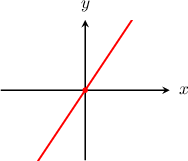
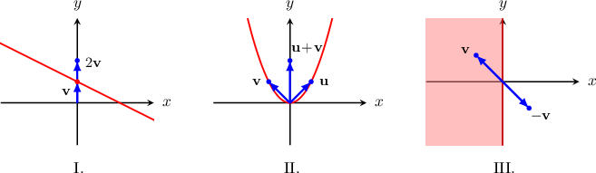
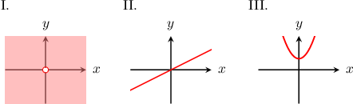
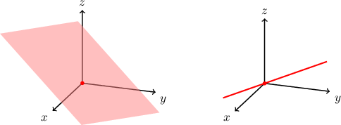
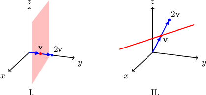
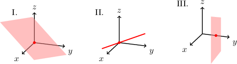

# Subspaces of N-Dimensional Space: Geometric Interpretation

Source: https://www.mathacademy.com/topics/4077?courseId=55
Topic ID: 4077

## Prerequisites

- [Subspaces of N-Dimensional Space](./1853-subspaces-of-n-dimensional-space.md)

## Lesson

### Introduction

Recall that $H\subseteq \mathbb R^n$ is a **subspace** of $\mathbb{R}^n$ if and only if it satisfies the following properties:

- *Closure under vector addition:* $\qquad$ If $\mathbf{u}$ and $\mathbf{v}$ are in $H,$ then their sum $\mathbf{u}+\mathbf{v}$ is also in $H.$

- *Closure under scalar multiplication:* $\qquad$ If $\mathbf{u}$ is in $H,$ then $c\cdot \mathbf{u}$ is also in $H$ for any scalar number $c.$

In the vector space $\mathbb{R}^n,$ there are two **trivial subspaces**.

- One trivial subspace is the set consisting of just the zero vector. This is a subspace because the sum of two zero vectors is the zero vector, and any multiple of the zero vector is the zero vector.

- Another trivial subspace is the set consisting of the entire set $\mathbb{R}^n.$ This is a subspace because the sum of two vectors in $\mathbb{R}^n$ is in $\mathbb{R}^n,$ and any multiple of a vector in $\mathbb{R}^n$ is in $\mathbb{R}^n.$

### Non-Trivial Subspaces in Two-Dimensional Space

In $\mathbb{R}^2,$ we have the following theorem:

*The only non-trivial subspaces in $\mathbb{R}^2$ are straight lines that pass through the origin.*

For example, the diagram below shows a subspace in $\mathbb{R}^2.$

Let's now consider a few examples of subsets of $\mathbb{R}^2$ that are *not* subspaces of $\mathbb{R}^2$.

- Diagram I shows a line that does not pass through the origin. It is *not* a subspace because $\mathbf v$ belongs to the set while $2\mathbf v$ does not. So the set is not closed under scalar multiplication.

- Diagram II is not a subspace because $\mathbf u$ and $\mathbf v$ belong to the set while $\mathbf u+\mathbf v$ does not. So the set is not closed under vector addition.

- Diagram III is not a subspace because $\mathbf v$ belongs to the set while $-\mathbf v$ does not. So the set is not closed under scalar multiplication.

### Example: Identifying Whether Sets Represented Graphically Are Subspaces in Two-Dimensional Space

#### Question

Which of the diagrams shown above represent subspaces of $\mathbb{R}^2?$

#### Explanation

Let's analyze each diagram in turn.

- Diagram I represents the whole plane $\mathbb{R}^2$ without the origin. But every subspace must contain the origin. Therefore, it is ** a subspace of $\mathbb{R}^2.$

- Diagram II is a line that passes through the origin. Therefore, it is a subspace of $\mathbb{R}^2.$

- Diagram III is a parabola that does not pass through the origin. But every subspace must contain the origin. Therefore, it is ** a subspace of $\mathbb{R}^2.$

In conclusion, the correct answer is "II only."

### Non-Trivial Subspaces in Three-Dimensional Space

In $\mathbb{R}^3,$ we have the following theorem:

*The only non-trivial subspaces in $\mathbb{R}^3$ are straight lines or planes that pass through the origin.*

For example, the diagram below shows two subspaces in $\mathbb{R}^3.$

On the other hand, the sets shown in the diagrams below are *not* subspaces in $\mathbb{R}^3.$

- Diagram I shows a plane that does not pass through the origin. It is not a subspace because $\mathbf v$ belongs to the set while $2\mathbf v$ does not. So, the set is not closed under scalar multiplication.

- Diagram II shows a line that does not pass through the origin. It is not a subspace because $\mathbf v$ belongs to the set while $2\mathbf v$ does not. So, the set is not closed under scalar multiplication.

### Example: Identifying Whether Sets Represented Graphically Are Subspaces in Three-Dimensional Space

#### Question

Which of the diagrams shown above represent subspaces of $\mathbb{R}^3?$

#### Explanation

Let's analyze each diagram in turn.

- Diagram I represents a plane that passes through the origin. Therefore, it is a subspace of $\mathbb{R}^3.$

- Diagram II represents a line that passes through the origin. Therefore, it is also a subspace of $\mathbb{R}^3.$

- Diagram III does not represent a subspace. The origin $\begin{aligned}0 \\ 0 \\ 0\end{aligned}$ clearly lies outside the subset.

So, the correct answer is "I and II only."

### Example: Identifying Whether Sets Represented Using Set Notation Are Subspaces

#### Question

Consider the subsets $\; A=\{\langle x, y, z \rangle \in \mathbb{R}^3: x^2=y \}\;$ and $\; B= \{\langle 3-t, -3+t, -6+2t \rangle: t \in \mathbb{R} \}.\;$ Which of them is a subspace of $\mathbb{R}^3?$

#### Explanation

Let's analyze each of the subsets.

- The set $A$ is not a subspace because it is not closed under scalar multiplication. For example, the vector $\begin{aligned}1 \\ 1 \\ 0\end{aligned}$ belongs to $A,$ but the vector $\begin{aligned}2 \\ 2 \\ 0\end{aligned}$ does not lie in $A$ (because it does not satisfy $x^2=y$).

- The set $B$ represents a line, and a line is a subspace if and only if it passes through the origin. If the origin belongs to this subset, we would have which gives us We see that $t=3$ is the solution to the three equations. So, if we choose $t=3,$ then we find that $\mathbf{0} \in B.$ Therefore, $B$ is a subspace of $\mathbb{R}^3.$

In conclusion, the correct answer is "$B$ only".

### Final Notes About the Set of Real Numbers

Lastly, consider the set $\mathbb{R},$ which belongs to the family of vector spaces $\mathbb{R}^n$ (when $n=1$). This vector space has only two subspaces, both of which are trivial:

- the zero subspace $\{0\},$ which contains only the number $0,$ and

- the whole space $\mathbb{R}$ (or, formally, $\mathbb{R}^1$), which contains all the real numbers.
