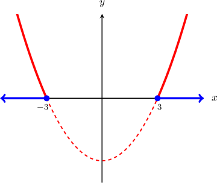

# Infinite Sets

Source: https://www.mathacademy.com/topics/4386?courseId=55
Topic ID: 4386

## Prerequisites

- [Cardinality of Finite Sets](./48-cardinality-of-finite-sets.md)
- [Subsets](./50-subsets.md)
- [Second and Higher-Order Derivatives](../ap-calculus-ab/281-second-and-higher-order-derivatives.md)
- [The Chain Rule With Trigonometric Functions](../ap-calculus-ab/305-the-chain-rule-with-trigonometric-functions.md)
- [The Chain Rule With Exponential Functions](../ap-calculus-ab/1007-the-chain-rule-with-exponential-functions.md)
- [Solving Quadratic Inequalities Using the Graphical Method](../integrated-math-iii-honors/3833-solving-quadratic-inequalities-using-the-graphical-method.md)

## Lesson

### Introduction

Recall that a set is **finite** if it contains a finite number of elements and is **infinite** if it has infinitely many elements.

In this lesson, we'll determine whether a set given in set-builder notation is finite or infinite.

For example, let's determine which of the following sets are finite and which are infinite:

$$

\begin{aligned}𝐴={𝑛∈ℤ\,:\,|2𝑛|≤8},\,𝐵={𝑞∈ℚ\,:\,|2𝑞|≤8},\,𝐶={𝑥∈ℝ\,:\,|2𝑥|≤8}\end{aligned}

$$

Notice that all three sets are defined using a conditional definition with the same restricting inequality defined over different universal sets ($\mathbb{Z},$ $\mathbb{Q},$ and $\mathbb{R}$).

Firstly, since $\mathbb Z\subset \mathbb Q \subset \mathbb R,$ we start by solving the restricting inequality $|2x| \leq 8$ for $x\in \mathbb R{:}$

$$

\begin{aligned}|2𝑥|≤8 \\ 2|𝑥|≤8 \\ |𝑥|≤4\end{aligned}

$$

This inequality has the solution

$$

-4 \leq x \leq 4.

$$

For convenience, we'll express our solution in interval notation as $x\in I,$ where $I=\left[-4,4\right].$

Now, before we analyze our sets, we need to state a couple of theorems:

******: *Every real interval of nonzero length contains infinitely many rational numbers.*

******: *If $X$ is infinite and $X\subseteq Y,$ then $Y$ is infinite.*

We're now ready to determine whether $A, B,$ and $C$ are finite or infinite:

- Set $A$ is finite. If $n \in \mathbb{Z},$ the solutions to the inequality $|2n| \leq 8$ are all the *integers* that lie in the interval $I.$ Therefore, Consequently, $|A| = 9,$ which is finite.

- Set $B$ is infinite. If $q \in \mathbb{Q},$ the solutions to $|2q| \leq 8$ are all the *rational* numbers in the interval $I.$ Since any real interval of nonzero length contains infinitely many rational numbers (by Theorem 1), it follows that $B$ is infinite.

- Set $C$ is infinite. Since $B$ is infinite, and $B \subset C,$ it follows that $C$ is infinite (by Theorem 2).

Therefore, we conclude that $A$ is finite, while $B$ and $C$ are infinite.

Let's see some more examples.

### Example: Sets Defined Using Inequalities

#### Question

Which of the following sets are infinite?

1. $A = \{n \in \mathbb{Z} \:: \: n^2-9 \geq 0 \}$

2. $B = \{m \in \mathbb{Z} \:: \: m^2-9 \leq 0 \}$

3. $C = \{q \in \mathbb{Q} \:: \: q^2-9 \leq 0 \}$

#### Explanation

The cardinality of a finite set is the number of elements contained within it. A set is infinite if it has infinitely many elements.

Let's start by analyzing the parabola $y=x^2-9$ for $x\in\mathbb R.$

First, we find the roots of the parabola:

$$

\begin{aligned}𝑥^{2}−9 & =0 \\ (𝑥−3)(𝑥+3) & =0\end{aligned}

$$

So, the roots are $x=-3$ and $x=3,$ and we can graph the parabola as follows:

Therefore:

- The solution to the inequality $x^2-9 \geq 0$ for $x \in \mathbb{R}$ is and can be expressed as $x \in I_1 = \left(-\infty, -3\right] \cup \left[3,\infty\right).$

- Similarly, the solution to the inequality $x^2-9 \leq 0$ for $x \in \mathbb{R}$ is and can be expressed as $x \in I_2 = [-3,3].$

With these in mind, let's examine our sets:

- The set $A$ is infinite. If $n \in \mathbb{Z},$ the solutions to the inequality $n^2-9 \geq 0$ are all the integers that lie in the interval $I_1.$ Therefore,

- The set $B$ is finite. If $m \in \mathbb{Z},$ the solutions to the inequality $m^2-9 \leq 0$ are all the integers that lie in the interval $I_2.$ Therefore, Consequently, $|B| = 7,$ which is finite.

- The set $C$ is infinite. If $q \in \mathbb{Q},$ the solutions to $q^2-9 \leq 0$ are all the rational numbers that lie in the interval $I_2.$ Since any real interval of nonzero length contains infinitely many rational numbers, it follows that $C$ is infinite.

Therefore, the correct answer is "$A$ and $C$ only."

### Example: Sets Defined Using Trigonometric Equations

#### Question

Which of the following sets are infinite?

1. $A = \{n \in \mathbb{Z} \:: \: \sin (n\pi) = 1 \}$

2. $B = \{q \in \mathbb{Q} \:: \: \sin (q\pi) = 1 \}$

3. $C = \{x \in \mathbb{R} \:: \: \sin (x\pi) = 1 \}$

#### Explanation

The cardinality of a finite set is the number of elements contained within it. A set is infinite if it has infinitely many elements.

We start by finding the solutions to the equation $\sin (x\pi) = 1$ for $x\in\mathbb R{:}$

$$

\begin{aligned}𝑥𝜋 & =\frac{𝜋}{2}+2𝑚𝜋 \\ 𝑥 & =\frac{1}{2}+2𝑚,\,𝑚∈ℤ\end{aligned}

$$

With that in mind, let's examine our sets:

- The set $A$ is finite. There are no values of $m\in\mathbb Z$ such that $\dfrac{1}{2} + 2m \in\mathbb Z.$ Therefore, Consequently, $|A| = 0,$ which is finite.

- The set $B$ is infinite. Listing the elements of $B$ for different values of $m,$ we have

- The set $C$ is infinite. Since $B$ is infinite, and $B \subseteq C,$ it follows that $C$ is infinite.

Therefore, the correct answer is "$B$ and $C$ only."

### Example: Sets Defined Using Derivatives

#### Question

Which of the following sets are infinite?

1. $A = \left\{f^{(n)}(x) = \dfrac{\textrm d^n}{\textrm d x^n}(e^{5x}) \:: \: n\in \mathbb{N}_0 \right\}$

2. $B = \left\{g^{(n)}(x) = \dfrac{\textrm d^n}{\textrm d x^n}(6e^{-x}) \:: \: n\in \mathbb{N}_0 \right\}$

3. $C = \left\{h^{(n)}(x) = \dfrac{\textrm d^n}{\textrm d x^n}(2e^{x+3}) \:: \: n\in \mathbb{N}_0 \right\}$

#### Explanation

The cardinality of a finite set is the number of elements contained within it. A set is infinite if it has infinitely many elements.

- The set $A$ is infinite. Listing the first few elements of our set, we have the following: Thus, we can write our set as follows: Consequently, $A$ is infinite.

- The set $B$ is finite. Listing the first few elements of our set, we have the following: Thus, $B$ contains only two elements: Consequently, $|B| = 2,$ which is finite.

- The set $C$ is also finite. Listing the first few elements of our set, we have the following: Thus, $C$ contains only one element: Consequently, $|C| = 1,$ which is finite.

Therefore, the correct answer is "$A$ only."
