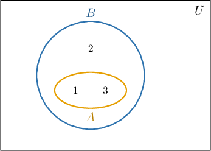
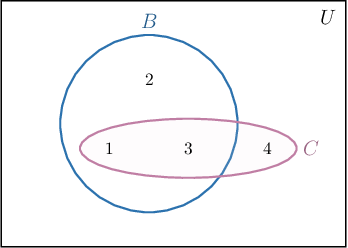
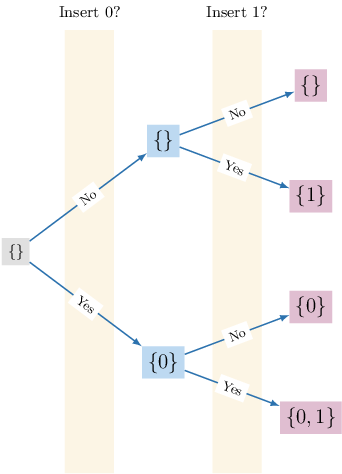
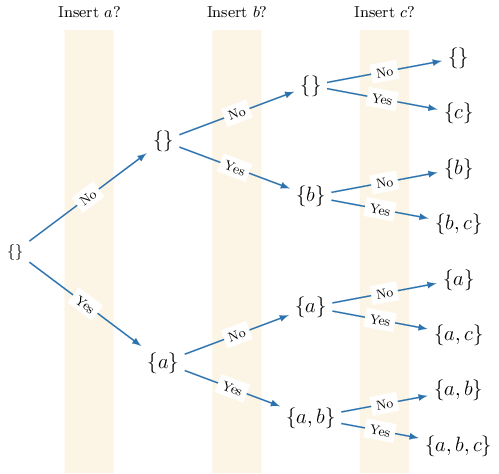
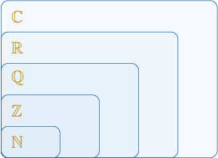

# Subsets

Source: https://www.mathacademy.com/topics/50?courseId=55
Topic ID: 50

## Prerequisites

- [Set Complements](./2829-set-complements.md)
- [The Conditional Definition of a Set](./4425-the-conditional-definition-of-a-set.md)

## Lesson

### Introduction

Given two sets $A$ and $B,$ if every element of $A$ is an element of $B,$ we say that $A$ is a **subset** of $B,$ and we write

$$

A \subseteq B.

$$

For example, consider the following sets:

$$

A = \{ {\color{blue}{1}},{\color{blue}{3}} \}, \qquad B = \{ 1,2,3\}, \qquad C=\{1,2,{\color{red}4}\}

$$

Notice that *every* element of $A$ is also an element of $B{:}$

$$

{\color{blue}{1}}\in B, \qquad {\color{blue}{3}}\in B

$$

Therefore, $A$ is a subset of $B,$ and we write $A \subseteq B.$

We can visualize the sets $A$ and $B$ as shown below. Notice that $A$ is contained entirely within $B$ (here, $U$ is the universal set).

On the other hand, not every element of $C$ is an element of $B{:}$

$$

1 \in B, \qquad 2\in B, \qquad {\color{red}4}\notin B

$$

Since $4 \notin B,$ we have that $C$ is *not* a subset of $B,$ and we write $C \not\subseteq B.$

We can visualize the sets $B$ and $C$ as follows. Notice that $C$ is *not* contained entirely within $B$ (here, $U$ is the universal set).

Another way of thinking about the statement $C \not\subseteq B$ is that $C$ contains *at least one* element that is not an element of $B.$ In this case, that element is $4.$

### Some Remarks

We note the following points regarding subsets:

- Every set $A$ is a subset of itself: This is because $A$ contains the same elements as $A,$ and therefore $A$ is a subset of $A.$

- The empty set is a subset of *every* set. So, for all sets $A,$ we have To understand this, remember that $\emptyset \not\subseteq A$ means that $\emptyset$ contains *at least one* element that is not an element of $A.$ However, this cannot be true since $\emptyset$ contains no elements! Thus, we must have $\emptyset\subseteq A.$ It's worth pointing out that the empty set is a subset of itself:

Finally, note that a set $A$ is a **proper subset** of a set $B$ if $A \subseteq B$ and $A \neq B.$ In this case, we can write

$$

A \subset B.

$$

To explain this concretely, consider the following sets:

$$

A = \{ 1,3 \}, \qquad B = \{ 1, 2, 3 \}, \qquad C = \{ 3,2,1 \}

$$

Notice that $A$ is a proper subset of $B,$ but $C$ is *not* a proper subset of $B{:}$

- Since every element of $A$ is an element of $B,$ we have that $A\subseteq B.$ Also, $A\neq B.$ Therefore, $A$ is a *proper* subset of $B{:}$

- On the other hand, $C\subseteq B$ because every element of $C$ is an element of $B.$ However, $C$ is *not* a proper subset of $B$ because $C=B.$ Therefore, we write

### Example: Identifying Subsets of a Given Set

#### Question

Which of the following sets is a subset of $S=\{n \in \mathbb{Z}: {-3} \leq 2n+1 \leq 7 \}?$

1. $\{-2, 0, 4 \}$

2. $\{0, 3 \}$

3. $\{-3, 1, 3 \}$

#### Explanation

First, we must find the elements of the set $S.$ Solving the given inequality, we have

$$

\begin{aligned}−3≤2𝑛+1 & ≤7 \\ −4≤2𝑛 & ≤6 \\ −2≤𝑛 & ≤3.\end{aligned}

$$

So, $S$ contains all integers between $-2$ and $3$ (including $-2$ and $3$):

$$

S = \{ -2, -1, 0, 1, 2, 3 \}

$$

A set is a subset of $S$ if all its elements are elements of $S.$ With that in mind, let's inspect each option.

- $\{-2,0,4 \}$ is ** a subset of $S$ because it contains the element $4 \notin S. \quad \color{red}\times$

- $\{0,3 \}$ is a subset of $S. \quad \color{green}\checkmark$

- $\{-3,1,3 \}$ is ** a subset of $S$ because it contains the element $-3 \notin S. \quad \color{red}\times$

Therefore, the correct answer is "II only".

### Listing All the Subsets of a Set

We can systematically list all the subsets of a given set using a tree diagram.

To demonstrate, let's find all the subsets of the set $A=\{0,1 \}.$

We list every possible combination of elements within the set using a tree diagram like the one below.

We start with the empty set as the root $\boxed{\{\}}.$

Next, we consider the element $0\in A.$ We can either include it or not include it in a new subset.

- If we don't include $0$ in $\boxed{\{\}},$ we are left with the empty set $\boxed{\{\}}.$ Next, we consider the element $1\in A.$ We can either include it or not include it in a new subset: If we don't include $1$ in $\boxed{\{\}},$ we are left with $\boxed{\{\}}.$ If we include $1$ in $\boxed{\{\}},$ we get $\boxed{\{1\}}.$

- If we include $0$ in $\boxed{\{\}},$ we get the set $\boxed{\{0\}}.$ Next, we consider the element $1\in A.$ We can either include it or not include it in a new subset: If we don't include $1$ in $\boxed{\{0\}},$ we are left with $\boxed{\{0\}}.$ If we include $1$ in $\boxed{\{0\}},$ we get $\boxed{\{0,1\}}.$

Finally, the list of all subsets is shown in the last column:

$$

\boxed{\{\}},\quad \: \boxed{\{0\}},\quad \: \boxed{\{1\}},\quad \: \boxed{\{0,1\}}

$$

### Example: Finding All Subsets of a Given Set

#### Question

Find all of the subsets of $A = \{a, b, c \}.$

#### Explanation

To find every subset of $A,$ we list out every combination of elements within $A.$

We can use the following diagram to visualize the process:

Note that we must include the empty set since it is a subset of every set.

By doing this, we get

$$

\emptyset, \{a\}, \{b\}, \{c\}, \{a, b\}, \{a, c\}, \{b, c\}, \{a, b, c\}.

$$

### Subsets of Special Sets

Recall that the natural numbers, integers, rational numbers, and real and complex numbers can be arranged in the following hierarchical diagram.

In other words, $\mathbb{N}$ is a (proper) subset of $\mathbb{Z},$ which is a (proper) subset of $\mathbb{Q},$ which is a (proper) subset of $\mathbb{R},$ which is a (proper) subset of $\mathbb{C}.$ We can write this symbolically as follows:

$$

\mathbb{N} \subseteq \mathbb{Z} \subseteq \mathbb{Q} \subseteq \mathbb{R} \subseteq \mathbb{C}

$$

Since none of these sets are equivalent, we can also write

$$

\mathbb{N} \subset \mathbb{Z} \subset \mathbb{Q} \subset \mathbb{R} \subset \mathbb{C}.

$$

Some restricted or extended special sets are subsets of others. For example:

- $\mathbb N$ is the set of natural numbers, and $\mathbb N_0$ is the set of natural numbers *and* zero. Therefore,

- $\mathbb Z$ is the set of integers, $\mathbb Z^+$ is the set of positive integers (equivalent to $\mathbb N$), and $\mathbb Z^+_0$ is the set of positive integers and zero (equivalent to $\mathbb N_0$). Therefore,

- $\mathbb Q^+$ is the set of positive rational numbers, $\mathbb R^+$ is the set of positive real numbers, and $\mathbb R$ is the set of real numbers. Therefore, However, note that, for example, $\mathbb Q \not\subset \mathbb R^+,$ since $0\in\mathbb Q$ yet $0\notin \mathbb R^+.$

### Example: Identifying Subsets of Special Sets

#### Question

Which of the following are subsets of $\mathbb{Z}_0^+$ (the set of non-negative integers)?

1. $\mathbb{Z}$

2. $\mathbb{Z}^-$ (the set of negative integers)

3. $\mathbb{N}$

#### Explanation

$A$ is a subset of $B$ if every element of $A$ is an element of $B.$

With that in mind, let's inspect the given choices.

- $\mathbb{Z}$ is ** a subset of $\mathbb{Z}_0^+.$ For example, $-1 \in \mathbb{Z}$ but $-1 \notin \mathbb{Z}_0^+.$

- $\mathbb{Z}^-$ is ** a subset of $\mathbb{Z}_0^+.$ For example, $-1 \in \mathbb{Z}^-$ but $-1 \notin \mathbb{Z}_0^+.$

- $\mathbb{N}$ is a subset of $\mathbb{Z}_0^+.$ Every natural number is a positive integer.

Therefore, the correct answer is "III only."

### Superset Notation

The notation

$$

A \supseteq B

$$

reads "$A$ is a **superset** of $B$", and is equivalent to $B \subseteq A.$ This is similar to how we can write either $x \leq y$ or $y \geq x$. The two notations mean the same thing.

Similarly, $A \supset B$ reads "$A$ is a **proper superset** of $B$," and is equivalent to $B \subset A.$

### Example: Identifying True Statements About Subsets

#### Question

Which of the following statements are true for the sets $A =\{n \in \mathbb{N} \mid 2n \geq 10 \}$ and $B= \{n\in \mathbb{Z} \mid n+2 \geq 5 \}?$

1. $A\subseteq B$

2. $B\subseteq A$

3. $B\nsubseteq A$

4. $B\supseteq A$

#### Explanation

First, we must find the elements of the sets $A$ and $B.$

- The elements of the set $A$ are all the natural numbers that satisfy the inequality $2n\geq 10,$ that is, $n\geq 5.$ So, we have

- On the other hand, the elements of the set $B$ are all integers that satisfy the inequality $n+2\geq 5,$ that is, $n\geq 3.$ So, we have

Now, let's inspect the given statements.

- $A\subseteq B$ is true. Every element of $A$ is an element of the set $B.$

- $B\subseteq A$ is false, while $B\nsubseteq A$ is true. For example, $3 \in B$ but $3 \notin A.$

- $B\supseteq A$ is equivalent to $A \subseteq B,$ which is true.

Therefore, the correct answer is "I, III, and IV only".

### Russell's Paradox: Why We Need a Universal Set

You might wonder why we need to define a universal set. Can't we just let the universal set be the set of everything?

The answer is no. If we don't specify a well-defined universal set, we encounter a nonsensical situation called **Russell's paradox.**

First, suppose there exists a set $\Omega$ that contains absolutely everything, including every mathematical object, every thought, every book, every person, animal, cell, and star in the universe, past, present, or future.

Russell's paradox originates from the following idea:

*Define $S$ as the set that contains all sets that are not elements of themselves.*

$$

S = \{A\in \Omega\,:\, A\notin A\}

$$

Most sets you can think of are elements of $S.$ For example, the set $\{1,2,3 \}$ is in $S$ because $\{1,2,3 \}\notin \{1,2,3 \}.$

It takes a bit of thought to find sets that *aren't* members of $S.$ Such sets do exist, although typical examples are somewhat abstract:

- The set containing all possible sets.

- The set containing all possible thoughts.

- The set $X,$ given by

However, what about $S$ itself? Is $S$ an element of $S?$ There are only two possibilities:

- If $S\in S,$ then by the definition of $S,$ we have that $S\notin S.$ But this is a contradiction because we cannot have $S\in S$ *and* $S\notin S.$

- If $S\notin S,$ then by the definition of $S,$ we must have that $S\in S.$ But this leads to the same contradiction as before!

The only way to resolve this is to conclude that $S\notin \Omega,$ but this is also a contradiction since $\Omega$ contains absolutely everything! So, there is no consistent answer to the question of whether $S$ itself is an element of $S.$ This is Russell's paradox, and when it was discovered, it shook the foundations of mathematics to its very core.

Later, it was realized that if a set is defined using a predicate, we should ensure that all sets involved are subsets of some larger set $U$ (i.e., a universal set) where we can always determine which elements are members of $U$ and which are not, at least in principle.

To see how this resolves Russell's paradox, suppose $U$ is a universal set. Let's refine our definition of $S$ as follows:

$$

S = \{A\subseteq U\,:\,A\notin A\}

$$

We'll assume $S$ is a set, so $S\subseteq U$ for some well-defined $U.$ Once again, we'll ask the question of whether $S\in S{:}$

- If $S\in S,$ then by the definition of $S,$ we have that $S\notin S.$ But this is a contradiction.

- If $S\notin S,$ then by the definition of $S,$ we have that $S\in S.$ But this is also a contradiction.

Thus, to resolve the paradox, we're left with no choice but to conclude that $S\not\subseteq U.$ This indicates that something is fundamentally wrong with our definition of $S,$ and no such set can exist because if it were a set, it would belong to a universal set.
