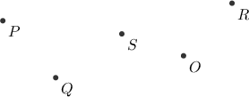
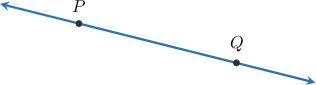
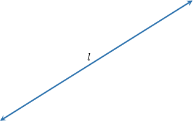
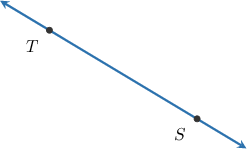
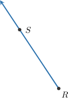
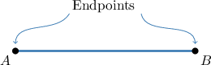
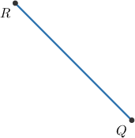

# Points, Lines, Rays, and Segments

Source: https://www.mathacademy.com/topics/1378?courseId=113
Topic ID: 1378

## Prerequisites

- None listed on the topic page.

## Lesson

### Introduction

In this lesson, we'll discuss some fundamental objects in geometry. The objects we'll discuss are some of the building blocks we use to describe all geometrical objects.

A **point** is an exact location in space. It has no size (i.e., no length, width, or depth), only position. A point is indicated with a dot usually labeled with a capital letter (e.g., $P$, $Q$, $S$,...), as shown below.

A **line** is a straight object that is infinitely long and has no width. We can think of it as an infinite collection of points, extending infinitely in both directions. A line has no endpoints!

Let's take a look at the following line.

A line that passes through the points $P$ and $Q$ is expressed as

$$

\overset{\longleftrightarrow}{PQ}.

$$

We use the "$\longleftrightarrow$" symbol to denote that the line extends forever in **both** directions.

Lines can also be indicated with lowercase letters. For example:

### Example: Identifying Lines and Their Notation

#### Question

What is the correct way to represent the line shown below?

#### Explanation

Since the line passes through the points $S$ and $T,$ we can represent this line as follows:

$$

\overset{\longleftrightarrow}{ST}

$$

We use the "$\longleftrightarrow$" symbol to denote that the line extends forever in **** directions.

### Rays

A **ray** is similar to a line but has a starting point and extends infinitely in one direction only. An example of a ray is shown below.

A ray that starts at the point $P$ and passes through a point $Q$ is expressed as

$$

\overset{\longrightarrow}{PQ}.

$$

We use the "$\longrightarrow$" symbol to denote that the line extends forever in **one** direction. Notice that the arrow's tail is above the starting point $P.$

Similar to lines, rays have no width but are infinite in length.

### Example: Identifying Rays and Their Notation

#### Question

Consider the points $R$ and $S$ shown above. Draw the ray $\overset{\longrightarrow}{RS}.$

#### Explanation

Note the following:

- A ray is a straight object with a specific starting point and extends forever in **** direction.

- Using diagrams, a ray is shown with an arrow on **** side.

In our case, the starting point is $R,$ and the ray extends in the $S$ direction. Therefore, we can draw the ray as follows:

### Segments

A **segment** is part of a line bounded by two points, called the **endpoints** of the segment. An example of a segment is shown below.

A segment with endpoints $A$ and $B$ is denoted $\overline{AB}.$

### Example: Identifying Segments and Their Notation

#### Question

What is the correct way to represent the line segment shown above?

#### Explanation

Since the segment has endpoints $R$ and $Q,$ we can represent this line segment as follows:

$$

\overline{RQ}

$$

We draw a horizontal line $(\overline{\phantom{\_\_}})$ with no arrows above our letters to denote that the line does not extend forever.
