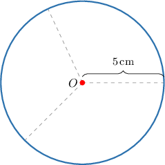
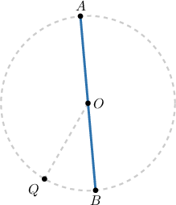
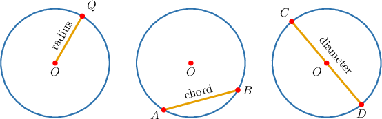
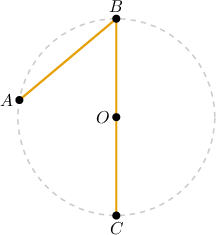

# Circles

Source: https://www.mathacademy.com/topics/1404?courseId=113
Topic ID: 1404

## Prerequisites

- [Inequalities](./178-inequalities.md)
- [The Segment Addition Postulate](./2278-the-segment-addition-postulate.md)

## Lesson

### Introduction

Let $O$ be a point on the plane. Let's consider all the points on the plane whose distance to $O$ is equal to $5\,\textrm{cm}.$

The collection of all such points defines a geometrical shape which is called a **circle**.

- The point $O$ is called the **center** of the circle.

- The distance from $O$ to any point on the circle is called the **radius**.

In our diagram above, the radius is $r={\color{black}5\,\textrm{cm}}.$

### Example: Calculating the Length of a Line Segment With Endpoints on a Circle and Passing Through the Center

#### Question

Consider the diagram below. What is the measure of $\overline{AB}$ if $OQ=3?$

#### Explanation

Notice that the points $A,$ $B,$ and $Q$ lie on the circle. From the diagram, the radius of the circle is $r =OQ=3.$

To find $AB,$ we first notice that

$$

AB = AO + OB.

$$

Now, $\overline{AO}$ and $\overline{OB}$ are both segments between the center of the circle and the circle itself. So, they are both radii of the circle, and because the radius is $3,$ we have

$$

AO=3, \qquad OB=3.

$$

Finally, we obtain

$$

AB = AO+OB = 3 + 3= 6.

$$

### Example: Identifying True Statements About the Distance to a Circle's Center

#### Question

The diagram below shows a circle of radius $4,$ a point $C$ that lies on the circle, and a third point $P$ on the plane.

Which of the following statements are true about the diagram above?

1. $OP \leq 4$

2. $OC = 4$

3. $OP > 4$

#### Explanation

The point $C$ lies on the circle itself. So, the distance from $O$ to $C$ is equal to the radius of the circle:

$$

OC = 4.

$$

On the other hand, the point $P$ lies strictly outside the circle. So, the distance between $P$ and the center $O$ of the circle must be greater than the radius:

$$

OP > OC = 4.

$$

Therefore, statements II and III are true, while statement I is false.

### Chords and Diameters

There are three important line segments associated with a circle:

- A **radius** is any line segment that connects a point on the circle with the center (left-hand diagram).

- A **chord** is any line segment whose endpoints lie on the circle (middle diagram).

- A **diameter** is any chord that passes through the center of the circle (right-hand diagram). The diameter is the longest chord and its measure is twice the radius of the circle:

### Example: Identifying True Statements About Line Segments Associated with a Circle

#### Question

Which of the following statements are true about the diagram above?

1. $\overline{BC}$ is a chord of the circle

2. $\overline{BC}$ is a diameter of the circle

3. $\overline{OC}$ is a radius of the circle

#### Explanation

Let's analyze each statement in turn.

- Statement I is true. As we can see, both endpoints $B$ and $C$ lie on the circle. Therefore, $\overline{BC}$ is a chord.

- Statement II is true. As we can see, both endpoints $B$ and $C$ lie on the circle and $\overline{BC}$ passes through the center $O.$ Therefore, $\overline{BC}$ is a diameter.

- Statement III is true. The segment $\overline{OC}$ connects a point on the circle with its center. So, $\overline{OC}$ is a radius.

In conclusion, statements I, II, and III are true.
