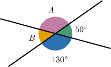
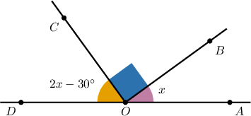
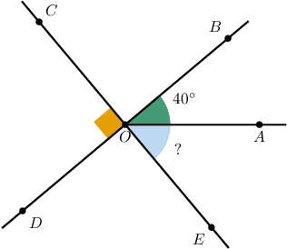

# Solving Problems With Angles

Source: https://www.mathacademy.com/topics/1437?courseId=113
Topic ID: 1437

## Prerequisites

- [Vertical Angles](./1507-vertical-angles.md)
- [Acute, Obtuse, and Reflex Angles](./1510-acute-obtuse-and-reflex-angles.md)

## Lesson

### Introduction

When solving problems with angles, it is helpful to remember the following classifications:

- a **null** angle has a measure of $0^\circ,$

- an **acute** angle has a measure between $0^\circ$ and $90^\circ,$

- a **right** angle has a measure of $90^\circ,$

- an **obtuse** angle has a measure between $90^\circ$ and $180^\circ,$

- a **straight** angle has a measure of $180^\circ,$

- a **reflex** angle has a measure between $180^\circ$ and $360^\circ,$ and

- a **full** angle has a measure of $360^\circ.$

It is also helpful to remember that when two lines meet at a point, the opposite angles are called **vertical angles**. Vertical angles are congruent, and consequently they have the same measure.

### Example: Identifying Angle Types From a Diagram

#### Question

Consider the diagram above. Which of the following statements is true?

1. $\angle A$ is obtuse

2. $\angle B$ is a right angle

3. $\angle A$ and $\angle B$ are vertical angles

#### Explanation

Let's examine our statements in turn.

- Statement I is true. From the diagram, $\angle A$ and the angle with measure $130^\circ$ are vertical angles. Therefore, Consequently, $\angle A$ is an obtuse angle.

- Statement II is false. From the diagram, $\angle B$ and the angle with measure $50^\circ$ are vertical angles. Therefore, Consequently, $\angle B$ is not a right angle.

- Statement III is false. Angles $\angle A$ and $\angle B$ are not vertical since they have a common side.

So, the correct answer is "I only."

### Example: Identifying an Angle Type From a Description

#### Question

Let $\angle S$ and $\angle T$ be two adjacent angles. Given that $\angle S$ is a straight angle and $\angle T$ is right, what type of angle is their sum?

#### Explanation

Since $\angle S$ is a straight angle, we have

$$

m\angle S=180^\circ,

$$

and since $\angle T$ is a right angle, we have

$$

m\angle T=90^{\circ}.

$$

So, their sum is

$$

m\angle S + m\angle T=180^{\circ} + 90^{\circ}=270^{\circ}.

$$

Consequently, the sum of $\angle S$ and $\angle T$ is a reflex angle.

### Example: Calculating Angles From Right, Straight, and Full Angles Using Algebra

#### Question

Given that $\angle DOA$ is a straight angle, what is the value of $x?$

#### Explanation

Note that $\angle AOD$ is a straight angle and $\angle BOC$ is a right angle. Hence,

$$

\begin{aligned}𝑚∠𝐴𝑂𝐷=180^{∘},\,𝑚∠𝐵𝑂𝐶=90^{∘}.\end{aligned}

$$

Therefore, we have:

$$

\begin{aligned}𝑚∠𝐴𝑂𝐵+𝑚∠𝐵𝑂𝐶+𝑚∠𝐶𝑂𝐷 & =𝑚∠𝐴𝑂𝐷 \\ 𝑥+90^{∘}+(2𝑥−30^{∘}) & =180^{∘} \\ 3𝑥+60^{∘} & =180^{∘} \\ 3𝑥 & =120^{∘} \\ 𝑥 & =40^{∘}\end{aligned}

$$

### Example: Finding the Measure of Unknown Angles on a Diagram

#### Question

In the figure shown below, determine the measure of $\angle EOA.$

#### Explanation

From the diagram, $\angle COD$ is a right angle, so

$$

m\angle COD = 90^\circ.

$$

Also, since $\angle COD$ and $\angle EOB$ are vertical angles, they have the same measure:

$$

m\angle EOB=m\angle COD=90^\circ

$$

Now, since we know that $m\angle AOB=40^{\circ}$ and $m\angle EOB = 90^\circ,$ we can use the angle addition postulate to solve for $m\angle EOA\mathbin{:}$

$$

\begin{aligned}𝑚∠𝐸𝑂𝐴+𝑚∠𝐴𝑂𝐵 & =𝑚∠𝐸𝑂𝐵 \\ 𝑚∠𝐸𝑂𝐴+40^{∘} & =90^{∘} \\ 𝑚∠𝐸𝑂𝐴 & =50^{∘}\end{aligned}

$$
