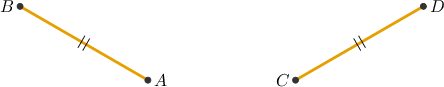
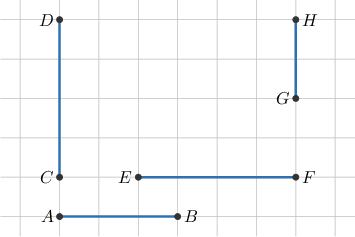
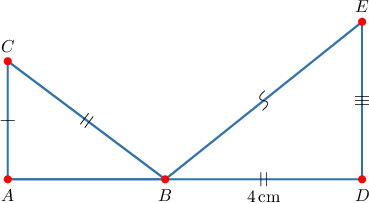

# Congruent Segments

Source: https://www.mathacademy.com/topics/1462?courseId=113
Topic ID: 1462

## Prerequisites

- [Measures of Segments](./1379-measures-of-segments.md)

## Lesson

### Introduction

When two line segments have the same length, they are **congruent** segments. To indicate that the line segments $\overline{AB}$ and $\overline{CD}$ are congruent we write

$$

\overline{AB} \:\:{\color{red}\boldsymbol{\cong}}\:\: \overline{CD},

$$

and we use special marks like in the diagram below.

We can also write

$$

AB \:{\color{blue}=}\: CD,

$$

which means that the measure of $\overline{AB}$ is equal to the measure of $\overline{CD}.$

**Watch out!** The equation

$$

\overline{AB} = \overline{CD}

$$

is only true when both $\overline{AB}$ and $\overline{CD}$ correspond to the same exact segment. When the segments are distinct, we should use the symbol $\cong$ to represent that the two segments are separate but that they have the same length.

### Example: Identifying Congruent Line Segments on a Grid

#### Question

Which of the line segments shown below are congruent?

#### Explanation

For two segments to be congruent, they must have the same length.

So, let's determine the length of each segment in the diagram. We see that:

- $AB = 3$ units

- $CD=EF = 4$ units

- $GH = 2$ units

Therefore, the only pair of congruent line segments is $\overline{CD}\cong\overline{EF}.$

### Example: Identifying Congruent Segments on a Number Line

#### Question

Given the number line above, which of the following statements are true?

1. $AC=BD$

2. $\overline{AB} \cong \overline{CD}$

3. $\overline{AB}$ is congruent to $\overline{BD}$

#### Explanation

Let's go through the statements one by one.

- Statement I is true. Indeed, we have that $AC= BD=5$ units.

- Statement II is true. Since $AB=CD=3$ units, we have that $\overline{AB} \cong \overline{CD}$.

- Statement III is false since $AB=3$, while $BD = 5.$ So, $\overline{AB}\ncong \overline{BD}$.

Therefore, only statements I and II are true.

### Example: Identifying Line Segments on a Given Plane Figure

#### Question

For the diagram shown below, which of the following statements are true?

1. The segments $\overline{BC}$ and $\overline{BD}$ are congruent

2. $\overline{BC} \cong \overline{BE}$

3. $BE = 4\,\textrm{cm}$

#### Explanation

Let's look at the statements one by one.

- Statement I is true. In the picture, both $\overline{BC}$ and $\overline{BD}$ have the same double hash marks, so

- Statement II is false. From the picture, we can see that $\overline{BE}$ and $\overline{BC}$ have different hash marks, so

- Statement III is false. According to the picture, we have that $\overline{BE}$ and $\overline{BD}$ have different hash marks, so Hence, ${BE} \neq {BD},$ and since ${BD} = 4\,\textrm{cm}$, we have $BE \neq 4\,\textrm{cm}.$

Therefore, only statement I is true.
