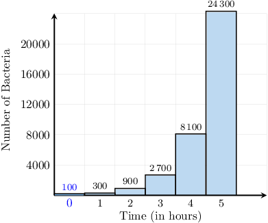

# Creating Exponential Growth Expressions

Source: https://www.mathacademy.com/topics/1499?courseId=113
Topic ID: 1499

## Prerequisites

- [Exponents With Rational Bases](./125-exponents-with-rational-bases.md)
- [Applying Percentage Increases](./2560-applying-percentage-increases.md)
- [Rounding Up Decimals](../grade-5/3585-rounding-up-decimals.md)
- [Applying Percentages in Succession](./6642-applying-percentages-in-succession.md)

## Lesson

### Introduction

A biologist is experimenting with bacteria stored in a Petri dish. She observes that the number of bacteria in the dish *triples* every hour. If there were $100$ bacteria initially, can she determine how many bacteria will be present after $3$ hours?

Starting with $100$ bacteria, she knows that this number *triples* after one hour. Remember that tripling means to multiply by a factor of $3.$

To get the number of bacteria after one hour, we multiply the initial amount by $3\mathbin{:}$

$$

\color{blue}{100\cdot 3}

$$

After another hour ($2$ hours in total), the number above triples again. So to get the total number of bacteria after $2$ hours, we multiply the amount above by $3\mathbin{:}$

$$

({\color{blue}{100\cdot 3}})\cdot 3 = {\color{red}{100 \cdot 3^2}}

$$

And after another hour ($3$ hours total), the number above triples once again:

$$

({\color{red}{100 \cdot 3^2}})\cdot 3 = 100 \cdot 3^3

$$

If we evaluate the above expression, we get

$$

100 \cdot 3^3 = 100\cdot 27 = 2\,700.

$$

So after $3$ hours, there will be $2\,700$ bacteria in the Petri dish.

This is an example of **exponential growth**. The number of bacteria triples over a time interval of $1$ hour, every hour. The total number of bacteria grows very rapidly, as we can see from the chart below.

### Example: Creating an Exponential Growth Expression

#### Question

The number of students using a new phone app doubles every week. There were $50$ users initially. How many students will be using the app after $4$ weeks?

#### Explanation

There are $50$ users initially, and this number ** every week. Remember that doubling means to multiply by a factor of $2.$

Therefore, we can write down the following:

- After $1$ week, there will be $50\cdot 2$ users.

- After ${\color{blue}{2}}$ weeks, there will be $(50\cdot 2) \cdot 2 = 50\cdot 2^{\color{blue}{2}}$ users.

- After ${\color{blue}{3}}$ weeks, there will be $(50\cdot 2^2) \cdot 2 = 50\cdot 2^{\color{blue}{3}}$ users.

- After ${\color{blue}{4}}$ weeks, there will be $(50\cdot 2^3) \cdot 2 = 50\cdot 2^{\color{blue}{4}}$ users.

So the total number of users after $4$ weeks is given by the expression $50\cdot 2^{\color{blue}{4}}.$

If we go ahead and evaluate this expression, we get

$$

50\cdot 2^4 = 50\cdot 16 = 800.

$$

Therefore, there will be $800$ users after $4$ weeks.

### Example: Creating an Exponential Growth Expression Using Percentage Growth

#### Question

Collectible baseball cards increase in value by $20\%$ every year. If Josh's collection is currently worth $1\,200,$ find an expression that gives the value of his collection in $8$ years.

#### Explanation

The collection is worth $1\,200,$ and increases by $20\%$ every year.

The number $20\%$ written as a decimal is $0.2.$ So, an increase of $20\%$ corresponds to multiplication by a factor of

$$

1+0.2 = 1.2.

$$

Therefore, we can write down the following:

- After $1$ year, the collection will be worth $1\,200 \cdot (1.2)$ dollars.

- After ${\color{blue}{2}}$ years, the collection will be worth $1\,200\cdot (1.2) \cdot 1.2 = 1\,200 \cdot (1.2)^{\color{blue}{2}}$ dollars.

- After ${\color{blue}{3}}$ years, the collection will be worth $1\,200\cdot (1.2^2) \cdot 1.2 = 1\,200 \cdot (1.2)^{\color{blue}{3}}$ dollars.

- After ${\color{blue}{4}}$ years, the collection will be worth $1\,200\cdot (1.2^3) \cdot 1.2 = 1\,200 \cdot (1.2)^{\color{blue}{4}}$ dollars.

- $\ldots$

If we continue the pattern, we can see that the collection will be worth $1\,200 \cdot (1.2)^{\color{blue}{8}}$ dollars after ${\color{blue}{8}}$ years.

If we evaluate this expression using a calculator, rounding to the nearest dollar, we get

$$

1\,200 \cdot (1.2)^{\color{blue}{8}} \approx 5\,160.

$$

So, in eight years, the collection will be worth approximately $\,5\,160.$
