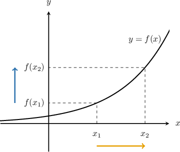
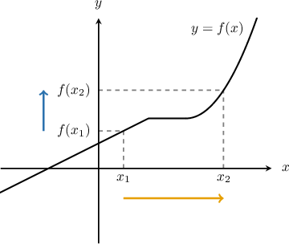
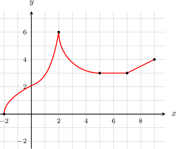
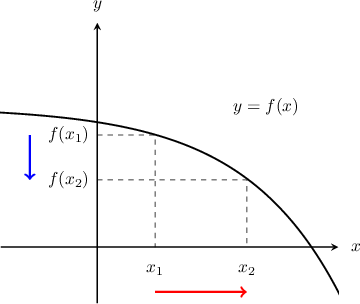
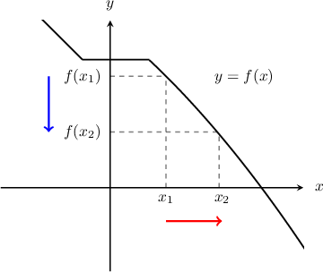
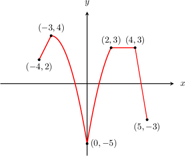

# Increasing and Decreasing Functions

Source: https://www.mathacademy.com/topics/1628?courseId=113
Topic ID: 1628

## Prerequisites

- [The Domain of a Function](./802-the-domain-of-a-function.md)

## Lesson

### Introduction

A function is **strictly increasing** if its -value always rises as we increase the -value. No section of the graph is allowed to be flat.

On the other hand, a function is **increasing** if its -value *never falls* as we increase the -value.

**Watch Out!** Increasing functions, like the one below, are allowed to have flat sections.

### Example: Identifying Intervals on Which a Function is Increasing

#### Question

In which intervals is the function $y=f(x)$ (plotted below) strictly increasing? In which intervals is it increasing?

#### Explanation

If we follow the graph from left to right, we can see that:

- For $x\in(-2,2)$ the graph rises

- For $x\in(2,5)$ the graph falls

- For $x\in(5,7)$ the graph is flat

- For $x\in(7,9)$ the graph rises

Therefore, we conclude that:

- The function is ** on the intervals where it always rises: $(-2,2)$ and $(7,9).$

- The function is ** on the intervals where it never falls: $(-2,2)$ and $(5,9).$

### Decreasing and Strictly Decreasing Functions

A function $f(x)$ is **strictly decreasing** if its $y$-value always *falls* as we increase the $x$-value. No section of the graph is allowed to be flat.

On the other hand, a function $f(x)$ is **decreasing** if its $y$-value *never rises* as we increase the $x$-value. Decreasing functions are allowed to have flat sections.

### Example: Identifying Intervals on Which a Function is Decreasing

#### Question

In which intervals is the function $y=f(x)$ (plotted below) strictly decreasing? On which intervals is it decreasing?

#### Explanation

If we follow the graph from left to right, we can see that:

- For $x\in (-4,-3)$ the graph rises

- For $x\in (-3,0)$ the graph falls

- For $x\in (0,2)$ the graph rises

- For $x\in (2,4)$ the graph is flat

- For $x\in (4,5)$ the graph falls

Therefore, we can conclude that:

- The graph is ** on the intervals where it always falls: $(-3,0)$ and $(4,5).$

- The graph is ** on the intervals where it never rises: $(-3,0)$ and $(2,5).$
