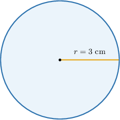
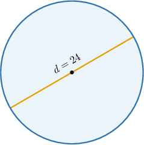
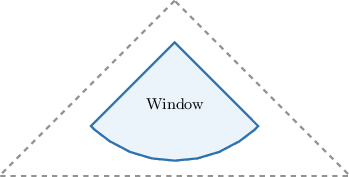

# Areas of Circles

Source: https://www.mathacademy.com/topics/1745?courseId=113
Topic ID: 1745

## Prerequisites

- [Solving Equations Using the Square Root Method](./430-solving-equations-using-the-square-root-method.md)
- [Areas of Rectangles and Squares](./1352-areas-of-rectangles-and-squares.md)
- [Circles](./1404-circles.md)

## Lesson

### Introduction

The area of a circle with radius $r$ is given by the formula

$$

\mathcal{A}=\pi r^2.

$$

To demonstrate, let's find the area of a circle that has a radius of $3\textrm{cm}.$

Using the area formula, the area is

$$

\begin{aligned}A & =𝜋𝑟^{2} \\ & =𝜋⋅(3)^{2} \\ & =𝜋⋅9 \\ & =9𝜋\,cm^{2}.\end{aligned}

$$

### Example: Calculating the Area of a Circle Given the Radius

#### Question

What is the area of a circle that has a radius of $\sqrt 2?$

#### Explanation

The formula for the area of a circle is

$$

\mathcal{A}=\pi r^2.

$$

Substituting the radius $r=\sqrt 2,$ we have

$$

\begin{aligned}A & =𝜋𝑟^{2} \\ & =𝜋⋅(\sqrt{√2})^{2} \\ & =𝜋⋅2 \\ & =2𝜋.\end{aligned}

$$

### Example: Calculating the Area of a Circle Given the Diameter

#### Question

What is the area of a circle that has a diameter of $24?$

#### Explanation

The radius of a circle is half the diameter. So, the radius of our circle is $r=12.$

Therefore, the area is

$$

\begin{aligned}A & =𝜋𝑟^{2} \\ & =𝜋⋅12^{2} \\ & =144𝜋.\end{aligned}

$$

### Example: Calculating the Radius or Diameter of a Circle Given the Area

#### Question

Given that the area of a circle is $22\pi\,\textrm{cm}^2,$ what is its radius?

#### Explanation

The formula for the area of a circle is $\mathcal{A}=\pi r^2$, where $r$ is the radius. Therefore,

$$

\begin{aligned}A & =𝜋𝑟^{2} \\ 22𝜋 & =𝜋𝑟^{2} \\ 22𝜋 & =𝜋𝑟^{2} \\ 𝑟^{2} & =22 \\ 𝑟 & =\sqrt{√22}\,cm.\end{aligned}

$$

### Example: Areas of Circles: Word Problems

#### Question

The window in the attic of Mary's house has the shape of a quarter circle, as shown below. If the area of ​​the window is $\dfrac{\pi}{2}\,\textrm{m}^2,$ what is the diameter of the corresponding circle?

#### Explanation

The area of the circle is four times the area of the quarter section. So,

$$

\mathcal{A}=4\cdot \dfrac{\pi}{2} =2\pi\,\textrm{m}^2.

$$

The formula for the area of a circle is $\mathcal{A}=\pi r^2$, where $r$ is the radius. Therefore,

$$

\begin{aligned}A & =𝜋𝑟^{2} \\ 2𝜋 & =𝜋𝑟^{2} \\ 2𝜋 & =𝜋𝑟^{2} \\ 2 & =𝑟^{2} \\ 𝑟 & =\sqrt{√2}\,m.\end{aligned}

$$

Finally, the diameter is

$$

d=2\cdot r= 2\cdot \sqrt{2}=2\sqrt{2}\,\textrm{m} .

$$
