# Subtracting Fractions With Unlike Denominators Using Models

Source: https://www.mathacademy.com/topics/2372?courseId=113
Topic ID: 2372

## Prerequisites

- [Subtracting Fractions and Whole Numbers Using Models](./544-subtracting-fractions-and-whole-numbers-using-models.md)
- [Adding Fractions With Unlike Denominators Using Models](./2374-adding-fractions-with-unlike-denominators-using-models.md)

## Lesson

### Introduction

We can also subtract fractions with unlike denominators using fraction models. To illustrate, let's use a fraction model to find the value of $\dfrac{2}{3} - \dfrac{1}{6}.$

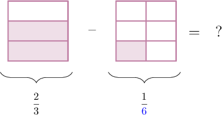

The denominators are $3$ and $6.$ Since the denominators are not the same, we need to make a common denominator before subtracting.

Since $6$ is a multiple of $3$, we can make a common denominator of ${\color{blue}{6}}.$ To do this, we split the shape on the left into $2$ parts vertically. This turns the fraction $\dfrac2 3$ into the equivalent fraction $\dfrac 4 {\color{blue}{6}}.$

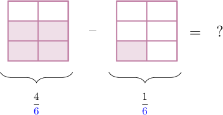

We can now subtract the fractions:

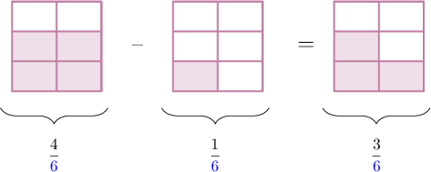

So our answer is $\dfrac 3 6.$

Notice that we can simplify this answer further by dividing the numerator and denominator by $3$. However, in this lesson, we'll focus just on subtraction and not worry about simplifying the final answers.

### Example: Subtracting Two Fractions When One Split is Required

#### Question

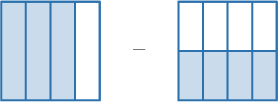

Use the model above to find the value of $\dfrac{3}{4} - \dfrac{4}{8}.$

#### Explanation

The denominators are $4$ and $8.$ Since $8$ is a multiple of $4,$ we can make a common denominator of $\color{blue}8.$

We split the shape on the left of the minus sign into $2$ parts horizontally:

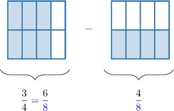

Now, the shape to the left shows $\dfrac{6}{\color{blue}8}$ and the shape to the right shows $\dfrac{4}{\color{blue}8}.$

Next, we subtract the number of shaded parts on the right from the number on the left.

$$

6 - 4 = {\color{red}{2}}

$$

This gives the picture shown below.

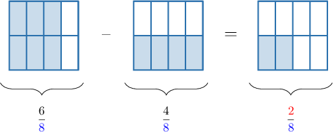

Therefore, we have:

$$

\dfrac{3}{4} - \dfrac{4}{8} = \dfrac{6}{\color{blue}8} - \dfrac{4}{\color{blue}8} = \dfrac{\color{red}2}{\color{blue}8}

$$

### Example: Subtracting Two Fractions When Multiple Splits are Required

#### Question

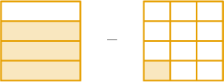

Use the model above to find the value of $\dfrac{3}{4} - \dfrac{1}{12}.$

#### Explanation

The denominators are $4$ and $12.$ Since $12$ is a multiple of $4,$ we can make a common denominator of $\color{blue}12.$

We split the shape on the left of the minus sign into $3$ parts vertically.

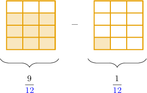

Now, the shape to the left shows $\dfrac{9}{\color{blue}12}$ and the shape to the right shows $\dfrac{1}{\color{blue}12}.$

Next, we subtract the number of shaded parts on the right from the number on the left.

$$

9 - 1 = {\color{red}{8}}

$$

This gives the picture shown below.

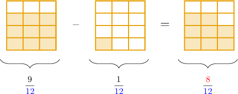

Therefore, we have

$$

\dfrac{3}{4} - \dfrac{1}{12} = \dfrac{9}{\color{blue}12} - \dfrac{1}{\color{blue}12} = \dfrac{\color{red}8}{\color{blue}12}.

$$

### Example: Making a Common Denominator by Altering Both Fractions

#### Question

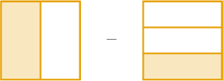

Use the model above to determine the number that is missing in the statement below.

$$

\,0\,

$$

#### Explanation

The denominators are $2$ and $3.$ So we can make a common denominator of $2\times 3 = \color{blue}6.$

We split the shape on the left of the minus sign into $3$ parts horizontally, and we split the shape on the right into $2$ parts vertically:

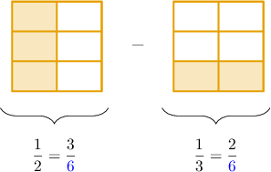

Now, the shape to the left shows $\dfrac{3}{\color{blue}6}$ and the shape to the right shows $\dfrac{2}{\color{blue}6}.$

Next, we subtract the number of shaded parts on the right from the number on the left.

$$

3-2 = {\color{red}{1}}

$$

This gives the picture shown below.

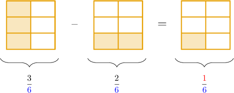

Therefore, we have

$$

\,1\,

$$

So, the missing number is $\color{red}1.$
