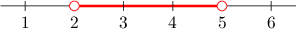
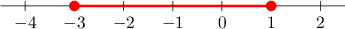
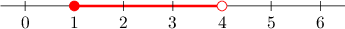
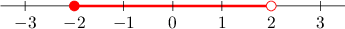

# Interval Notation

Source: https://www.mathacademy.com/topics/239?courseId=113
Topic ID: 239

## Prerequisites

- [Compound Inequalities](./2310-compound-inequalities.md)
- [Simplifying Expressions With Surds](./3709-simplifying-expressions-with-surds.md)

## Lesson

### Introduction

Consider the region below, which represents the inequality $2 < x < 5.$

We can represent this inequality using **interval notation** as follows:

$$

(2,5)

$$

The parentheses $(\phantom{0})$ tell us that the endpoints $x=2$ and $x=5$ are *not* included in this interval.

When an interval does not include the endpoints, we say that it is **open**.

More formally, we can also write

$$

x\in (2,5).

$$

The symbol $\in$ means "lies in" or "belongs to." So, the above reads, "*$x$ belongs to the (open) interval $(2,5).$*"

### Closed Intervals

Now consider the region below, which represents the inequality $-3 \leq x \leq 1.$

We express this inequality using interval notation as follows:

$$

[-3,1]

$$

The brackets $[\phantom{0}]$ tell us that the endpoints $x=-3$ and $x=1$ *are* included in this interval.

When an interval includes the endpoints, we say that it is **closed**.

More formally, we can also write

$$

x\in [-3,1].

$$

The above reads, "*$x$ belongs to the (closed) interval $[-3,1].$*"

### Example: Converting Between Intervals and Inequalities: Open Intervals

#### Question

Which inequality corresponds to the interval $x \in (1, 5)?$

#### Explanation

Every interval can be expressed as an inequality. We use the following notations:

- Parentheses ${\color{red}{(}}\phantom{0} \phantom{0}{\color{red}{)}}$ to indicate that the endpoints are ** included.

- Brackets ${\color{blue}{[}}\phantom{0} \phantom{0}{\color{blue}{]}}$ to indicate that the endpoints ** included.

Our interval contains only parentheses. So, the endpoints are ** included.

$$

x\in {\color{red}{(}}1, 5{\color{red}{)}}

$$

Therefore, our interval can be expressed as the following inequality:

$$

1 \,\,{\color{red}{< }}\,\, x \,\,{\color{red}{< }}\,\, 5

$$

### Example: Converting Between Intervals and Inequalities: Closed Intervals

#### Question

Express the inequality $1 \le x \le4$ in interval notation.

#### Explanation

Every inequality can be expressed as an interval. We use the following notations:

- Parentheses ${\color{red}{(}}\phantom{0} \phantom{0}{\color{red}{)}}$ if the endpoints are ** included.

- Brackets ${\color{blue}{[}}\phantom{0} \phantom{0}{\color{blue}{]}}$ if the endpoints ** included.

Our inequality contains only "or equal to" symbols. So, the endpoints $1$ and $4$ ** included.

$$

1\,\, {\color{blue}{\le}} \,\, x \,\, {\color{blue}{\le}} \,\, 4

$$

Therefore, we can express our inequality in interval notation as follows:

$$

{\color{blue}{[}}1,4{\color{blue}{]}}

$$

More formally, we can also write

$$

x\in [1,4].

$$

### Half-Open Intervals

Some intervals may include one parenthesis and one bracket.

For example, consider the following interval:

$$

{\color{blue}{{\big[}}} 1,4 {\color{red}{\big)}}

$$

To express this interval as an inequality, we note the following:

- The left bracket $\,\color{blue}[\,$ tells us that left endpoint $1$ *is* included in the interval. Therefore, we use ${\color{blue}{\leq}}$ for this endpoint.

- The right parenthesis $\,\color{red})\,$ tells us that the right endpoint $4$ is *not* included in the interval. Therefore, we use ${\color{red}{<}}\,$ for this endpoint.

Therefore, the inequality that corresponds to the given interval is

$$

1 \,\,{\color{blue}{\leq }}\,\, x \,\,{\color{red}{\lt}}\,\, 4.

$$

The interval can be graphed as follows:

Intervals with one bracket and one parenthesis are called **half-open** (or **half-closed**).

### Example: Translating Between Half-Open Intervals and Inequalities

#### Question

Write the interval $y\in\big(-4, \sqrt{2}\big]$ as an inequality.

#### Explanation

Every interval can be expressed as an inequality. We use the following notations:

- Parentheses ${\color{red}{(}}\phantom{0} \phantom{0}{\color{red}{)}}$ to indicate that the endpoints are ** included.

- Brackets ${\color{blue}{[}}\phantom{0}\phantom{0}{\color{blue}{]}}$ to indicate that the endpoints ** included.

For the given interval

$$

{\color{red}{{\big(}}} -4, \sqrt2\, {\color{blue}{\big]}}

$$

we note the following:

- The left endpoint $-4$ is ** included in the interval. Therefore, we use ${\color{red}{\lt}}\,.$

- The right endpoint $\sqrt2$ ** included in the interval. Therefore, we use ${\color{blue}{\leq}}\,.$

Therefore, the inequality that corresponds to the given interval is

$$

-4 \,\,{\color{red}{\lt }}\,\, y \,\,{\color{blue}{\leq}}\,\, \sqrt 2.

$$

### Example: Translating Between Half-Open Intervals and Number Lines

#### Question

What interval corresponds to the segment shown below?

#### Explanation

Every inequality can be expressed as an interval. We use the following notations:

- Parentheses ${\color{red}{(}}\phantom{0} \phantom{0}{\color{red}{)}}$ if the endpoints are ** included.

- Brackets ${\color{blue}{[}}\phantom{0} \phantom{0}{\color{blue}{]}}$ if the endpoints ** included.

The given interval can be represented by the following inequality:

$$

-2\,\, {\color{blue}{\leq}} \,\, x \,\, {\color{red}{\lt}} \,\, 2

$$

We can express our inequality in interval notation as follows:

$$

x\in {\color{blue}{[}}-2,2{\color{red}{)}}

$$
