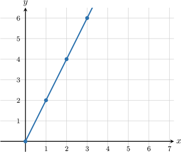
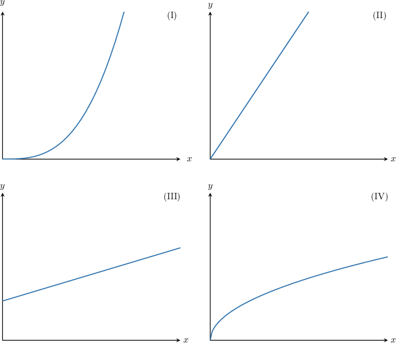
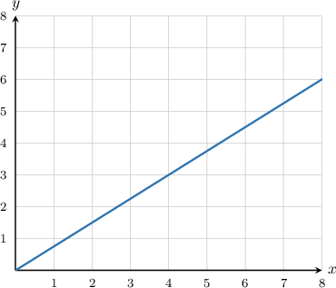
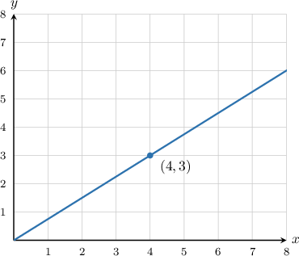
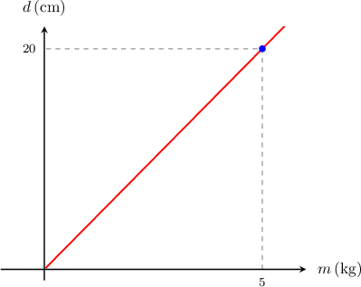

# Understanding Proportional Relationships Using Graphs

Source: https://www.mathacademy.com/topics/2552?courseId=113
Topic ID: 2552

## Prerequisites

- [The Cartesian Coordinate System](./92-the-cartesian-coordinate-system.md)
- [Graphing Ratios](./561-graphing-ratios.md)
- [Understanding Proportional Relationships Using Tables](./2553-understanding-proportional-relationships-using-tables.md)

## Lesson

### Introduction

How does a proportional relationship look when we plot it in the $(x,y)$ plane?

To answer this, let's consider the following proportional relationship:

$$

y = 2x

$$

To plot a graph, we first need a table of values.

Filling in the $y$-values using the equation $y = 2x,$ we get the following:

So, we have the following $(x,y)$ coordinates:

$$

(0,0), \quad (1,2), \quad (2,4), \quad (3,6)

$$

If we plot these points in the coordinate plane, we get the following:

This leads us to the following important fact:

*The graph of any proportional relationship is a straight line that passes through the origin $(0,0)$.*

### Example: Identifying Graphs of Proportional Relationships

#### Question

Which of the graphs below represent proportional relationships?

#### Explanation

Remember that the graph of a proportional relationship is always a straight line that passes through the origin $(0,0).$

Of the given graphs, only graph II fits this description.

- Graphs I and IV are not straight lines.

- Graph III does not pass through the origin $(0,0).$

Therefore, the correct answer is "II only".

### Example: Computing a Constant of Proportionality or Unit Rate

#### Question

The graph below shows a proportional relationship. What is the constant of proportionality?

#### Explanation

To find the constant of proportionality, we first need to choose a point $(x,y)$ on the graph. Here, let's choose the point $(4,3).$

Now, we can find the constant of proportionality by computing the ratio of the $y$-coordinate to the $x$-coordinate, as follows:

$$

k = \dfrac{y}{x} = \dfrac{3}{4}

$$

Therefore, the constant of proportionality is $k=\dfrac{3}{4}.$

### Alternative Notations and Terminology

When there is a proportional relationship between $x$ and $y,$ we can express this using the **proportionality symbol** $\propto,$ as follows:

$$

y \propto x

$$

Note that the following statements are all equivalent:

- $y = kx$

- $y$ **varies directly** with $x$

- $y$ is **directly proportional** to $x$

- $y \propto x$

### Example: Finding a Direct Variation Equation from a Graph

#### Question

The graph above shows the relationship between the displacement $d,$ in centimeters, of a particular spring when a mass $m,$ in kilograms, is attached to it. Find a direct variation equation that describes the relationship between $d$ and $m.$

#### Explanation

Since $d$ varies directly with $m,$ we use the equation

$$

d = km.

$$

Next, we notice that there is a point on the graph with $m=5$ and $d=20.$ So, we substitute this data into the above equation to find $k\mathbin{:}$

$$

\begin{aligned}20 & =𝑘⋅5 \\ \frac{20}{5} & =𝑘 \\ 4 & =𝑘\end{aligned}

$$

Therefore, the direct variation equation is given by

$$

d=4m.

$$
