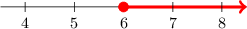
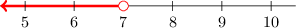
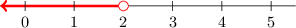
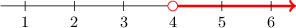

# Representing Solutions to Inequalities on Number Lines

Source: https://www.mathacademy.com/topics/4031?courseId=113
Topic ID: 4031

## Prerequisites

- [Solving Two-Step Inequalities](./4021-solving-two-step-inequalities.md)

## Lesson

### Introduction

We can always represent the solution of an inequality using a number line.

For example, let's express the solution of the following inequality using a number line:

$$

5x \geq 30

$$

The variable $x$ is being *multiplied* by $5.$ To isolate $x,$ we can perform the *opposite* operation, which is *dividing* by $5.$ So, we divide both sides of the inequality by $5{:}$

$$

\begin{aligned}5𝑥 & ≥30 \\ \frac{5𝑥}{5} & ≥\frac{30}{5} \\ \frac{5𝑥}{5} & ≥6\end{aligned}

$$

Now, we can cancel a common factor of $5$ from the numerator and denominator:

$$

\begin{aligned}\frac{5𝑥}{5} & ≥6 \\ \frac{5𝑥}{5} & ≥6 \\ 𝑥 & ≥6\end{aligned}

$$

Therefore, the solution is $x \geq 6.$ This solution can be expressed on a number line, as shown below.

### Example: Solving One-Step Inequalities

#### Question

Represent the solution of the inequality $k -12 \lt -5$ on a number line.

#### Explanation

To isolate $k,$ we need to perform the ** of ** $12,$ which is ** $12.$ Remember to perform the same operation on the right-hand side.

$$

\begin{aligned}𝑘−12 & <−5 \\ 𝑘−12+12 & <−5+12 \\ 𝑘+0 & <7 \\ 𝑘 & <7\end{aligned}

$$

Therefore, the solution is $k \lt 7.$ The solution can be expressed on a number line, as shown below.

### Example: Solving One-Step Inequalities When Flipping Is Required

#### Question

Represent the solution of the inequality $-6a > -12$ on a number line.

#### Explanation

The variable $a$ is being ** by $-6.$ To isolate $a,$ we can perform the ** operation, which is ** by $-6.$ So, we divide both sides of the equation by $-6.$

Remember, when multiplying or dividing by a negative number, we need to flip the inequality:

$$

\begin{aligned}−6𝑎\,\, & >\,\,−12 \\ \frac{−6𝑎}{−6}\, & <\,\,\frac{−12}{−6} \\ \frac{−6𝑎}{−6}\, & <\,\,2\end{aligned}

$$

Now, we can cancel a common factor of $-6$ from both the numerator and denominator.

$$

\begin{aligned}\frac{−6𝑎}{−6} & <2 \\ \frac{−6𝑎}{−6} & <2 \\ 𝑎 & <2\end{aligned}

$$

Therefore, the solution is $a< 2.$ The solution can be expressed on a number line, as shown below.

### Example: Solving Two-Step Inequalities

#### Question

Represent the solution of the inequality $14 \lt 5x-6$ on a number line.

#### Explanation

First, we apply the addition principle, adding $6$ to both sides:

$$

\begin{aligned}14 & <5𝑥−6 \\ 14+6 & <5𝑥−6+6 \\ 20 & <5𝑥+0 \\ 20 & <5𝑥\end{aligned}

$$

Second, we apply the multiplication principle, dividing both sides by $5{:}$

$$

\begin{aligned}20 & <5𝑥 \\ \frac{20}{5} & <\frac{5𝑥}{5} \\ \frac{20}{5} & <\frac{5𝑥}{5} \\ 4 & <𝑥\end{aligned}

$$

Finally, let's swap the left and right-hand sides so that the variable is on the left-hand side. Remember that we also need to flip the inequality.

$$

x \gt 4

$$

Therefore, the solution is $x \gt 4.$ The solution can be expressed on a number line, as shown below.

