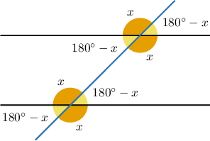
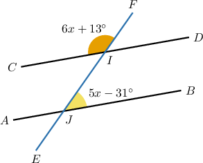
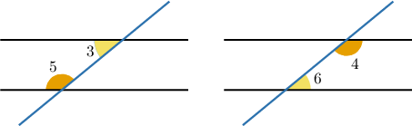
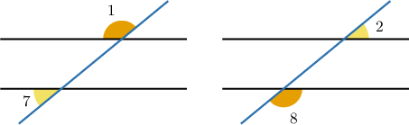
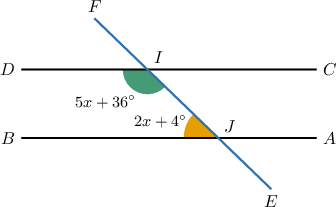
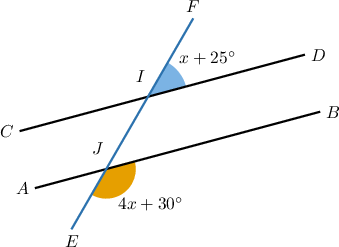
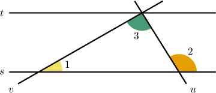
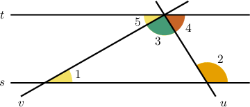

# Consecutive Angles

Source: https://www.mathacademy.com/topics/4104?courseId=113
Topic ID: 4104

## Prerequisites

- [Supplementary Angles](./1511-supplementary-angles.md)
- [Alternate Angles](./4019-alternate-angles.md)

## Lesson

### Introduction

Whenever two parallel lines are cut by a transversal, any pair of adjacent angles (angles that have a common side) form a linear pair. In other words, they are supplementary, and the sum of their measures is $180^\circ.$

In total, there are $4$ pairs of adjacent angles. These are shown below.

### Example: Finding an Unknown Value Using Adjacent Angles

#### Question

Solve for $x$ in the figure above given that $\overset{\longleftrightarrow}{AB} \parallel \overset{\longleftrightarrow}{CD}.$

#### Explanation

First, notice that $\angle{FIC}$ and $\angle{IJA}$ are corresponding angles. Therefore, their measures are equal.

$$

m\angle{FIC} = m\angle{IJA} = 6x + 13^\circ

$$

Also, the angles $\angle{IJA}$ and $\angle{IJB}$ are supplementary. So, we have:

$$

\begin{aligned}𝑚∠𝐼𝐽𝐴+∠𝐼𝐽𝐵 & =180^{∘} \\ 6𝑥+13^{∘}+5𝑥−31^{∘} & =180^{∘} \\ 11𝑥−18^{∘} & =180^{∘} \\ 11𝑥 & =198^{∘} \\ 𝑥 & =18^{∘}\end{aligned}

$$

### Consecutive Interior and Consecutive Exterior Angles

**Consecutive interior angles** are the pairs of angles that are *consecutive* (on the same side of the transversal) and *interior* to (inside of) the parallel lines. These pairs of angles are always supplementary.

**Consecutive exterior angles** are angles that are *consecutive* (on the same side of the transversal) and *exterior* to (outside of) the parallel lines. These pairs of angles are always supplementary.

### Example: Finding an Unknown Value Using Consecutive Interior Angles

#### Question

Solve for $x$ in the figure below given that $\overset{\longleftrightarrow}{AB} \parallel \overset{\longleftrightarrow}{CD}.$

#### Explanation

We notice that $\angle{EID}$ and $\angle{BJF}$ are consecutive interior angles. Therefore, they are supplementary, and the sum of their measures is $180^{\circ}.$

So, we have:

$$

\begin{aligned}𝑚∠𝐸𝐼𝐷+𝑚∠𝐵𝐽𝐹 & =180^{∘} \\ (5𝑥+36^{∘})+(2𝑥+4^{∘}) & =180^{∘} \\ 7𝑥+40^{∘} & =180^{∘} \\ 7𝑥 & =140^{∘} \\ 𝑥 & =20^{∘}\end{aligned}

$$

### Example: Finding an Unknown Value Using Consecutive Exterior Angles

#### Question

Solve for $x$ in the figure below given that $\overset{\longleftrightarrow}{AB} \parallel \overset{\longleftrightarrow}{CD}.$

#### Explanation

We notice that $\angle{FID}$ and $\angle{EJB}$ are consecutive exterior angles. Therefore, they are supplementary, and the sum of their measures is $180^\circ.$ Therefore, we have

$$

\begin{aligned}𝑚∠𝐹𝐼𝐷+∠𝐸𝐽𝐵 & =180^{∘} \\ (𝑥+25^{∘})+(4𝑥+30^{∘}) & =180^{∘} \\ 5𝑥+55^{∘} & =180^{∘} \\ 5𝑥 & =125^{∘} \\ 𝑥 & =25^{∘}.\end{aligned}

$$

### Example: Solving Problems With Consecutive Angles and Two Transversals

#### Question

Solve for $x$ given that $s \parallel t,$ and

$$

\begin{aligned}𝑚∠1=𝑥−11^{∘},\,𝑚∠2=5𝑥+2^{∘},\,𝑚∠3=5𝑥−10^{∘}.\end{aligned}

$$

#### Explanation

Consider $\angle 4$ and $\angle 5$ in the diagram below.

First, notice that $\angle{2}$ and $\angle{4}$ are consecutive interior angles formed by the same transversal. Therefore,

$$

\begin{aligned}𝑚∠4 & =180^{∘}−𝑚∠2 \\ & =180^{∘}−(5𝑥+2^{∘}) \\ & =178^{∘}−5𝑥.\end{aligned}

$$

Now, notice that $\angle{5}$ and $\angle{1}$ are alternate interior angles formed by another transversal. Therefore,

$$

\begin{aligned}𝑚∠5 & =𝑚∠1 \\ & =𝑥−11^{∘}.\end{aligned}

$$

Finally, angles $\angle{3},$ $\angle{4},$ and $\angle{5}$ form a straight angle. So, we obtain:

$$

\begin{aligned}𝑚∠3+𝑚∠4+𝑚∠5 & =180^{∘} \\ (5𝑥−10^{∘})+(178^{∘}−5𝑥)+(𝑥−11^{∘}) & =180^{∘} \\ 𝑥+157^{∘} & =180^{∘} \\ 𝑥 & =23^{∘}\end{aligned}

$$
