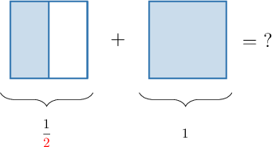
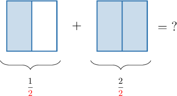
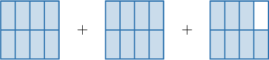

# Adding Fractions and Whole Numbers Using Models

Source: https://www.mathacademy.com/topics/543?courseId=113
Topic ID: 543

## Prerequisites

- [Adding Fractions With Like Denominators Using Models](../grade-4/2370-adding-fractions-with-like-denominators-using-models.md)
- [Modeling Mixed Numbers Using Number Lines](../grade-4/7008-modeling-mixed-numbers-using-number-lines.md)

## Lesson

### Introduction

We can use fraction models to help us to add fractions and whole numbers.

For example, suppose that we want to find the value of $\dfrac 1 2 + 1$ as an improper fraction. Let's solve this problem using a fraction model.

We cannot add these two fractions at the moment, because they are split into different numbers of parts (i.e., they have different denominators). So what do we do?

The first shape is split into $\color{red}2$ equal parts. So, we can split the whole number into $\color{red}2$ equal parts also:

Now, both shapes are split into $\color{red}2$ equal parts, and we have $1+2 = {\color{blue}{3}}$ shaded parts in total. Therefore,

$$

\dfrac 1 2 + 1 = \dfrac{{\color{blue}3}}{{\color{red}2}}.

$$

And that's our answer!

Learning to add fractions and whole numbers will give us vital clues on how to add fractions with *unlike* denominators, which is our ultimate goal.

### Example: Adding Fractions and Whole Numbers

#### Question

Use the model below to find the value of $2+\dfrac{1}{3}$ as an improper fraction.

#### Explanation

All three shapes are split into $\color{red}3$ equal parts, and we have $3+3+1 = {\color{blue}{7}}$ parts in total.

Therefore,

$$

2 + \dfrac 1 3 = \dfrac{{\color{blue}7}}{{\color{red}3}}.

$$

### Example: Splitting Whole Numbers Into Parts

#### Question

Use the model above to determine the missing number in the following statement:

$$

\,0\,

$$

#### Explanation

The first shape is split into $\color{red}6$ equal parts. We can split the second shape into $\color{red}6$ equal parts, as follows:

There are $5+6 = \color{blue}11$ shaded parts in total. Therefore, the sum of the two fractions is $\dfrac{{\color{blue}{11}}}{\color{red}{6}}.$

Hence, the missing number is $\color{blue}11.$

### Example: Solving Addition Problems Using Fraction Models

#### Question

Use a visual fraction model to find the value of $2+\dfrac 7 {8}$ as an improper fraction.

#### Explanation

Writing $2+\dfrac 7 {8}$ as a visual fraction model, we get the following:

The shape on the right is split into $\color{red}8$ equal parts. We can split the first and second shapes into $\color{red}8$ equal parts as follows:

There are $8+8+7 = \color{blue}23$ shaded parts in total. Therefore, their sum is $\dfrac{{\color{blue}{23}}}{\color{red}{8}}.$
