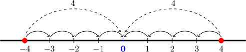
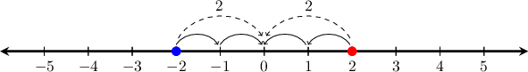
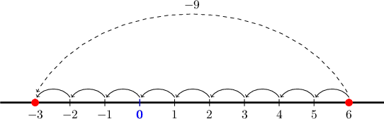
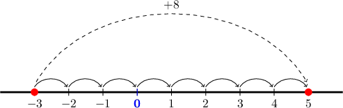

# Interpreting Additive Opposites and Addition Using Absolute Value

Source: https://www.mathacademy.com/topics/7005?courseId=113
Topic ID: 7005

## Prerequisites

- [Additive Inverses of Numbers](./524-additive-inverses-of-numbers.md)

## Lesson

### Introduction

On a number line, a number and its *additive inverse* are at the same distance from zero but on opposite sides. Remember that the distance of a number from zero is given by its *absolute value*.

For instance, the only two numbers that are at a distance of $4$ from zero are $4$ and $-4.$ So, $-4$ is the additive inverse of $4$ (and vice versa).

### Example: Identifying an Additive Inverse

#### Question

How can we represent the additive inverse of $-2$ on the number line?

#### Explanation

The additive inverse of a number is the number that lies at the same distance from zero on the number line, but on the opposite side.

As we can see on the number line below, the distance of $-2$ from zero is $2$ units. The only other number that is at a distance of $2$ units from zero is $2.$

Therefore, the additive inverse of $-2$ is $2$, and it can be represented on the number line as follows:

### Opposite Quantities Combine to Zero

Suppose that a bank account had an *initial balance* of $0.$ During the day, there was a *withdrawal* of $80.$ Then there was a *deposit* of $80$ later.

What is the resulting amount in the account?

In our situation:

- During the day, the account had a *withdrawal of* $80,$ which is a change of $-80.$

- Later, the account had a *deposit of* $80,$ which is a change of $+80.$

These two changes are *opposite quantities*. When opposite quantities combine, they make $0{:}$

$$

-80 + 80 = 0

$$

Therefore, the balance returns to its original value of $0.$

### Example: Adding Opposite Quantities

#### Question

A drone’s elevation **** $85\text{m}$ while descending into a valley. Then it **** $85\text{m}$ while flying back up. Which of the following statements are true?

1. The drone’s elevation is now higher than the initial elevation.

2. The drone’s elevation is now lower than the initial elevation.

3. The drone returned to the initial elevation.

#### Explanation

In our situation:

- While descending, the drone’s elevation ** $85\text{m}$, which is a change of $-85\text{m}.$

- While climbing back up, the drone’s elevation ** $85\text{m},$ which is a change of $+85\text{m}.$

These two changes are **. When opposite quantities combine, they make $0{:}$

$$

-85 + 85 = 0

$$

This means the ** is $0\text{m},$ so the drone returns to the original elevation.

So, statements I and II are false, while statement III is true.

Therefore, the correct answer is "III only".

### Addition and Absolute Values on the Number Line

Now, let $p=6$ and $q=-9.$ What point on the number line corresponds to $p+q?$

The value of $p+q$ is the number located a distance $|q|$ from $p$ on the number line,

- moving to the *right* if $q$ is *positive*, and

- moving to the *left* if $q$ is *negative*.

In our situation:

- We start at $p = 6$ on the number line.

- Here, $q = -9$, so the distance we move is $|q| = 9.$

- Because $q$ is *negative*, we move $9$ units to the *left* from $6.$

This point corresponds to the number

$$

6 + (-9) = -3.

$$

### Example: Interpreting Addition Using Absolute Value

#### Question

Let $p=-3$ and $q=8.$ What point on the number line corresponds to $p+q?$

#### Explanation

The value of $p+q$ is the number located a distance $|q|$ from $p$ on the number line,

- moving to the ** if $q$ is **, and

- moving to the ** if $q$ is **.

In our situation:

- We start at $p = -3$ on the number line.

- Here, $q = 8$, so the distance we move is $|q| = 8.$

- Because $q$ is **, we move $8$ units to the ** from $-3.$

This point corresponds to the number

$$

-3 + 8 = 5.

$$
