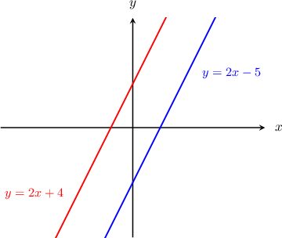
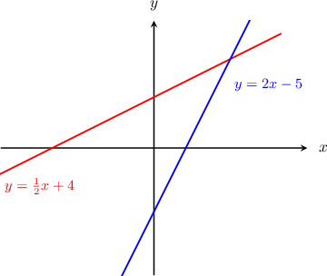

# Parallel Lines in the Coordinate Plane

Source: https://www.mathacademy.com/topics/837?courseId=113
Topic ID: 837

## Prerequisites

- [Properties of Lines Given in Standard Form](./3725-properties-of-lines-given-in-standard-form.md)
- [Parallel and Perpendicular Lines](./3979-parallel-and-perpendicular-lines.md)

## Lesson

### Introduction

Two distinct lines that never intersect are said to be **parallel.** For two lines to be parallel, they must have the same slope.

For example, the lines $y=2x+4$ and $y=2x-5$ have the same slope of $m=2,$ so they are parallel. Indeed, looking at the graph, we see that the two lines never cross.

On the other hand, the lines $y=\dfrac{1}{2}x+4$ and $y=2x-5$ have different slopes, so they are *not* parallel. Indeed, looking at the graph, we see that the two lines *do* cross.

### Example: Identifying Parallel Lines Given in Slope-Intercept Form

#### Question

The lines $y=cx+7$ and $y=5x-3$ are parallel. What is the value of $c$?

#### Explanation

For two lines to be parallel, they must have the same slope.

Both lines are in slope-intercept form, so we can pick out the slope of each equation by looking at the $x$-coefficient.

- The slope of the line $y=cx+7$ is $c.$

- The slope of the line $y=5x-3$ is $5.$

Because the slopes must be the same, we must have $c=5.$

### Example: Identifying Parallel Lines Given in Standard Form

#### Question

Which of the following lines is parallel to $12x - y=3?$

1. $y=4x-8$

2. $y=12x+1$

3. $y=3x-12$

#### Explanation

For two lines to be parallel, they must have the same slope.

To find the slope of the line $12x-y=3,$ we convert to slope-intercept form:

$$

\begin{aligned}12𝑥−𝑦 & =3 \\ −𝑦 & =−12𝑥+3 \\ 𝑦 & =12𝑥−3.\end{aligned}

$$

In slope-intercept form, the slope is the $x$-coefficient. So, the slope is $12.$

From the given options, the only line that has a slope of $12$ is $y = 12x+1.$

### Example: Finding Unknown Parameters

#### Question

The lines $y=2x$ and $kx-2y=-1$ are parallel. What is the value of $k?$

#### Explanation

For two lines to be parallel, they must have the same slope.

- The line $y=2x$ is in slope-intercept form, and its slope is $2.$

- To find the slope of the line $kx-2y=-1,$ we convert to slope-intercept form: In slope-intercept form, the slope is the $x$-coefficient. So, the slope is $\dfrac{k}{2}.$

Since the slopes of the two lines must be equal, we must have $\dfrac{k}{2}=2.$ Consequently, $k=4.$
