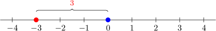
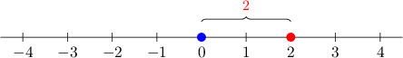

# Absolute Value Expressions

Source: https://www.mathacademy.com/topics/96?courseId=113
Topic ID: 96

## Prerequisites

- [Evaluating Linear Expressions](./64-evaluating-linear-expressions.md)
- [Evaluating Expressions With Integer Exponents](./1987-evaluating-expressions-with-integer-exponents.md)

## Lesson

### Introduction

Let's take a number, say, $-3.$ We can depict it on a number line as follows:

The *distance* between the number $-3$ and $0$ is known as the **absolute value** of $-3.$ We write it as

$$

|-3| = {\color{red}3}.

$$

Similarly, $|\,2\,|$, the absolute value of the number $2$, is the distance between $2$ and $0$:

We write $|\,2\,| = {\color{red}2}.$

So, the absolute value simply

- *removes the minus sign*, if the number is negative, or

- does nothing, if the number is non-negative.

Sometimes, we can be asked to evaluate an expression involving the absolute value function, like $|x +1| + 5$ when $x=-3.$ In this case, we evaluate the expression inside the absolute value before simplifying the rest of the expression:

$$

\begin{aligned}|𝑥+1|+5 & = \\ |(−3)+1|+5 & = \\ |−2|+5 & = \\ 2+5 & = \\ 7 & \end{aligned}

$$

### Example: Evaluating an Expression With One Absolute Value

#### Question

Evaluate $|x - 6| + 2 x +3$ for $x = -3.$

#### Explanation

We substitute $x = -3$ and then evaluate the absolute value before we simplify the rest of the expression:

$$

\begin{aligned}|𝑥−6|+2𝑥+3 & = \\ |−3−6|+2(−3)+3 & = \\ |−9|+2(−3)+3 & = \\ 9+2(−3)+3 & = \\ 9−6+3 & = \\ 6 & \end{aligned}

$$

### Example: Evaluating an Expression With Two Absolute Values

#### Question

Evaluate $|2 - x| + 1 + 5|x|$ for $x = 5.$

#### Explanation

We substitute $x = 5$ and then evaluate the absolute values before we simplify the rest of the expression:

$$

\begin{aligned}|2−𝑥|+1+5|𝑥| & = \\ |2−5|+1+5|5| & = \\ |−3|+1+5(5) & = \\ 3+1+25 & = \\ 4+25 & = \\ 29 & \end{aligned}

$$
