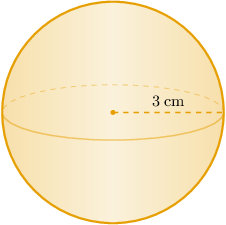
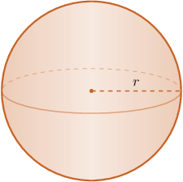

# Volumes of Spheres

Source: https://www.mathacademy.com/topics/1146?courseId=111
Topic ID: 1146

## Prerequisites

- [Introduction to Functions](../algebra-i/470-introduction-to-functions.md)
- [Circles](../geometry/1404-circles.md)
- [Identifying Three-Dimensional Shapes](./2467-identifying-three-dimensional-shapes.md)
- [Solving Equations With Odd Exponents Using the Nth Root Method](../algebra-i/3748-solving-equations-with-odd-exponents-using-the-nth-root-method.md)

## Lesson

### Introduction

Given a sphere with radius $r= 3\:\textrm{cm},$ how do we calculate its volume?

In general, we can find the volume of a sphere using the formula

$$

V= \dfrac 4 3 \pi r^3,

$$

where $r$ is the radius of the sphere.

Substituting $r=3\:\textrm{cm}$ into the formula, we obtain

$$

V = \dfrac 4 3 \pi \cdot (3)^3 =36 \pi \:\textrm{cm}^3.

$$

We often express the volume of a sphere as a multiple of $\pi.$ However, we can also use a calculator to get a numerical approximation. In this case, we get

$$

V \approx 113.10 \:\textrm{cm}^3

$$

rounded to two decimal places.

### Example: Finding the Volume of a Sphere Given Its Radius or Diameter

#### Question

What is the volume of a sphere whose diameter is $18 \:\textrm{cm}?$

#### Explanation

We can find the volume of a sphere using the formula

$$

V = \dfrac 4 3 \pi r^3 ,

$$

where $r$ is the radius of the sphere.

Substituting $r=\dfrac{18}{2}=9\:\textrm{cm}$ into the formula, we obtain

$$

V = \dfrac 4 3 \pi \left(9\right)^3 = 972\pi \:\textrm{cm}^3.

$$

### Example: Finding the Radius or Diameter of a Sphere Given Its Volume

#### Question

What is the radius of a sphere whose volume is $36\pi\:\textrm{in}^3.$

#### Explanation

We can find the volume of a sphere using the formula

$$

V = \dfrac 4 3 \pi r^3 ,

$$

where $r$ is the radius of the sphere.

Substituting $V=36\pi\:\textrm{in}^3$ into the formula, we get

$$

\begin{aligned}𝑉 & =\frac{4}{3}𝜋𝑟^{3} \\ 36𝜋 & =\frac{4}{3}𝜋𝑟^{3} \\ 36𝜋⋅\frac{3}{4𝜋} & =𝑟^{3} \\ 𝑟^{3} & =27.\end{aligned}

$$

Therefore,

$$

r = \sqrt[3]{27} = 3\:\textrm{in}.

$$
