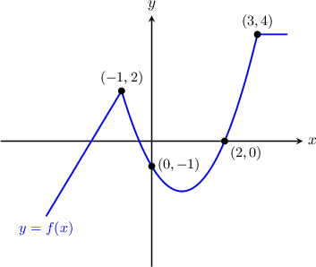
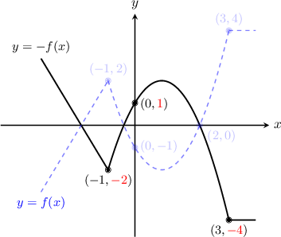
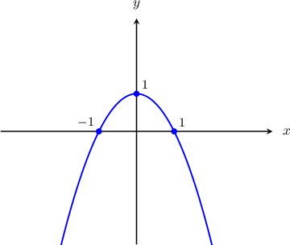
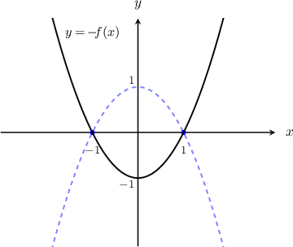
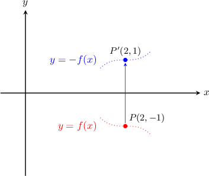

# Vertical Reflections of Functions

Source: https://www.mathacademy.com/topics/1150?courseId=111
Topic ID: 1150

## Prerequisites

- [Graphs of Functions](../algebra-i/3821-graphs-of-functions.md)

## Lesson

### Introduction

The graph of $y=f(x)$ shown below. How can we plot the graph of $y=-f(x)$?

As usual, It's helpful to first find a few points on the graph of $y=-f(x)$. You can use the points on the graph of $y=f(x)$ to identify corresponding points on the graph of $y=-f(x)$:

$$

\begin{aligned}Points on 𝑦=𝑓(𝑥) & Points on 𝑦=−𝑓(𝑥) \\ (−1,2) & (−1,−2) \\ (0,−1) & (0,1) \\ (2,0) & (2,0) \\ (3,4) & (3,−4)\end{aligned}

$$

For each point on the graph of $y=f(x)$ there is a point on the graph of $y=-f(x)$ with the *same* $x$-value and the *opposite* $y$-value.

Let's plot our new points, and draw $y=-f(x)$.

The graph of $y=-f(x)$ is a **reflection across the $x$-axis** of the graph of $y=f(x)$.

### Example: Sketching the Graph of a Vertically Reflected Function

#### Question

The graph of the function $y=f(x)$ is shown below. Sketch the graph of $y=-f(x)$.

#### Explanation

To obtain the graph of $y=−f(x)$ from $y=f(x)$, we need to reflect the graph over the $x$-axis. The resulting graph is shown below.

### Example: Identifying a Point on a Vertically Reflected Function

#### Question

The point $P$ with coordinates $(2, -1)$ lies on the curve $y=f(x)$. Which point must lie on the graph of $y= -f(x)?$

#### Explanation

The transformation $y=-f(x)$ reflects the curve $y=f(x)$ in the $x$-axis.

First, notice that the point $P(2, -1)$ lies $1$ unit ** the $x$-axis. So, under the action of the transformation, this point will be reflected $1$ unit ** the $x$-axis.

We conclude that the point $(2,1)$ must lie on the graph of $y=-f(x).$
