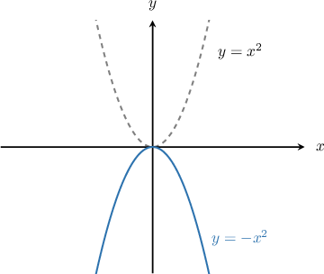
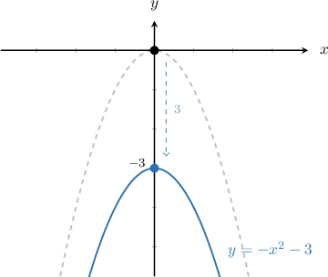
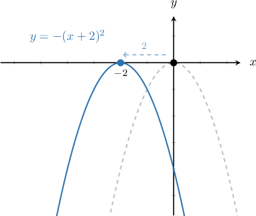
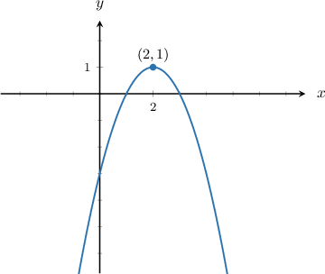

# Vertical Reflections of Quadratic Functions

Source: https://www.mathacademy.com/topics/117?courseId=111
Topic ID: 117

## Prerequisites

- [Graphing Elementary Quadratic Functions](./453-graphing-elementary-quadratic-functions.md)

## Lesson

### Introduction

If we want to plot the graph of we reflect the curve in the -axis, as shown below:

This transformation is called a **reflection in the -axis**, and it occurs because the output -values of the function are made negative.

As with the curve, the vertex of is still at However, in the curve the vertex is the **maximum point**, because the curve does not go above that point.

If we combine vertical and horizontal translations with reflection, we get a general form

This is the equation of a reflected graph that is translated

- units right and

- units up.

### Example: Combining Reflection with Vertical Translation

#### Question

Plot the graph of $y=-x^2-3.$

#### Explanation

Remember that $y=-x^2+k$ is a reflected parabola $y=-x^2$ that is translated $k$ units up.

The given function $y=-x^2-3$ has $k=-3.$ Therefore, it is a reflected parabola $y=-x^2$ that is translated $3$ units **.

### Example: Combining Reflection with Horizontal Translation

#### Question

Plot the graph of $y=-(x+2)^2.$

#### Explanation

Remember that $y=-(x-h)^2$ is a reflected parabola $y=-x^2$ that is translated $h$ units right.

The given function $y=-(x+2)^2$ has $h=-2.$ To see this clearly, we can write the curve as follows:

$$

\begin{aligned}𝑦 & =−(𝑥+2)^{2} \\ 𝑦 & =−(𝑥−(−2))^{2}\end{aligned}

$$

Therefore, the given curve is a reflected parabola $y=-x^2$ that is translated $2$ units **.

### Example: Combining Reflection with Vertical and Horizontal Translation

#### Question

Identify the equation of the parabola shown below.

#### Explanation

Remember that the graph of $y=-(x-h)^2+k$ is a translation of the reflected parabola $y=-x^2$ by

- $h$ units right, and

- $k$ units up.

The vertex of $y=-(x-h)^2+k$ is located at $(h,k).$

Here, the parabola is translated $2$ units right, so we have $h=2.$ The parabola is also translated $1$ unit up, so we have $k=1.$ We can also see that the vertex is at $(2,1),$ so again we must have $h=2$ and $k=1.$

Therefore, the equation of the graph is:

$$

\begin{aligned}𝑦 & =−(𝑥−2)^{2}+1\end{aligned}

$$
